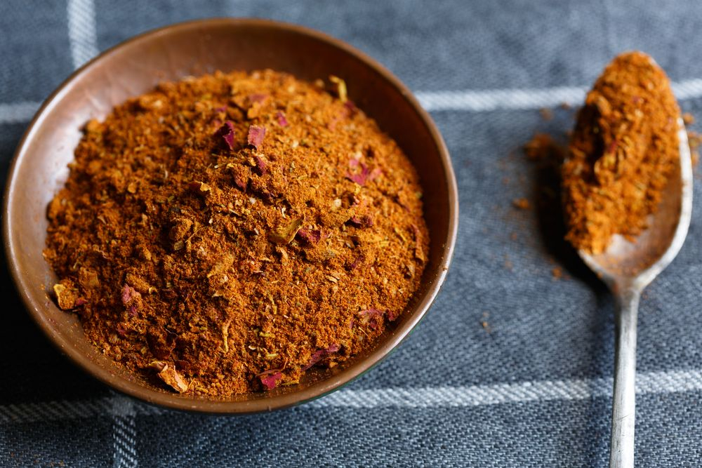

# Ras el Hanout

*Moroccan for "head of the shop", the blend the spice merchant brings out as their best, often a dozen spices and sometimes thirty, balanced into warm and floral and slightly bitter all at once.*

**Prep Time:** 15 minutes

**Yield:** Approximately 90 grams (makes 30+ portions)

## Overview
Ras el hanout is the showpiece Moroccan blend, the literal "top of the shop" each spice merchant builds to their own taste. Every souk vendor in Marrakech, Fez and Casablanca has their own version, with anywhere from 10 to 30 ingredients including some you can't easily buy (rose petals, monk's pepper, grains of paradise). This home version covers the warm-spice core, plus rose petals and the floral character that's the blend's signature. Use it in tagines (lamb with apricots, chicken with preserved lemon), in couscous, on slow-roasted carrots and squash, in marinades for grilled meat. Toasted whole spices ground fresh produce dramatically better results than pre-ground; a small heavy frying pan and a spice grinder are the kit you need.

## Ingredients

### Whole Spices to Toast
- 2 teaspoons cumin seeds
- 2 teaspoons coriander seeds
- 1 teaspoon black peppercorns
- 6 cardamom pods (seeds removed)
- 4 cloves
- 1 cinnamon stick (broken into pieces)
- 1 teaspoon fennel seeds
- 1 teaspoon caraway seeds

### Pre-Ground Spices to Add After Toasting
- 1 tablespoon ground ginger
- 1 tablespoon sweet paprika
- 1 teaspoon ground turmeric
- 1 teaspoon ground allspice
- 1 teaspoon ground nutmeg
- 1 teaspoon dried rose petals (crushed, optional)
- 1 teaspoon fine sea salt

## Method

1. Place a heavy-bottomed frying pan over medium heat without oil.
1. Add the whole spices and toast for 3 to 4 minutes, shaking the pan often, until visibly darker and intensely fragrant.
1. Tip onto a cool plate to halt the roasting.
1. Cool to room temperature, then grind to a fine powder in a spice mill.
1. Combine the freshly ground spices with the pre-ground ginger, paprika, turmeric, allspice, nutmeg, rose petals and salt.
1. Mix thoroughly until the colour is uniform.
1. Transfer to an airtight jar.

## Notes
- **Rose petals.** Dried culinary rose petals (Rosa damascena) are sold at Middle Eastern grocers. Skip if you can't find them; the blend works without.
- **Cardamom pods.** Crack the pods and discard the green husks; only the small black seeds go in.
- **Toasting cinnamon.** Break the stick into 1 cm pieces before toasting so the heat penetrates evenly.
- **Saffron variant.** A pinch of crushed saffron threads stirred in at the end lifts the blend into special-occasion territory.

## Serving
- **Use in:** lamb tagines, chicken tagines, couscous dishes, roasted root vegetables, slow-cooked stews, grilled lamb marinades
- **Typical ratio:** 1 to 2 teaspoons per portion
- **Application:** bloomed in hot oil at the start, or rubbed into meat before roasting

## Storage
- Store in an airtight glass jar in a cool dark cupboard
- Best within 4 months while the toasted spices are at peak
- Make small batches; the freshness shows in the finished dish

*Moroccan for "head of the shop", the blend each spice merchant builds to their own recipe. Used to season the slow-cooked tagines, couscous and grilled meat of North African cooking.*
