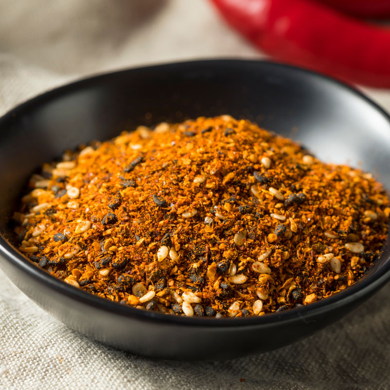

# Shichimi Togarashi

*The Japanese seven-spice blend: chilli flakes, dried orange peel, sesame seeds, nori, sansho pepper, ginger and hemp/poppy seeds, the universal table-top condiment for ramen, udon and yakitori.*

**Prep Time:** 10 minutes

**Yield:** Approximately 50 grams (makes 30+ portions)

## Overview
Shichimi togarashi means "seven-flavour chilli" in Japanese, and the blend dates to seventeenth-century Edo. Unlike most spice blends, shichimi is built on flavours most Western kitchens don't usually combine: dried orange peel and nori (toasted seaweed) doing the aromatic-citrus-and-ocean work, sansho pepper providing the numbing-tingling Japanese version of mala, ground chilli flakes for the heat, sesame and hemp (or poppy) seeds for the toasted-nut top notes. Each Tokyo shichimi vendor has their own ratio; the blend you buy at Asakusa's Yagenbori shop tastes different from the supermarket S&B brand. Sprinkle on ramen, udon, soba, yakitori, gyudon (beef-and-rice bowl), miso soup, even pickles. A tiny amount goes far.

## Ingredients

- 2 tablespoons dried red chilli flakes (Japanese togarashi if available, else generic chilli flakes)
- 2 teaspoons dried orange peel, ground to a powder
- 2 teaspoons sesame seeds (mix of black and white if available)
- 1 teaspoon nori flakes (toasted seaweed, crumbled)
- 1 teaspoon sansho pepper (or Sichuan peppercorns, ground)
- 1 teaspoon hemp seeds (or poppy seeds)
- ½ teaspoon ground ginger

## Method

1. Toast the sesame seeds in a dry pan over medium heat for 2 minutes, until pale gold and fragrant. Set aside to cool.
1. Toast the nori flakes briefly (10 seconds) to crisp; cool.
1. Combine all ingredients in a bowl.
1. Pulse briefly in a spice grinder to break up the chilli flakes and integrate the textures, but don't over-grind; the blend should be a coarse mix, not a fine powder.
1. Transfer to an airtight jar.

## Notes
- **Dried orange peel.** Either buy ready-dried at an Asian grocer, or grate fresh orange zest and dry it in a low oven (80°C) for 20 minutes until crisp.
- **Nori sourcing.** Pre-flaked nori (aonori) is sold in shaker bottles at Japanese grocers. Whole nori sheets work too; toast briefly and crumble fine.
- **Sansho vs Sichuan.** Japanese sansho is brighter and more citrusy; Chinese Sichuan pepper is smokier. Either works.
- **Heat level.** Adjust the chilli flake ratio for personal heat preference; traditional Japanese versions are moderate, not aggressive.

## Serving
Use in: sprinkled on ramen, udon and soba; over rice bowls (donburi); on yakitori chicken skewers; into miso soup; on Japanese pickles; on gyoza; on rice crackers (senbei)
Typical ratio: a pinch per bowl
Application: scattered straight from the jar at the table

## Storage
- Store in an airtight glass jar in a cool dark cupboard
- Best within 4 months while the sesame is fresh
- The nori loses crispness with humidity; a small silica packet helps

*The Japanese seven-spice table-top condiment, traceable to seventeenth-century Edo. Chilli, citrus, sesame, seaweed and sansho combined to lift any ramen, udon or rice bowl with a single pinch.*
