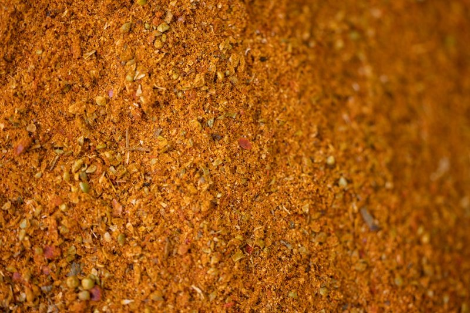

# Taco Spice Mix

*A Tex-Mex taco seasoning: chilli powder, cumin, paprika, garlic, onion and oregano. Toasted in oil with ground beef for tacos and burritos.*

**Prep Time:** 10 minutes

**Yield:** Approximately 80 grams (makes 16-20 portions, ½ tablespoon each)

## Overview
Taco spice mix is the building block for Tex-Mex weeknight cooking: a dry seasoning blend you sprinkle into a pan of browning mince or pinto beans to make taco fillings, burrito stuffings, nacho toppings, quesadilla mixes and chilli con carne. The flavour profile leans on earthy ground cumin balanced against sweet and smoked paprikas (the two paprikas are the trick; sweet gives colour, smoked gives depth, and either one alone falls flat), with garlic powder, onion powder and salt doing the savoury heavy lifting, chilli powder providing warmth, and a small dose of dried oregano (preferably Mexican oregano with its faintly citrus piney note) finishing the blend with a herbal lift. Salt is included so the blend seasons in one step at the pan with no extra seasoning needed. Tip the sweet paprika, smoked paprika, ground cumin, chilli powder, garlic powder, onion powder, dried oregano, black pepper and sea salt into a small bowl with optional pinches of red chilli flakes and caster sugar. Whisk thoroughly with a fork or small whisk for one or two minutes till the colour goes uniform and any clumps in the onion or garlic powder break apart against the side of the bowl. Rub the dried oregano between your fingers as you add it to release the volatile oils that otherwise stay locked in the dried leaf. Sieve for a smoother texture if you want. Store in a small airtight jar in a cool dark place; freshness matters most for the cumin and paprika, both of which fade within six months in the cupboard, so make modest batches and replace often. Use roughly half a tablespoon (around 4 g) per 100 g of mince; brown the meat first, drain excess fat, then add the spice mix with a splash of water or tomato passata and simmer five minutes.

## Ingredients

### Dry Spice Blend
- 2 tablespoons sweet paprika
- 1 tablespoon smoked paprika (or hot smoked paprika for more heat)
- 2 tablespoons ground cumin
- 1 tablespoon chilli powder
- 1 tablespoon garlic powder
- 1 tablespoon onion powder
- 1 teaspoon dried oregano (preferably Mexican oregano)
- 1 teaspoon ground black pepper
- 1 teaspoon fine sea salt
- ½ teaspoon dried red chilli flakes (optional, for extra kick)
- ½ teaspoon caster sugar (optional, balances the salt)

## Method

### Stage 1 - Measure
1. Spoon each spice into a small mixing bowl on a kitchen scale or with measuring spoons.
1. Use fresh-smelling spices, ground cumin and paprika lose punch after 6 months in the cupboard.

### Stage 2 - Blend
1. Whisk thoroughly with a fork or small whisk for 1-2 minutes until the colour is uniform.
1. Break up any clumps of brown sugar (if used) or onion powder against the side of the bowl.
1. Optional: sift through a fine sieve for a smoother dose; rub the oregano between your fingers as you add to release the oils.

### Stage 3 - Store
1. Transfer to a small airtight jar.
1. Label with the date.
1. Store in a cool, dark cupboard for up to 6 months.

## Notes
- **Sweet plus smoked paprika:** Two paprikas in the blend gives both colour and depth. All-sweet is flat; all-smoked is overpowering.
- **Mexican oregano vs Mediterranean:** Mexican oregano (Lippia graveolens) has a faintly citrusy / piney note that Mediterranean oregano (Origanum vulgare) lacks. Either works; if you have the choice, Mexican is more authentic.
- **No flour:** Shop-bought taco seasoning often includes wheat flour or cornstarch as a thickener. Skipping it makes the blend gluten-free and lets you control the sauce consistency at the pan with a splash of stock or tomato passata.

## Variations
- **Extra Spicy:** Add 1 teaspoon cayenne pepper; double the chilli flakes.
- **Milder:** Halve the chilli powder; omit the chilli flakes; use sweet paprika only.
- **Citrus-forward:** Add 1 teaspoon ground coriander and ½ teaspoon dried lime peel.
- **Low-salt:** Omit the salt entirely; season the meat at the pan instead.
- **Bean-friendly:** Add ½ teaspoon ground chipotle for smoky depth in vegetarian taco filling.

## Serving
- **Typical dose:** ½ tablespoon (about 4 g) per 100 g of mince, or per tin of beans.
- **Application:** Brown the mince first, drain excess fat, then add the spice mix with a splash of water or tomato passata. Simmer 5 minutes to bloom and coat. Don't add to a cold pan, toasting in the residual fat is what brings the cumin and paprika to life.
- **Beyond taco mince:** Rub onto chicken thighs before roasting; toss with roast potatoes; sprinkle on popcorn; stir into sour cream for a dip.

## Storage
- Keep in a sealed glass jar in a cool, dark cupboard for up to 6 months.
- Freezes 1 year in an airtight container, but it doesn't really need to (the cupboard shelf life is fine).
- Discard if the colour fades from red-brown to grey-brown, or if the cumin smell goes flat.

*The seasoning behind the Tex-Mex taco, earthy ground cumin, sweet and smoked paprika, garlic and onion powder, a hit of chilli and a small amount of oregano for the herbal back-note. Mixed dry, kept in a jar, and dosed at about ½ tablespoon per 100 g of mince. A homemade blend beats the shop sachets because you control the salt and the heat level, and the spices stay fresh.*
