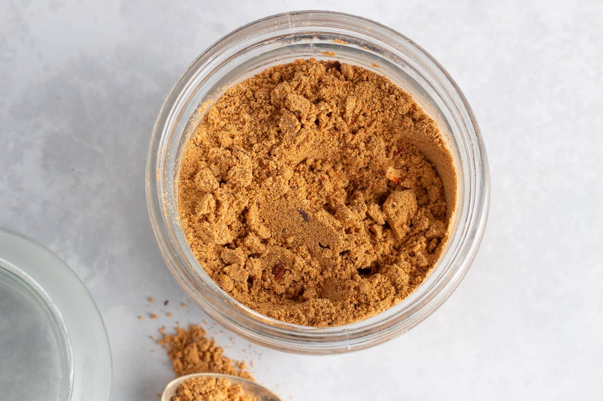

# Tsire Powder (West African Spice Coating)

*West Africa's spice coating: ground roasted peanuts mixed with chilli, ginger and onion powder.*

**Prep Time:** 5 minutes

**Yield:** Approximately 100-110 grams (makes 20-30 kebab portions)

## Overview
Tsire is the coarse coating powder behind West African grilled kebabs, particularly Nigerian suya: ground roasted peanuts mixed with warm spices, designed to crust onto meat over high charcoal heat. The peanuts are doing the structural work, so the texture lands closer to coarse breadcrumbs than spice powder. Grind unsalted roasted peanuts to a crumbly almost-sandy texture, stopping the moment oil starts to leak (any further and you've made peanut butter). Stir in mixed spice, chilli powder, salt, and optional ginger and cayenne. To use, cube beef, lamb or chicken, oil or egg-wash each piece, then roll generously in tsire and thread onto skewers. Grill over high heat till the coating caramelises into a dark crust. Use within 4 to 6 weeks at room temperature, or refrigerate up to 3 months; the peanut oils eventually turn.

## Ingredients

### Primary Coating Component
- 50 grams unsalted roasted peanuts (finely ground)

### Spice Additions
- 1 teaspoon ground [Mixed Spice](mixed-spice.md) (cinnamon, nutmeg, cloves blend)
- 1 teaspoon chilli powder
- 1 teaspoon fine sea salt
- ½ teaspoon ground ginger (optional)
- ¼ teaspoon cayenne pepper (optional, for extra heat)

## Method

### Stage 1 - Grind Peanuts
1. Place unsalted roasted peanuts in a spice grinder, food processor, or mortar.
1. Grind to a coarse powder (not a smooth peanut butter, leave some texture).
1. The result should resemble breadcrumbs more than powder.
1. Transfer to a bowl.

### Stage 2 - Combine Spices
1. Add mixed spice, chilli powder, salt, and optional ginger and cayenne to the ground peanuts.
1. Using a spoon, stir very thoroughly for 2-3 minutes.
1. Ensure all components are completely blended and uniformly distributed.
1. Break up any clumps that form.

### Stage 3 - Optional Sift
1. For finer texture, sift through a mesh sieve (optional, West African style often keeps some coarseness).
1. The goal is even distribution, not necessarily fine powder.

### Stage 4 - Use or Store
1. Transfer to airtight container with tight-fitting lid.
1. Use immediately or label with preparation date and store.

## Notes
- **Peanut Quality:** Use high-quality roasted unsalted peanuts. Salted peanuts will throw off the salt balance.
- **Texture Important:** Unlike ground spice blends, tsire benefits from maintaining some coarseness. Don't over-grind.
- **Coating Consistency:** The peanut powder should adhere to oil or egg on the meat, creating a flavorful crust as it cooks.
- **Meat Application:** Oil or egg acts as binder; coat meat, then roll thoroughly in tsire powder, coating all surfaces.
- **Grilling Essential:** This coating is designed for high-heat grilling over coals or flame. It caramelizes and develops while the meat cooks.
- **West African Tradition:** Tsire is street food and celebratory cooking; embrace the communal, outdoor spirit.

## Variations
- **Spicier Heat:** Increase chilli powder to 1 ½ teaspoons or add ½ teaspoon extra cayenne.
- **Milder Coating:** Reduce chilli powder to ½ teaspoon and omit cayenne.
- **Extra Peanut Depth:** Increase peanuts to 60 grams while keeping spice amounts the same.
- **Smoky Version:** Add ½ teaspoon smoked paprika (reduce mixed spice to ½ teaspoon if needed to maintain balance).
- **With Garlic:** Add ½ teaspoon garlic powder to complement the meat application.

## Serving
- Use in: Meat kebabs (grilled over coals), spiced lamb or beef skewers, grilled chicken preparations
- Typical ratio: 3-4 tablespoons tsire powder per 1 pound meat (about 6-8 skewers)
- Application: Oil or egg-beat meat, roll generously in tsire powder, grill over high heat
- Additional: Dust finished kebabs with a little more tsire powder before serving

## Storage
- Store in airtight container in cool, dark place away from light and heat
- Properly stored, remains potent for 4-6 weeks (peanut oils eventually go rancid)
- Because peanuts contain oils, this blend has shorter shelf-life than pure spice blends
- Check for musty smell or moisture before using after 4 weeks
- For longer storage (up to 3 months), refrigerate or freeze
- Stir before each use; peanut oils may separate slightly
- Does not keep at room temperature as long as other spice blends
- Make fresh every 4-6 weeks for optimal peanut freshness
- Grind fresh peanuts when possible for best flavor

*This simple spice mixture is used as a coating for kebabs throughout West Africa, particularly Nigeria. Cubes of raw meat are first dipped in oil or beaten egg, then rolled in tsire powder, creating a flavorful spiced crust that develops as the kebabs cook over coals or flame.*
