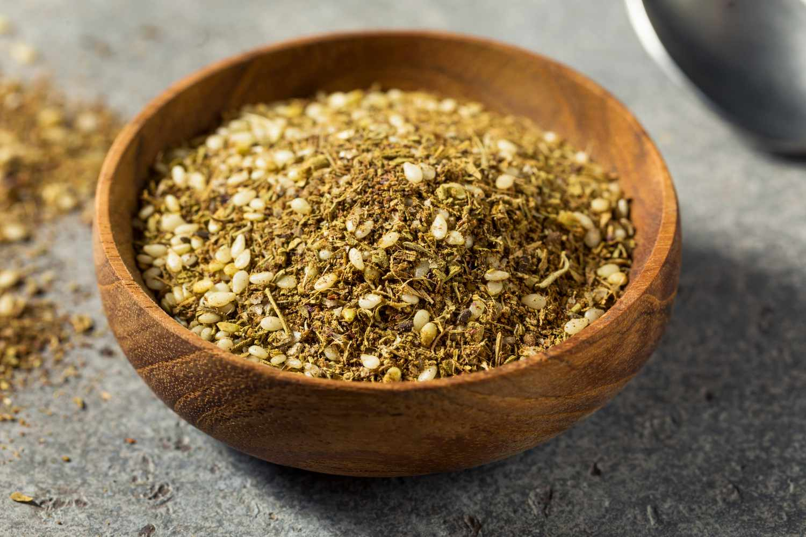

# Za'atar

*The Levantine herb-and-seed blend: dried thyme (or wild za'atar herb), sumac, toasted sesame seeds and salt, scattered on flatbread with olive oil at every Lebanese, Syrian and Palestinian breakfast.*

**Prep Time:** 10 minutes

**Yield:** Approximately 80 grams (makes 25+ portions)

## Overview
Za'atar is two things in one word: the wild Levantine herb (Origanum syriacum, somewhere between thyme, oregano and marjoram) and the spice blend built around it. The blend has been ubiquitous across Lebanon, Syria, Palestine, Jordan and Israel for centuries. Each family has its own recipe, and the proportions vary regionally: Lebanese za'atar leans on sumac for the tart-fruity note, Palestinian versions often add caraway, Jordanian versions can include extra nuts. The everyday use is the manakish breakfast, flatbread dough brushed with olive oil and za'atar before baking, but it scatters onto hummus, into roast chicken rubs, over labneh, into salad dressings. Make small batches: the sesame seeds go rancid faster than the dried herbs, and the whole point of the blend is that it tastes fresh.

## Ingredients

- 4 tablespoons dried thyme (or za'atar herb if you can find it)
- 2 tablespoons sumac
- 3 tablespoons sesame seeds
- 1 teaspoon dried oregano (optional, deepens the herb character)
- 1 teaspoon dried marjoram (optional)
- 1 teaspoon fine sea salt

## Method

1. Place a dry frying pan over medium heat.
1. Add the sesame seeds and toast, shaking the pan, for 2 to 3 minutes until pale gold and fragrant.
1. Tip onto a plate to cool; the seeds darken slightly off the heat.
1. In a bowl, combine the cooled sesame seeds, dried thyme, sumac, oregano, marjoram and salt.
1. Crush briefly with a pestle (or pulse in a food processor) so the seeds release some of their oil into the herbs.
1. Transfer to an airtight jar.

## Notes
- **Genuine za'atar herb.** Some Middle Eastern grocers sell dried za'atar (Origanum syriacum); the substitute of dried thyme + a pinch of oregano covers most of the flavour.
- **Sumac sourcing.** Look for vivid deep ruby-red sumac powder; dull brown sumac is old and weak.
- **Sesame ratio.** Lebanese versions go heavier on sesame (closer to 1:1 with the herbs); Palestinian versions go heavier on the thyme.
- **Salt level.** Adjust to taste; some commercial blends are over-salted to mask weak herbs.

## Serving
Use in: manakish bread topping, drizzled with olive oil for bread dipping, scattered on hummus, scattered on labneh, in roast chicken rubs, on grilled vegetables, in salad dressings
Typical ratio: 1 to 2 teaspoons per portion
Application: mixed with olive oil for spreads; scattered straight from the jar for finishing

## Storage
- Store in an airtight glass jar in a cool dark cupboard
- Best within 3 to 4 months while the sesame is fresh
- The seeds go rancid before the herbs do; use the sniff test

*The herb-and-seed blend that defines Levantine breakfast. Brushed onto flatbread with olive oil, scattered over hummus, baked into chicken, za'atar shows up at every meal of the day across Lebanon, Syria, Palestine and beyond.*
