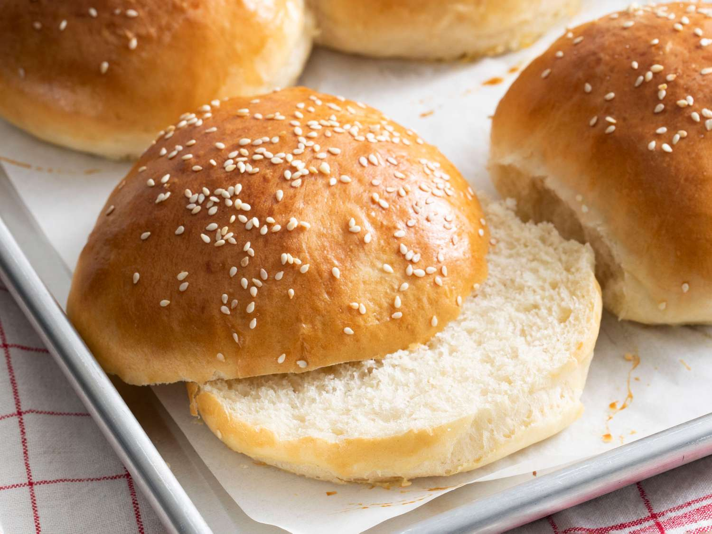

# Burger Buns

*The home-baker's burger bun: soft, slightly enriched white bread shaped into round buns, brushed with egg and topped with sesame seeds.*

**Prep Time:** 10 minutes

**Yield:** 10 buns (serves 10)

**Cook Time:** 10 minutes

## Overview
Burger buns are the home-baker's building block for proper burgers, pulled-pork sandwiches and steak sarnies: soft pillowy white rolls with a tender slightly sweet crumb, an egg-glazed golden top and a scatter of sesame seeds. The fat and dairy do the heavy lifting on texture. Lard gives a slightly flakier lighter crumb than butter (it's the traditional choice for this style of bun), the milk and water together strike the right balance between richness and softness without making the dough too heavy, and a tablespoon of sugar feeds the yeast while adding the gentle sweetness that pairs well with savoury fillings. Mix flour, sugar, lard and salt in a bowl, dissolve the yeast in tepid water, add tepid milk, then pour the liquid into the dry and stir to a soft almost sticky dough; resist the urge to add flour to firm it up, the wetness is what makes the buns tender (rub a little olive oil on your hands instead of dusting more flour). Knead 10 minutes till smooth and elastic, prove an hour till doubled, then divide into 10 equal pieces and roll each into a ball, flattening to a 10 cm disc with a rolling pin. Brush with beaten egg, prove 30 minutes, brush a second coat (the first helps the sesame stick, the second gives the glossy gold finish), sprinkle generously with sesame seeds and rest a final 30 minutes till noticeably puffier. Bake at 200 C for 10 to 15 minutes till deep gold and hollow when tapped underneath, cool briefly on a rack and use the same day, ideally still warm. Day-old buns toast beautifully.

## Ingredients

### Dough
- 500 grams strong white flour
- 1 tablespoon caster sugar
- 25 grams lard (or softened butter)
- 1 tablespoon fine sea salt
- 5 grams dried yeast (approximately 1 teaspoon)
- 200 ml whole milk (tepid, approximately 40°C)
- 100 ml warm water (tepid, approximately 40°C)

### For Finishing
- 1 egg (beaten)
- Sesame seeds (for sprinkling)
- Extra flour for dusting

## Method

### Stage 1 - Mix Dough
1. In a large bowl, combine the flour, sugar, lard, and salt.
1. Combine the yeast with the tepid water in a small bowl, stirring until dissolved.
1. Add the tepid milk to the yeast mixture.
1. Pour the liquid mixture into the flour and mix thoroughly with a wooden spoon until a soft dough forms.
1. The dough should be soft, almost sticky; this is correct.

### Stage 2 - Knead
1. Turn the dough out onto a lightly floured surface.
1. Knead for 10 minutes until the dough becomes soft and elastic.
1. If the dough is too sticky, rub your hands with a little olive oil rather than adding flour.
1. The dough should be smooth and slightly tacky but hold together.

### Stage 3 - First Rise
1. Place the dough in a lightly oiled bowl, cover with a tea towel.
1. Leave to rise for 1 hour in a warm place (about 20-25°C).
1. The dough should roughly double in size.

### Stage 4 - Shape Buns
1. Divide the dough into 10 equal pieces.
1. On a lightly floured surface, roll each piece into a ball with your hands.
1. Using a rolling pin, gently flatten each ball into a disc approximately 10 cm diameter.
1. Place each bun on baking trays lined with baking paper, spacing them about 5 cm apart.

### Stage 5 - First Egg Wash & Initial Rise
1. Brush beaten egg over the top of each bun.
1. Cover loosely with cling film.
1. Leave them in a warm place for 30 minutes to rise.
1. The buns should become visibly lighter and puffier.

### Stage 6 - Final Egg Wash & Seed Topping
1. Brush a second coat of beaten egg over each bun.
1. Sprinkle a generous pinch of sesame seeds onto each bun, gently pressing them to adhere.
1. Cover loosely with cling film and leave for a final 30 minutes to rise.
1. The buns should look slightly puffy and golden.

### Stage 7 - Bake
1. Meanwhile, preheat your oven to 200°C.
1. Bake the buns until they are perfectly golden, about 10-15 minutes.
1. The buns should sound hollow when tapped on the bottom.
1. Transfer to a wire rack to cool.

## Notes
- **Lard vs. Butter:** Lard creates a slightly lighter, flakier crumb than butter; either works well. Lard is traditional for this style of bun.
- **Milk & Water Ratio:** The combination of milk and water creates tender, soft dough without being too rich; milk alone makes the dough too dense.
- **Dual Egg Wash:** The first coat helps the sesame seeds adhere; the second coat creates the glossy, golden finish.
- **Sesame Seeds:** These add visual appeal and pleasant textural contrast; don't skip them, but they're optional and can be replaced with poppy seeds.
- **Softness:** The relatively high water content creates soft dough; this is intentional and creates tender buns.
- **Doubling Test:** The buns are ready for the oven when they've become noticeably puffy and feel light; don't over-proof or they'll deflate.

## Variations
- **Everything Bagel Topping:** Replace sesame seeds with a mix of poppy seeds, sesame seeds, and dried onion flakes.
- **Whole Wheat:** Replace 150g white flour with whole wheat flour for nuttier flavor and denser crumb.
- **Sugar-Topped:** Omit sesame seeds and brush the final egg wash, then sprinkle coarse sugar instead.
- **Herb Buns:** Add 1 tablespoon finely chopped fresh rosemary or thyme to the dough after mixing.
- **Smaller Dinnerrolls:** Divide dough into 15-16 pieces for smaller rolls; reduce baking time to 8-10 minutes.

## Serving
- **Serve:** Warm from the oven, ideally, or toasted the next day
- **Fill with:** Burgers, pulled meats, grilled vegetables, sandwiches
- **Best within:** 24 hours of baking; excellent toasted on day 2

## Storage
- Best served the day they're baked while soft
- Store in a paper bag at room temperature for up to 2 days
- After 2 days, slice and freeze in plastic wrap for up to 1 month
- Refresh stale buns: Wrap loosely in foil and warm in a 180°C oven for 5-10 minutes
- Do not refrigerate; refrigeration stales bread faster

*These golden-topped burger buns are simple to make, and work especially well when cut in half, toasted, and eaten as a steak sandwich. Where most people go wrong is not making the mixture wet enough and so the finished bread ends up too doughy and dry. Once the water is added, don't flood the work surface with flour as it will unbalance the recipe; instead, use olive oil if needed.*
