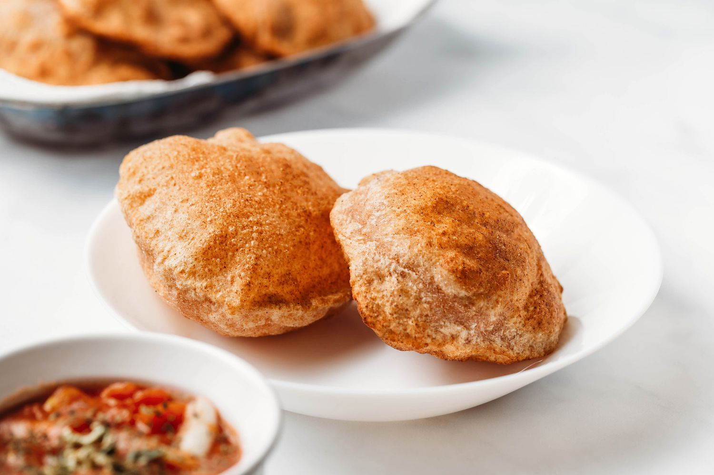

# Chilli Pooris

*North India's chilli pooris: small wholemeal flatbreads spiced with chilli and ajwain, deep-fried till they puff into golden balloons.*

**Prep Time:** 10 minutes

**Yield:** 12 pooris (serves 4)

**Cook Time:** 10 minutes

## Overview
Chilli pooris are the building block of an Indian street-food spread and the bread you reach for when a curry or dal needs something that puffs dramatically on the plate: small wholemeal-and-plain-flour discs studded with chopped fresh red chilli, deep-fried at high heat into golden balloons. No yeast, no proving, just a firm kneaded dough and hot oil doing the lift. Sift the two flours with salt and chilli powder, rub in a couple of tablespoons of oil, then bring it together with water added carefully a little at a time. The dough has to be firmer than roti dough (a sticky dough never puffs, it just sits flat in the oil), so add water conservatively, kneading for a full 10 minutes till the dough turns smooth and springy. Rest under cling film for 30 minutes to relax the gluten, knead in the chopped chilli at the end so it stays in visible specks, then divide into 12 small balls and roll each into a 13 cm disc, keeping them stacked between sheets of cling film so they don't dry out (a dried-out poori is another reason they fail to puff). Heat oil to 180 C in a deep pan, slide one poori in at a time, and the moment it surfaces, press it gently down into the oil with the back of a spatula; that single action is what causes the steam to expand and balloon the disc into a puffed sphere within seconds. Flip after three to five seconds, cook the second side 20 to 30 seconds till pale gold (any darker and they go hard rather than crisp), drain on paper, and serve hot, straight away. They deflate as they cool.

## Ingredients

### Dry Ingredients
- 115 grams plain all-purpose flour
- 115 grams wholemeal flour
- ½ teaspoon fine sea salt
- ½ teaspoon mild chilli powder

### Wet Ingredients & Flavoring
- 2 tablespoons vegetable oil
- 1 fresh red chilli (de-seeded and finely chopped)
- 100 ml water (plus an additional 20 ml if needed)

### For Cooking & Serving
- Vegetable oil (for deep frying, approximately 500 ml)

## Method

### Stage 1 - Mix Dough
1. Sift the plain flour, wholemeal flour, salt, and chilli powder into a large bowl.
1. Add 2 tablespoons vegetable oil to the dry ingredients.
1. Gradually mix in water, a little at a time, until you have a firm dough.
1. **Important:** The dough should be firm, not sticky; if it's too sticky, it won't puff. Add water conservatively.

### Stage 2 - Knead
1. Turn the dough out onto a lightly floured surface.
1. Knead firmly for 10 minutes until it is smooth, elastic, and springy.
1. The dough should feel silky and responsive to pressure.

### Stage 3 - Rest
1. Place the dough in a lightly oiled bowl.
1. Cover with cling film.
1. Leave to rest for 30 minutes at room temperature (this allows gluten to relax).

### Stage 4 - Incorporate Chilli & Divide
1. Turn the dough out onto a lightly floured surface.
1. Knead in the finely chopped fresh red chilli, distributing it evenly throughout the dough.
1. Divide the dough into 12 equal pieces (approximately 25g each).
1. Keep the pieces covered to prevent drying.

### Stage 5 - Roll
1. Working with one piece at a time, roll it into a thin disc approximately 13 cm (5 inches) diameter.
1. Keep the discs between sheets of cling film to prevent sticking and drying out.
1. Stack the rolled pooris between layers of cling film.
1. **Important:** Keep uncooked pooris covered; they dry out quickly and won't puff when fried.

### Stage 6 - Heat Oil & Prepare
1. Pour oil into a deep pan (or wok) to a depth of 2 ½ cm (1 inch).
1. Heat the oil to 180°C.
1. **Temperature test:** A cube of day-old bread added to the oil should brown in approximately 40-45 seconds; if faster, oil is too hot; if slower, oil is too cool.
1. Preheat the oven to a low 100°C (this keeps cooked pooris warm while you finish frying).

### Stage 7 - Fry
1. Using a spatula or spoon, lift one poori and slide it gently into the hot oil.
1. The poori will initially sink, then rise and begin to sizzle.
1. **Key step:** Using the back of the spatula, gently press the poori into the oil; this helps it puff up dramatically and cook evenly.
1. The poori should puff into a balloon within a few seconds.
1. Turn the poori over after 3-5 seconds and cook the second side for 20-30 seconds until pale golden.
1. **Don't overcolor:** Pooris should be pale golden, not dark (dark means they've cooked too long and will be hard).

### Stage 8 - Drain & Keep Warm
1. Remove the cooked poori from the pan using tongs or a spatula.
1. Drain on kitchen paper, placing it on several layers to absorb oil.
1. Keep warm in a preheated 100°C oven while you cook the remaining pooris.
1. Pooris are best served hot immediately; they soften as they cool.

## Notes
- **Oil Temperature:** This is critical; too cool and the pooris won't puff; too hot and they brown before cooking through. Use a thermometer.
- **Firm Dough:** The dough must be firmer than typical roti or bread dough; this allows proper puffing when fried.
- **Fresh Chilli:** The fresh chilli adds flavor and heat; de-seed if you prefer milder results.
- **Puffing Technique:** Gently pressing the poori into the hot oil with a spatula encourages it to puff upward and cook evenly on both sides.
- **Serving Immediately:** Pooris crisp outside and soften as they cool; ideally eat them within minutes of frying.
- **Flour Balance:** The mix of whole wheat and plain flour creates nice texture; all plain flour works but is blander.

## Variations
**Spicier Heat:** Add ½ teaspoon chilli powder to the dough, or use red chilli powder instead of mild.
**Plain Pooris:** Omit the fresh chilli and chilli powder for simple, unseasoned version.
**Herb Pooris:** Add 1 tablespoon finely chopped fresh coriander or mint to the dough.
**Bigger Pooris:** Roll into 15 cm discs for larger puffed breads (they take 40-60 seconds per side).
**Sooji Pooris:** Replace plain flour with sooji (semolina) for crispier texture.

## Serving
Serve with: Potato curry, dal, pickles, chutneys, or curries
Accompany: With fresh lime juice and onion slices
Temperature: Serve immediately while hot and crispy
Vessel: Serve in a basket lined with cloth to retain heat and crispness

## Storage
- Best served immediately after frying
- Store cooled pooris in an airtight container at room temperature for up to 1 day (they become soft)
- Reheat in a 180°C oven for 3-5 minutes to re-crisp
- Do not refrigerate; pooris become limp in cold
- Do not freeze; texture becomes grainy when thawed
- Pooris are best fresh-made; they don't store well longer than 1-2 hours

*These small discs of dough puff up into light, airy breads when fried. Lightly studded with pieces of fresh red chilli, they melt into your mouth and leave you with a warm, spicy glow. Pooris are Indian street food at its finest.*
