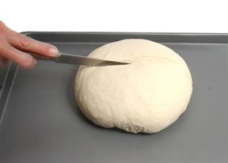

# Coburg

*A British coburg: a round loaf slashed across the top in a deep cross, baked to open in four crusty quarters. Plain crumb, dramatic shape.*

**Prep Time:** 20 minutes

## Overview
A Coburg is similar to a cob except that it has a cross slashed into the top. The four resulting quarters open up dramatically in the oven, producing a distinctive blistered crust and a clear visual divide across the top. Same dough, same shaping as a cob; just a different finishing cut.

## Method
1. Create a cob shape, place the dough onto a lightly greased baking sheet, cover with a kitchen towel, and allow the dough to rise for the final time. Slash the dough down the centre creating a deep score that divides the dough into halves.

2. Slash the dough again perpendicular to the first score, dividing the dough into quarters and then bake.
