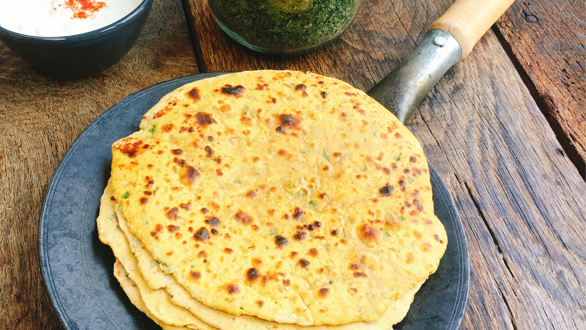

# Missi Rotis

*Punjab's mixed-flour roti: wholemeal and gram flour kneaded with chilli, onion and herbs, rolled and griddled on a hot tawa.*

**Prep Time:** 15 minutes

**Cook Time:** 2 minutes

**Yield:** 4 rotis

## Overview
Missi rotis are Punjab's mixed-flour flatbread, the building block of a north Indian dal-and-roti supper: thick speckled discs of gram flour (chickpea flour) and wholemeal blended with chopped green chilli, finely diced onion, fresh coriander and turmeric, kneaded into a soft yellow dough and pan-fried on a hot tawa till golden patches develop. The gram flour does the work that makes them special; it gives the rotis their nutty earthy savour and a slightly denser tender crumb than a pure-wheat chapati, and pulls about 25 percent protein into the bread without changing the technique. Mix the two flours in a bowl with chopped chilli, very finely chopped onion (any larger and it'll tear holes in the dough as you roll), chopped coriander, turmeric and salt. Make a well, pour in a tablespoon of melted butter, then add lukewarm water gradually, mixing with your fingers till you have a soft pliable dough; flours vary so add water carefully, you may not need all of it. Knead 3 to 4 minutes till smooth, then rest covered for a full hour (this isn't optional, it relaxes the gluten and lets you roll thin discs without tearing). Divide into four balls, roll each into a 15 cm round on a floured surface, then onto a medium-hot griddle or heavy frying pan brushed with melted butter; cook 2 minutes till golden patches form underneath, flip and cook another 1 to 2 minutes till the second side is freckled too. Brush with more butter as they come off the heat and stack them under a tea towel while you finish the rest. Serve hot with dal, curry, plain yoghurt and lime pickle.

## Ingredients

### Dry Mix
- 115 grams gram flour
- 115 grams wholemeal flour
- 1 fresh green chilli (de-seeded and chopped)
- ½ onion (very finely chopped)
- 1 tablespoon fresh coriander (chopped)
- ½ teaspoon ground turmeric
- ½ teaspoon fine sea salt

### Wet & Fat
- 3 tablespoons melted butter
- 120 ml lukewarm water (plus extra 30 ml as needed)

## Method

### Stage 1 - Mix Dry Ingredients
1. Place both flours in a large bowl.
1. Add the chopped green chilli, finely chopped onion, fresh coriander, turmeric, and salt.
1. Mix everything together with your fingers until well combined.

### Stage 2 - Create Dough
1. Make a well in the center of the dry mix.
1. Pour in 1 tablespoon of the melted butter.
1. Add the lukewarm water gradually, mixing with your fingers as you go.
1. Add water in small increments until a soft, pliable dough forms; you may not need all 120 ml.
1. The dough should be soft but not sticky; if it's too firm, add the extra water 15 ml at a time.

### Stage 3 - Rest Dough
1. Turn the dough onto a lightly floured surface and knead for 3-4 minutes until smooth.
1. Place the dough in a lightly oiled bowl.
1. Cover the bowl with cling film or a damp cloth.
1. Leave to rest in a warm place for 1 hour. This develops the gluten and makes rolling easier.

### Stage 4 - Shape & Cook
1. Preheat your oven to a low 100°C.
1. Turn the rested dough onto a lightly floured surface.
1. Divide the dough into 4 equal pieces and roll each into a ball.
1. Using a rolling pin, gently roll each ball into a thick round about 15 cm in diameter.
1. Heat a griddle or heavy frying pan over medium heat for 2-3 minutes until hot.

### Stage 5 - Pan-Fry
1. Brush both sides of one roti lightly with melted butter.
1. Place it on the hot griddle and cook for approximately 2 minutes.
1. Flip and cook the second side for 1-2 minutes until light golden patches appear.
1. Remove from the griddle and brush again with melted butter.
1. Transfer to a warm plate and keep warm in the preheated oven.
1. Repeat with the remaining rotis.
1. Serve warm immediately.

## Notes
- **Gram Flour Proportion:** The combination of gram flour and wholemeal creates a uniquely textured, protein-rich bread. Don't skip the gram flour; it's essential to the character of the dish.
- **Fresh Herbs:** Use fresh coriander, not dried. The fresh flavor is integral to the recipe.
- **Water Absorption:** Flours vary in their water absorption. Start with 120 ml and add more only if needed; too wet and the dough becomes sticky and impossible to roll.
- **Resting is Key:** The 1-hour rest is not optional. It develops gluten and makes the dough much easier to roll out without tearing.
- **Pan Temperature:** Medium heat is crucial; too hot and the outside burns before the inside cooks through.

## Variations
- **Extra Spiced:** Add ½ teaspoon cumin powder and ¼ teaspoon black pepper for deeper spice.
- **With Fenugreek:** Replace half the coriander with fresh fenugreek (methi) leaves.
- **Minimal Spice:** Reduce turmeric to ¼ teaspoon and omit the chilli for milder versions.
- **Thicker Rotis:** Roll to 18-20 cm diameter for thicker, chewier bread.

## Serving
- Serve with: Dal, curry, soup, chutney, or pickle
- Temperature: Serve warm, immediately after cooking
- Amount: 1 roti per person as an accompaniment
- Accompaniments: Plain yogurt, pickle, or fresh lime wedges

## Storage
- Best served warm immediately after cooking
- Can be stored stacked in a warm chapati container or wrapped in foil for up to 2 hours
- Refrigerate leftovers in an airtight container for up to 2 days
- Reheat gently in a dry pan over low heat for 30 seconds per side
- Do not freeze; texture becomes rubbery

*These savory Indian flatbreads are made from gram flour and wholemeal flour, flavored with fresh herbs and spices. They're quick to make and pair beautifully with soups or curries.*
