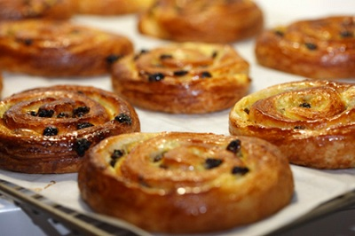

# Pains au Raisins

*France's spiral pastry: a butter-laminated croissant dough rolled around a crème pâtissière and raisins.*

**Prep Time:** 5 minutes

**Yield:** 30 pastries

## Overview
Pains aux raisins are the building block of the French breakfast pastry counter: spiral discs of laminated croissant dough rolled around a generous smear of crème pâtissière and rum-soaked sultanas, baked till deep gold and slightly caramelised at the edges. The sultanas are the part you can't shortcut; soak 250 g in a hot sugar-and-rum syrup for two hours so they plump up dark and aromatic, then drain them thoroughly before scattering or the wet syrup will pool in the dough and make the spirals soggy. Roll your 1.1 kg of croissant dough into a 65 by 35 cm rectangle about 4 mm thick (the dough is the same lamination you'd use for croissants or pains au chocolat, with the butter-layer architecture doing all the work later), trim the edges, then spread 400 g of cold crème pâtissière evenly across the surface leaving a 1 cm clean border. Scatter the drained sultanas across the cream, brush the borders with egg wash, then roll the rectangle into a tight log starting from the long edge furthest from you. Lay the log seam-down on a lined tray and freeze for 30 to 45 minutes till firm; this is the trick that lets you slice clean uniform spirals later (a soft log smears under the knife). Slice into 2 cm rounds with a sharp knife dipped in hot water between cuts, lay each round cut-side down on a lined tray well-spaced, and prove at 24 to 30 C for an hour till noticeably puffed. Bake at 170 C for 12 minutes till deep gold, lift carefully off with a palette knife (they're fragile while hot), and eat warm with hot chocolate or strong coffee.

## Ingredients

### Pastry & Cream
- 1.1 kg croissant dough (prepared according to [croissant dough recipe](../baking/pastry/croissant-dough.md))
- 400 grams crème pâtissière (prepared according to [crème pâtissière recipe](../baking/cremes/creme-patissiere.md), substituting half the flour with custard powder)

### Sultanas & Soaking
- 250 grams sultanas (or golden raisins)
- 100 grams caster sugar
- 50 ml dark rum
- 200 ml water

### For Assembly
- Eggwash: 1 egg yolk mixed with 1 tablespoon milk

## Method

### Stage 1 - Prepare the Sultanas
1. Place 200 ml water in a saucepan.
1. Add the sugar, sultanas, and dark rum.
1. Slowly bring to a boil over low heat.
1. Let bubble gently for 2 minutes.
1. Remove from the heat.
1. Leave to stand and soak for 2 hours at room temperature.
1. Just before using, drain the sultanas thoroughly in a fine sieve, discarding the liquid.

### Stage 2 - Roll & Fill the Dough
1. On a lightly floured surface, roll the croissant dough into a rectangle approximately 65 x 35 cm, about 4 mm thick.
1. Trim the edges with a chef's knife to create clean borders.
1. Using a palette knife, spread the crème pâtissière evenly over the dough, leaving a 1 cm margin free all around the edges.
1. Scatter the drained sultanas evenly over the crème pâtissière.
1. Brush the pastry edges with eggwash.

### Stage 3 - Roll & Chill
1. Working away from you, roll the pastry rectangle tightly into a sausage shape.
1. Place the roll seam-side down on a parchment-lined baking sheet.
1. Transfer to the freezer for 30-45 minutes until firm.

### Stage 4 - Cut & Proof
1. Remove the pastry roll from the freezer.
1. Using a very sharp knife (dip it in hot water between cuts for clean edges), cut the pastry sausage into 2 cm thick rounds.
1. Place each round cut-side down on a parchment-lined baking sheet, spacing them about 5 cm apart.
1. Leave in a warm place (approximately 24-30°C) for 1 hour to proof.

### Stage 5 - Bake
1. Preheat the oven to 170°C.
1. Bake the pains aux raisins for 12 minutes until golden brown.
1. Transfer immediately to a wire rack using a palette knife (they're delicate while hot).
1. Leave to cool until just warm before serving.

## Notes
- **Sultana Preparation:** Soaking the raisins in rum and sugar adds depth and keeps them moist during baking. Don't skip this step.
- **Crème Pâtissière:** Make this ahead if possible; it's easier to spread when well-chilled.
- **Rolling Tightness:** Roll the pastry firmly but evenly to create uniform spirals; loose rolling creates gaps that separate during baking.
- **Freezing the Roll:** This step firms the pastry, making it easier to cut clean, uniform slices without smearing the cream.
- **Sharp Knife:** A warm, sharp knife creates clean cuts. Wipe the knife between cuts.
- **Spiral Formation:** The spiral happens naturally during proofing as the pastry rises around the filled center.

## Variations
- **With Custard Only:** Omit the sultanas and use custard cream throughout for a simpler version.
- **Chocolate & Raisin:** Add chocolate chips alongside the sultanas.
- **Spiced Raisins:** Infuse the soaking liquid with cinnamon sticks and star anise.
- **With Pistachios:** Scatter chopped pistachios over the cream before rolling.
- **Alternative Spirits:** Use Grand Marnier, cognac, or coffee liqueur instead of rum.

## Serving
- **Serve with:** Hot chocolate, strong coffee, or tea
- **Temperature:** Serve warm or at room temperature
- **Amount:** 1-2 pastries per person
- **Accompaniments:** Jam, pastry cream, or unsweetened crème fraîche

## Storage
- Best served warm on the day of baking
- Keeps at room temperature in an airtight container for 1 day
- Reheat gently in a 160°C oven for 3-4 minutes to restore warmth
- Can be prepared and frozen before baking; bake directly from frozen at 170°C for 14-15 minutes
- Do not refrigerate; cold makes them stodgy

*These classic French breakfast pastries should be served with a steaming cup of hot chocolate.*
