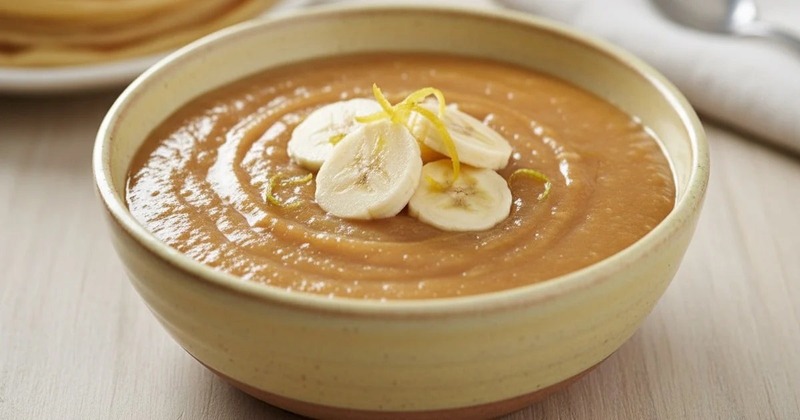

# Banana Sauce

*With its Caribbean flavour, this simple sauce is a perfect accompaniment to a dish of exotic fruits*

**Serves:** 8

**Prep Time:** 5 minutes

**Cook Time:** 20 minutes

## Overview
Banana sauce is the building block for tropical and Caribbean-leaning desserts, a smooth pourable sauce that ties pale caramel, blended banana, crème fraîche and white rum into something that drapes itself over ice cream, exotic fruit salads or a slice of pastry and instantly makes the plate feel finished. Two banana details set the tone. Toss the sliced fruit with lemon juice the second it's peeled (banana browns the moment air hits it, and brown banana makes a grey-tinted sauce no matter what you do later), and cook the sugar only to a pale caramel; take it any deeper and the bitter caramel notes overshadow the soft fruit. Dissolve the sugar in 150 ml of water in a heavy-bottomed pan over low heat, then bring it up to a boil and cook it just to that pale gold stage. Take it off the heat (this stops the caramel running away into bitterness) and stir in the lemon-tossed banana, crème fraîche, white rum and milk with a spatula. Return it to medium heat and let it bubble gently for around 20 minutes, stirring often, till the banana breaks down and the sauce thickens to coat-the-spoon. Cool slightly, then blitz in a blender for a full minute and push through a fine sieve to strip out any banana fibre; that final straining is what turns a homemade sauce into a restaurant one. Chill and serve from cold over warm fruits or ice cream.

## Ingredients
- 2 bananas (medium)
- 1 lemon (juice)
- 350 grams caster sugar
- 200 grams crème fraîche
- 100 ml white rum
- 150 ml milk

## Method
1. Peel the bananas, slice into rounds and immediately toss with the lemon juice to stop them discolouring.
1. Dissolve the sugar in 150 ml water in a heavy-based saucepan over a low heat, then bring to the boil and cook to a pale caramel. 
1. Take off the heat and add all the other ingredients, mixing gently with a spatula.
1. Return the pan to a medium heat and cook at a gentle bubble for about 20 minutes, delicately stirring the mixture frequently.
1. Leave the sauce to cool slightly, then transfer to a blender and purée for 1 minute. 
1. Pass the sauce through a fine-meshed conical sieve into a bowl and keep it in the fridge until ready to use.

## Notes
- **Lemon juice:** Essential to prevent oxidation and browning of banana purée. Add immediately after peeling.
- **Caramel color:** Cook the sugar to pale caramel, not brown, to maintain the sauce's vibrant hue.
- **Straining:** Pressing through a sieve removes any banana fibers for a smooth, refined texture.
- **Rum quality:** Use dark rum for deeper, more complex tropical flavors.

## Serving
- **Serve with:** Exotic fruit medley, poached pears, vanilla ice cream, or pastries
- **Drizzle on:** Warm plates for an elegant plating presentation

## Storage
- Keeps 3-4 days refrigerated in an airtight container
- Does not freeze well due to banana texture degradation
- Serve chilled or at room temperature
- Flavor increases and mellows during storage
