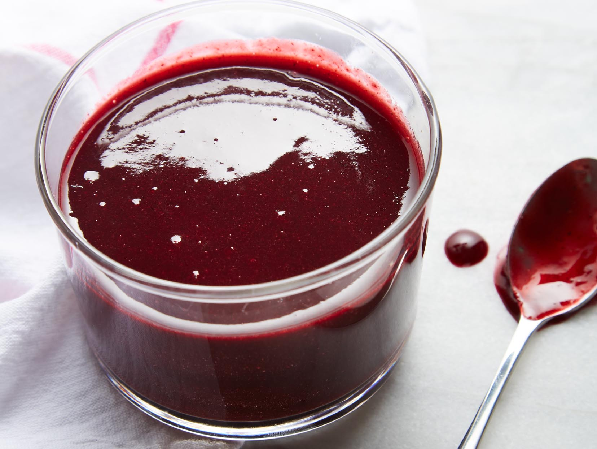

# Blackberry Coulis

*Delicious served with poached pears, parfaits, ice bombes or ice creams.*

**Serves:** 6 - 8

**Prep Time:** 15 minutes

## Overview
Blackberry coulis is the building block that gives a plated dessert its dramatic dark-purple slick: ripe blackberries blitzed with a light sirop à sorbet, a slug of Kirsch, and a squeeze of lemon to keep the fruit lifted. There's almost nothing to it; the work is all in the ingredients and the strain. Tip the blackberries into a blender with the syrup, kirsch and lemon juice and blitz for a full minute till the fruit collapses into a deep glossy purée, then push the whole thing through a fine-meshed conical sieve with the back of a spoon to leave the seeds behind. The seeds matter: leave them in and every spoonful crunches, strain them out and you get the smooth velvety pour that paints a clean stripe across a white plate. Use ripe in-season fruit for the colour (a peak-summer blackberry will give you that jewel-tone purple; pale berries make a thin pinkish sauce), and the kirsch is the secret note that turns the whole thing from a fruit purée into a coulis with a faint warming top-note. The sirop à sorbet is non-negotiable for the right balance of sweetness and pour; if you have to substitute, use equal parts sugar and water cooked to a light syrup and cooled. Chill before serving over poached pears, vanilla ice cream, parfaits or an ice bombe, and freezes well for up to two months.

## Ingredients
- 450 grams blackberries
- 150 ml [sirop a sorbet](../../base-ingredients/syrup/sirop-a-sorbet.md)
- 50 ml Kirsch
- ½ lemon (juice)

## Method
1. Place all the ingredients into a blender and purée for about 1 minute until it forms a purée, then rub through a fine-meshed conical sieve.

## Notes
- **Berry quality:** Use ripe, in-season blackberries for maximum flavor and beautiful color.
- **Kirsch:** This clear brandy adds floral brightness; substitute with raspberry liqueur if preferred.
- **Sirop à sorbet:** Essential for proper consistency. If unavailable, use equal parts sugar and water syrup.
- **Straining:** Push the coulis through the sieve with the back of a spoon to extract all flavor while leaving seeds behind.

## Serving
- Serve with: Poached pears, vanilla ice cream, parfaits, or as a plating element on dessert plates
- Drizzle on: White plates for striking color contrast and elegant presentation

## Storage
- Keeps 4-5 days refrigerated in an airtight container
- Freezes well up to 2 months
- Best served chilled
- Color and flavor may intensify slightly during storage
