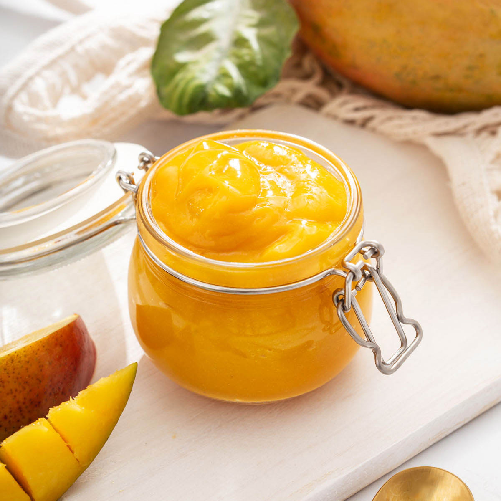

# Mango Coulis with Saffron

*This fragrant coulis can be served topped with soft poached meringues, as a variation of the classic floating islands, which uses a base of crème anglaise.*

**Serves:** 6

**Prep Time:** 10 minutes

## Overview
Mango coulis with saffron is the building block for floating-island desserts and any plated dessert that wants a golden silk pour underneath: ripe mango blitzed smooth with lemon and a light sirop à sorbet, then laced with saffron-infused syrup so the colour deepens to a richer amber and the flavour picks up that faint honeyed perfume the threads carry. Mango ripeness is the whole game. Fragrant, soft, just past firm is the target; an unripe mango makes a thin pale-tasting sauce and no amount of saffron will rescue it. Dice the flesh straight into a blender with the lemon juice and all but two tablespoons of the syrup, blitz for two full minutes till velvety, then push through a fine-meshed sieve into a bowl to strip out any fibre. Meanwhile warm the reserved two tablespoons of syrup gently in a small pan with a pinch of saffron threads and pull it off the heat the moment it's hot enough to steam; the threads need warmth to bloom and release their colour, but boiling them dulls the perfume. Let the syrup cool completely (don't tip warm saffron into the cold purée or it'll smear rather than infuse evenly), then stir it through the coulis and chill for at least two hours so the flavours marry. Serve well chilled with soft poached meringues for île flottante done the tropical way, or over panna cotta, vanilla ice cream or a simple fruit salad.

## Ingredients
- 250 grams mango (diced)
- ½ lemon (juice)
- 250 ml [sirop a sorbet](../../base-ingredients/syrup/sirop-a-sorbet.md)
- pinch saffron threads

## Method
1. Put the diced mango into a blender with the lemon juice and all but 2 tablespoons of the sirop a sorbet. 
1. Purée the mixture for 2 minutes in a blender, then strain the purée through a fine-meshed conical sieve into a bowl.
1. In a small saucepan, warm the reserved syrup with the saffron threads, then leave to cool. 
1. When the syrup is cold, mix it into the mango coulis and chill until ready to serve. 

## Notes
- **Mango ripeness:** Use perfectly ripe, fragrant mangoes; unripe fruit produces dull, flat flavor.
- **Saffron infusion:** The brief steeping in syrup extracts color and elegance without overpowering the delicate mango.
- **Straining:** Removes any fibrous bits for a silky, refined texture.
- **Make-ahead:** Coulis improves when chilled for several hours as flavors meld.

## Serving
- Serve with: Soft poached meringues, vanilla ice cream, fruit salads, or panna cotta
- Temperature: Well chilled
- Garnish with: A few saffron threads or a mint leaf

## Storage
- Keeps 3-4 days refrigerated in an airtight container
- Does not freeze well due to mango texture degradation
- Serve well chilled
- Flavour mellows as it sits; best after 2+ hours chilling
