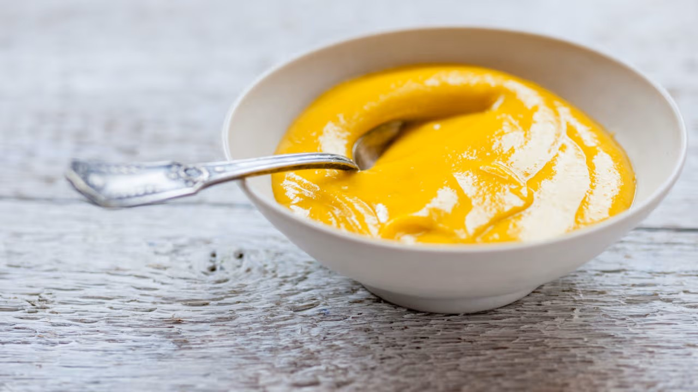

# Orange Butter Sauce

*A lovely rich, tangy sauce to serve with crêpes , a warm plum tart or a chocolate soufflé. A few drops of Grand Marnier can be added for extra warmth.*

**Serves:** 6

**Prep Time:** 15 minutes

## Overview
Orange butter sauce is the building block for crêpes Suzette, warm plum tarts, chocolate soufflés and any dessert that wants a glossy intensely citrus pour over the top, and it goes together in about fifteen minutes. It's effectively a fruit-juice beurre blanc: reduce fresh orange juice with icing sugar to concentrate the flavour, then whisk in soft butter off the heat for a silky emulsion. Fresh juice matters more here than anywhere else (bottled juice is flat and dull, and a sauce this short can't carry it), so squeeze six oranges and strain the juice through a conical sieve into a heavy-based pan with the icing sugar. Bring it slowly to the boil, then let it bubble over medium for several minutes till it reduces by half and turns syrupy enough to coat the back of a spoon. Turn the heat off (residual heat alone will carry the butter in; live heat splits the emulsion), then whisk in 125 g of softened butter a small piece at a time, only adding the next once the last has melted into the syrup. The sauce thickens and turns glossy as it goes. Serve at room temperature, or barely warm; if it cools too much it tightens, but a touch of fresh orange juice loosens it back. A few drops of Grand Marnier whisked in at the end adds a warming spice note that lifts the whole thing.

## Ingredients
- 6 oranges (juice)
- 100 grams icing sugar
- 125 grams butter (softened)

## Method
1. Strain the orange juice through a conical sieve into a heavy-based saucepan and add the icing sugar. 
1. Slowly bring to the boil and let bubble over a medium heat until reduced by half.
1. Turn off the heat and whisk in the softened butter, a little at a time. 
1. Serve the sauce at room temperature.

## Notes
- **Orange juice:** Use freshly squeezed juice from ripe oranges; bottled juice cannot replicate the brightness.
- **Reduction:** Cooking to half-volume concentrates flavor and creates the right consistency for whisking in butter.
- **Butter incorporation:** Remove from heat before whisking butter, too much heat will break the emulsion.
- **Grand Marnier:** Optional but highly recommended for warming spice and extra depth.

## Serving
Serve with: Crêpes, warm tarts, chocolate soufflés, or poached fruits
Drizzle on: Warm plates for best flavor delivery

## Storage
- Best served warm or at room temperature immediately
- Keeps 1-2 days refrigerated; reheat gently over low heat, whisking constantly
- Cannot be frozen as butter separates upon thawing
- Sauce will thicken as it cools; thin with a touch of orange juice if needed
