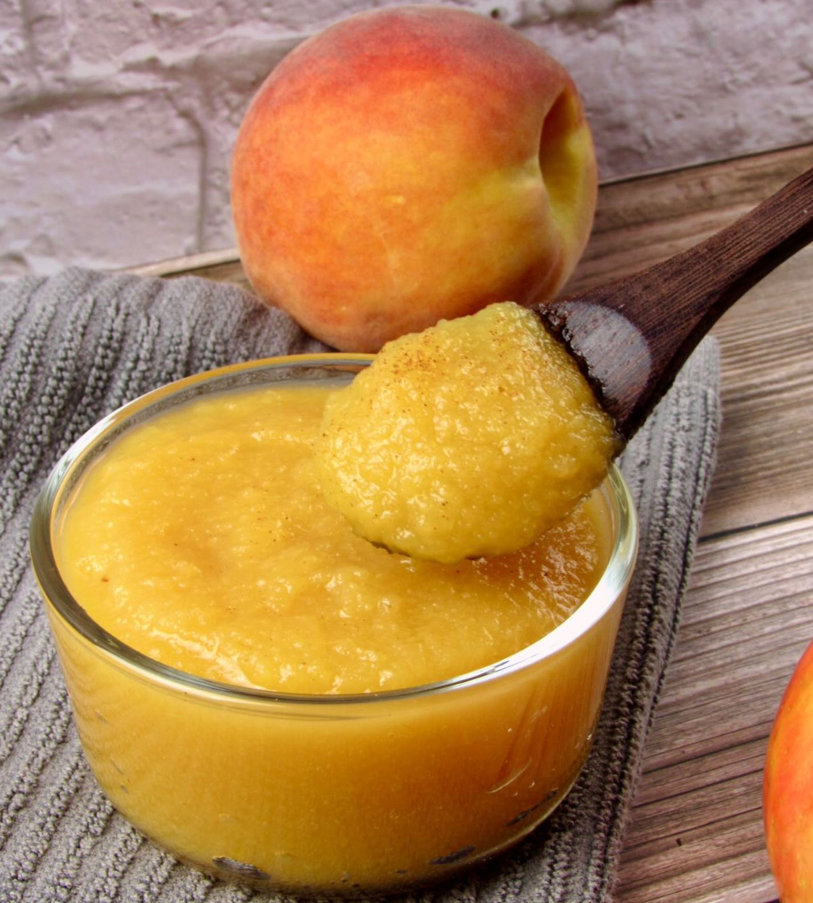

# Coulis of Peaches with Lavender Honey

*This delectable sauce is superb served with slices of toasted brioche or with a panna cotta.*

**Serves:** 6

**Cook Time:** 5 minutes

**Prep Time:** 15 minutes

## Overview
Peach coulis with lavender honey is the building block for late-summer desserts: silky golden purée that drapes over a slice of toasted brioche for breakfast, pools under a panna cotta, or carries a quenelle of vanilla ice cream like a soft cushion. Two ingredients carry the whole sauce, so pick them well. The peaches need to be properly ripe and fragrant (a peach that smells of peach in the bowl is what you're after; pale supermarket fruit makes a thin pale sauce), and the lavender honey needs to be the real thing, not a regular honey with a drop of essence; it's potent and floral and a few tablespoons go a long way. Peel and halve four very ripe peaches, drop them into a pan with lemon juice, four tablespoons of the honey and 150 ml of water, and bring the lot up to a bare simmer over low heat. Hold it there for five minutes till the fruit softens through, then drop in a flowering lavender sprig if you have one for the final 30 seconds; any longer and the lavender turns soapy, that brief warm dip is enough to lift the perfume. Cool the pan for a few minutes off the heat, tip everything into a blender and blitz for a full minute till smooth and silky, then push it through a fine-meshed conical sieve into a bowl to catch any stray fibre. Cool completely, then chill till you need it. Serve over toasted brioche, panna cotta, vanilla ice cream, or as a glossy pool under a plated dessert.

## Ingredients
- 4 very ripe peaches
- 1 lemon (juice)
- 4 tablespoons lavender honey
- 1 flowering lavender sprig (optional)

## Method
1. Peel, halve and stone the peaches. 
1. Put them in a saucepan with the lemon juice, honey and 150 ml of water. 
1. Slowly bring to a simmer over a low heat and poach gently for 5 minutes. 
1. Add the lavender sprig, if using, and cook for a further 30 seconds.
1. Leave to cool for a few minutes, then transfer the contents of the pan to a blender and purée for 1 minute.
1. Pass the sauce through a fine-meshed conical sieve into a bowl and leave to cool completely. 
1. When cold, refrigerate until ready to use.

## Notes
- **Peach selection:** Use ripe, fragrant peaches at their seasonal peak for best flavor.
- **Lavender honey:** This specialty honey carries floral notes that pair perfectly with peaches. Use sparingly, it's potent.
- **Gentle poaching:** Low heat preserves the delicate peach flavor and creates a naturally silky texture.
- **Lavender sprig:** Fresh flowering sprigs add visual elegance; dried lavender can substitute if gentle on quantity.

## Serving
Serve with: Toasted brioche, panna cotta, vanilla ice cream, or as a plating element
Drizzle on: Light-colored plates for beautiful presentation

## Storage
- Keeps 3-4 days refrigerated in an airtight container
- Does not freeze well due to peach texture degradation
- Serve well chilled or at room temperature
- Flavor develops and mellows upon storage
