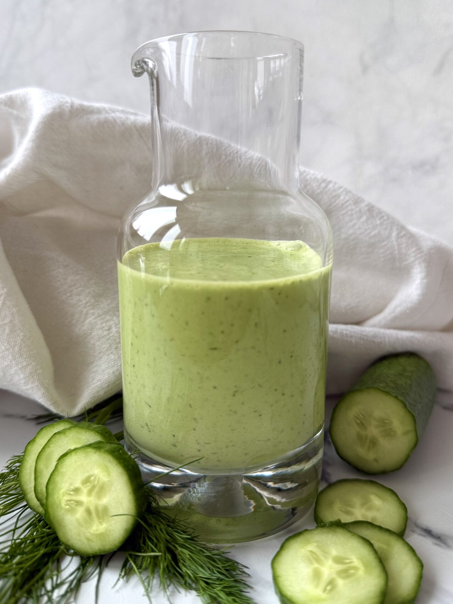

# Cucumber Coulis

*This refreshing coulis goes well with poached fish, smoked salmon, cold omelettes and pasta salads.*

**Serves:** 6

**Prep Time:** 10 minutes

## Overview
Cucumber coulis is the building block for cold plates and cold-fish presentations: a pale-green herbaceous pour with the cool clean flavour of cucumber underneath a quiet kick of red chilli, parsley and sage, finished into something almost cream-textured by olive oil. The trick is to strip the cucumber of its watery bits before blending. Peel it, cut it in half lengthways, and scrape out the seeds with a teaspoon; without that step the seeds bleed water into the sauce as it sits and you end up with a thin diluted coulis rather than the velvety one you're after. Chop the cucumber into chunks straight into a blender, add the deseeded diced chilli (half a chilli first if you're unsure, you can always add more) and blitz for a full minute till mostly smooth. Drop in the roughly chopped parsley and sage and blitz another minute to break the herbs down, then pour the olive oil and a generous squeeze of lemon through the open hopper while the blade keeps running and let it run a further two minutes till the whole thing turns almost creamy. The olive oil is doing real work here; it's what creates the silky body of the sauce, so don't skimp. Taste, adjust the salt, pepper and lemon, then chill and serve over poached salmon, smoked salmon, cold omelettes, pasta salads, or as a pale-green slick under chilled summer fish.

## Ingredients
- 1 cucumber (medium)
- 1 red chilli (de-seeded and diced)
- 4 sprigs parsley (roughly chopped)
- 6 sage leaves (roughly chopped)
- 50 ml olive oil
- squeeze of lemon juice
- salt
- pepper

## Method
1. Peel the cucumber, cut it in half length-ways and remove the seeds. 
1. Chop the cucumber into chunks and put into a blender.
1. Add the chilli to the blender and purée for 1 minute until the mixture is fairly smooth.
1. Add the parsley and sage to the blender and process for another minute. 
1. Pour in the olive oil and a generous squeeze of lemon juice. 
1. Blend for about 2 minutes until smooth and almost creamy.
1. Pour the coulis into a bowl, taste and adjust the seasoning, adding more lemon juice if needed. 
1. Cover and refrigerate until ready to serve.

## Notes
- **Cucumber seeding:** Essential, removes excess water that would dilute the coulis.
- **Fresh herbs:** Use the freshest parsley and sage available; dried herbs cannot replicate the bright flavor.
- **Chilli heat:** Start with ½ chilli and adjust to taste for your preference.
- **Oil quantity:** Sufficient olive oil creates the creamy texture that defines this sauce.

## Serving
- Serve with: Poached fish, smoked salmon, cold salads, or as a plating accent
- Drizzle on: Light-colored plates or white fish for striking presentation

## Storage
- Keeps 2-3 days refrigerated in an airtight container
- Does not freeze well due to herb flavor degradation
- Serve chilled
- Oil may separate slightly during storage; stir before serving
