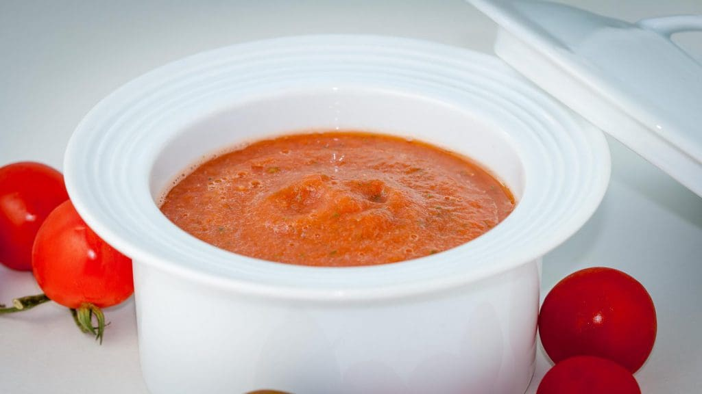

# Tomato Coulis

*France's smooth tomato coulis: ripe tomatoes simmered with shallot, garlic and basil, then pushed through a sieve to a glossy red sauce.*

**Serves:** 4

**Prep Time:** 15 minutes

**Cook Time:** 1 hour

## Overview
Tomato coulis is the building block under half the French summer table: a glossy red pour-from-the-jug sauce that drapes over fresh pasta, anchors a risotto, glazes grilled vegetables or sits underneath roasted fish. It's nothing more than ripe tomatoes simmered slowly with shallot, garlic and herbs until every drop of water has evaporated, then blitzed and strained to a smooth shine. Ripeness is the whole game. Use the reddest, softest marmande tomatoes you can find at the market; pale supermarket fruit makes a thin watery sauce no matter how long you cook it (and if your tomatoes are anything less than peak, stir in a spoon of tomato purée at the start to give the body somewhere to land). Score a cross in the top of each tomato, drop them into boiling water for 10 to 20 seconds till the skins blister, then straight into iced water, and the skins slip off in your hand. Warm the olive oil gently in a heavy pan with crushed garlic, finely chopped shallot and a bouquet garni with thyme, soften for two minutes without colour, then tip in the peeled tomatoes, the sugar pinch and crushed peppercorns. From here it's an hour at the gentlest bubble, stirring every so often with a wooden spoon, till the moisture has cooked off and the mixture turns thick and jammy. Fish out the bouquet garni, blitz the lot to a smooth purée, season with salt, and drizzle a little fresh olive oil over the top just before serving. Keeps five to seven days in the fridge and freezes for three months.

## Ingredients
- 750 grams large marmande tomatoes (very ripe)
- 150 ml  olive oil
- 2 cloves garlic (crushed)
- 60 grams shallots (finely chopped)
- 6 sprigs thyme
- 1 tablespoon tomato purée (optional if the tomatoes are not fully ripe)
- 1 pinch sugar
- 6 peppercorns (crushed)
- 1 pinch salt
- 1 [Bouquet Garni](../../base-ingredients/herbs/bouquet-garni.md) (with extra thyme sprigs)

## Method
1. First peel the tomatoes: cut a cross on the top and cut out the core, then immerse the tomatoes in a bowl of boiling water for 10-20 seconds until the skin starts to split. 
1. Take out and plunge into a bowl of iced water.
1. Lift out with a draining spoon and slip off the skins.
1. In a heavy saucepan, warm the olive oil with the garlic, shallots and bouquet garni. 
1. After 2 minutes, add the tomatoes and the tomato purée if needed, along with the sugar and crushed pepper.
1. Cook very gently for 1 hour, stirring occasionally with a wooden spoon until all the moisture has evaporated. 
1. Remove the bouquet garni.
1. Tip the contents of the pan into a blender and purée until smooth. 
1. Season with salt to taste.
1. The coulis is ready to use at once, or it may be kept in the fridge for up to 5 days.
1. After reheating, add a little olive oil before serving.

## Notes
- **Tomato selection:** Use the ripest marmande tomatoes available; pale or underripe tomatoes require tomato purée for depth.
- **Long cooking:** The 1-hour gentle simmer concentrates flavors and develops sweetness.
- **Oil quantity:** Start with less and drizzle more after cooking for fresher flavor and brilliant color.
- **Make-ahead friendly:** Coulis improves with a day or two in the refrigerator as flavors meld.

## Serving
- Serve with: Pasta, risotto, soups, fish, or as a base for other sauces
- Drizzle on: Grilled vegetables, fresh mozzarella, or cooked meats

## Storage
- Keeps 5-7 days refrigerated in an airtight container
- Freezes well up to 3 months
- Serve warm or at room temperature
- Flavor deepens and mellows during storage
