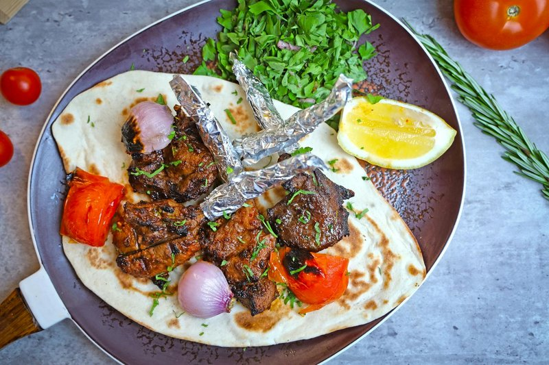

# Chapli Kebab

*Afghanistan's slipper-shaped patty: ragged-edged beef shot through with onion, tomato, herbs and a heavy hand of pomegranate seeds, griddled hard.*

**Serves:** 4

**Prep Time:** 25 minutes (plus 30 minutes resting)

**Cook Time:** 15 minutes

## Overview
Beef mince mixes with grated onion, chopped tomato, ginger, garlic, beaten egg, gram flour and the signature Afghan spice mix (coriander seed, pomegranate seeds, chilli flakes, cumin, garam masala). Rest for 30 minutes; the gram flour absorbs moisture and the flavours combine. Form thin wide patties; fry hot in oil 3-4 minutes per side until darkly crusted.

## Ingredients

- 600 g beef mince (or half beef, half lamb)
- 1 large onion (very finely chopped, juices reserved)
- 1 medium tomato (deseeded, very finely chopped)
- 4 garlic cloves (crushed)
- 1 thumb fresh ginger (grated)
- 1 large egg (beaten)
- 4 tablespoons gram (chickpea) flour
- 2 tablespoons coriander seeds (lightly toasted, coarsely ground)
- 2 tablespoons dried pomegranate seeds (anardana, coarsely ground)
- 1 tablespoon ground cumin
- 1 tablespoon dried chilli flakes
- 1 teaspoon garam masala
- 1 teaspoon ground black pepper
- 1 ½ teaspoons salt
- 4 tablespoons fresh coriander (chopped)
- 2 tablespoons fresh mint (chopped)
- 4-6 tablespoons vegetable oil (for frying)

## Method

### Stage 1 - Mix
1. Combine mince, onion (with its juices), tomato, garlic, ginger, egg, gram flour, spices, salt and herbs in a wide bowl.
1. Mix thoroughly with hands. The mixture is loose and wet.

### Stage 2 - Rest
1. Cover; refrigerate 30 minutes.

### Stage 3 - Shape
1. Wet your palms. Take a fistful of mix; flatten between your palms into a wide thin patty (12-14 cm wide, 8-10 mm thick) with ragged edges.

### Stage 4 - Fry
1. Heat 2 tablespoons oil in a wide pan over medium-high heat.
1. Lay 2 patties at a time; fry 3-4 minutes per side until dark, crusted and cooked through.
1. Add a fresh tablespoon of oil between batches.
1. Drain briefly on kitchen paper.

### Stage 5 - Serve
1. Plate on warm Afghan naan with sliced onion, tomato and fresh coriander. A wedge of lime alongside.

## Notes
- **Anardana:** Dried pomegranate seeds, sour-sweet and tannic. Sold at Indian or Middle Eastern shops. Don't substitute fresh seeds (too wet); skip if unavailable.
- **Thin and ragged:** A thick chapli is just a burger. The character is in the lacy thin-pressed patty that crusts dark.
- **Hot pan:** Medium and the patties go grey. High heat, short cook.

## Storage
- Refrigerate 3 days; reheat in a hot pan.
- Freeze raw shaped patties between baking paper up to 2 months.
