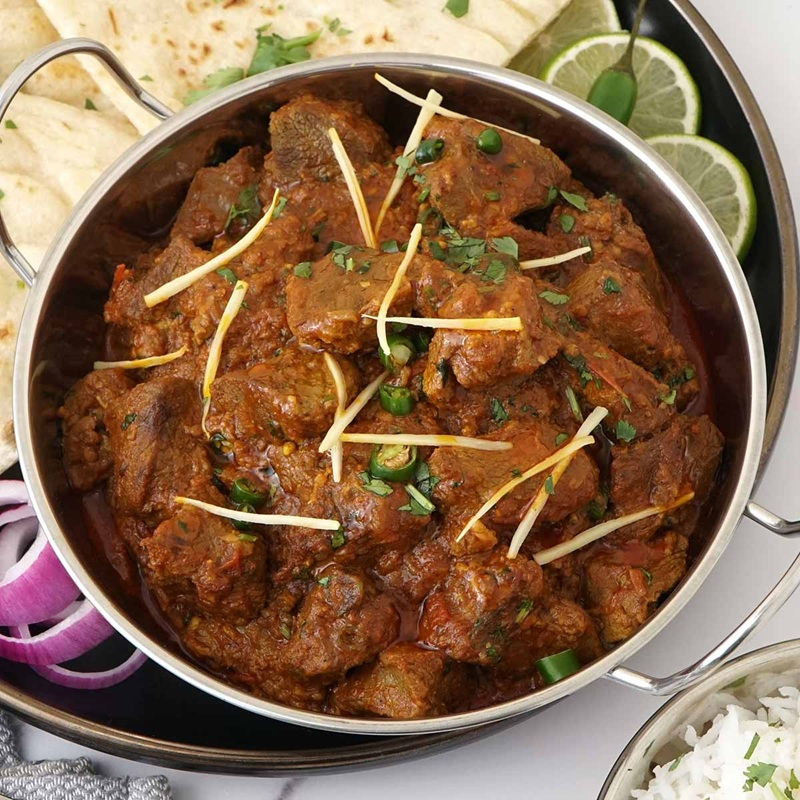

# Lamb Karahi (Afghan Style)

*Slow-cooked lamb shoulder simmered in a thick tomato-and-onion gravy with cumin, coriander, ginger and green chillies, finished with a slick of cooking fat on the surface (the Afghan signature of a properly built curry). Eaten over plain rice or with hot naan; the gravy is the point as much as the meat.*

**Serves:** 4

**Prep Time:** 20 minutes

**Cook Time:** 1 hour 45 minutes

## Overview
Lamb shoulder browns hard in oil; onions cook deep brown alongside. Ginger, garlic, cumin, coriander and turmeric toast briefly; tomato cooks down to a jammy base; the lamb returns with stock and slow-simmers for 90 minutes until tender. Green chillies and ginger julienne go in at the end; uncovered, the gravy reduces and the cooking fat rises to the surface.

## Ingredients

- 1 kg lamb shoulder (bone-in or out, cut into 4 cm chunks)
- 6 tablespoons vegetable oil
- 3 onions (large, chopped)
- 6 garlic cloves (crushed)
- 1 large thumb fresh ginger (half grated, half julienned)
- 2 tablespoons coriander seeds (lightly toasted, ground)
- 1 tablespoon cumin seeds (lightly toasted, ground)
- 1 teaspoon ground turmeric
- 1 teaspoon Kashmiri chilli powder
- 4 fresh tomatoes (grated) or 1 (400 g) tin chopped tomatoes
- 2 tablespoons tomato puree
- 1 ½ teaspoons salt
- 600 ml hot lamb or chicken stock
- 3 green chillies (slit lengthways)
- 3 tablespoons fresh coriander (chopped)
- 1 teaspoon garam masala (to finish)

## Method

### Stage 1 - Brown
1. Pat lamb dry; season with a pinch of salt.
1. Heat 3 tablespoons of the oil in a heavy pot over medium-high.
1. Brown lamb in batches, 4-5 minutes per side. Set aside.

### Stage 2 - Base
1. Add remaining oil; soften onion 12 minutes until deep gold.
1. Add garlic and grated ginger; cook 1 minute.
1. Stir in ground coriander, cumin, turmeric, chilli; toast 30 seconds.
1. Add tomato and tomato puree; reduce 8 minutes until thick and the oil splits.

### Stage 3 - Slow cook
1. Return the lamb with juices; add salt and hot stock.
1. Bring to a simmer; cover; cook on the lowest heat 1 hour 15 minutes.

### Stage 4 - Finish
1. Add green chillies and julienned ginger.
1. Uncover; raise heat; cook 15-20 minutes more, until the gravy is thick and a slick of oil rises to the top.
1. Stir in garam masala; taste; adjust salt.

### Stage 5 - Serve
1. Scatter fresh coriander. Eat over plain rice or with hot naan.

## Notes
- **Fat returns:** Like other Afghan curries (and BIR si byan), the signal that the dish is ready is the oil rising to the surface. Don't skim - it's flavour.
- **Whole spice freshly ground:** Buying ground cumin and coriander gives a dusty curry. Toasting whole and grinding adds a depth you can't fake.
- **Bone-in for stock:** If using boneless lamb, add 2 lamb bones to the braise (remove before serving) for body.

## Storage
- Refrigerate 4 days; reheats well.
- Freezes 3 months.
