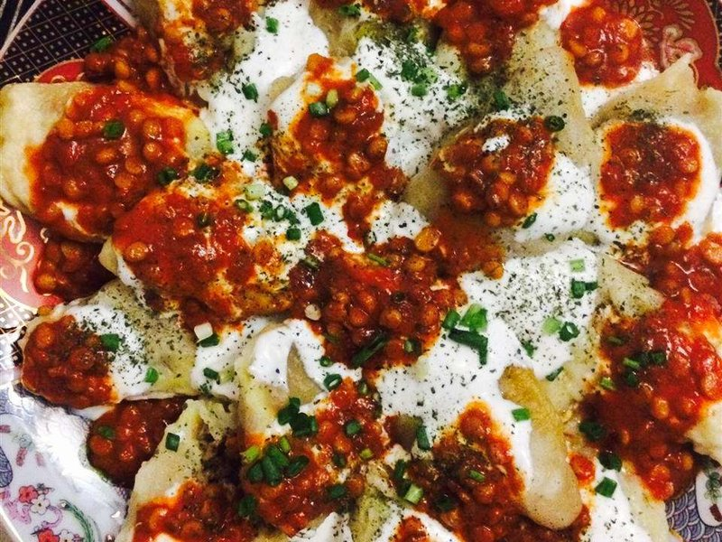

# Mantu

*Afghan steamed dumplings filled with spiced lamb mince, draped with garlicky strained yogurt (chaka) and crowned with a tomato-and-yellow-split-pea topping (qorma). A Friday family dish - three layers of sauce telling the story of Persian-Indian-Central-Asian crossroads cooking.*

**Serves:** 4

**Prep Time:** 1 hour 15 minutes

**Cook Time:** 45 minutes

## Overview
Mantu are the steamed lamb dumplings that Afghanistan shares with the rest of Central Asia, plated under garlic yogurt and topped with a thick split-pea-and-tomato sauce. The filling is straightforward: lamb mince fried with onion and spices, then cooled completely before it goes into the wrappers (warm filling makes the dough soggy). A plain flour-and-water dough rolls thin, gets cut into 8 cm squares, and each square gets a teaspoon of filling pinched closed at all four corners. Steam for twenty minutes. While they are steaming you whisk the chaka (yogurt with garlic and salt) and cook a quick qorma of yellow split peas with tomato and dried mint. Plate stacked: yogurt under, mantu in the middle, qorma over the top, dried mint and a sprinkle of chilli powder to finish. A whole platter goes to the centre of the table to share.

## Ingredients

### Filling
- 400 g lamb mince
- 1 onion (large, very finely chopped)
- 4 garlic cloves (crushed)
- 1 ½ teaspoons ground cumin
- 1 teaspoon ground coriander
- ½ teaspoon ground cinnamon
- ½ teaspoon ground black pepper
- 1 teaspoon salt
- 2 tablespoons vegetable oil

### Dough
- 400 g plain flour
- 1 teaspoon salt
- 220 ml lukewarm water

### Yogurt sauce (chaka)
- 400 g strained Greek yogurt
- 3 garlic cloves (crushed to a paste with ½ tsp salt)
- 1 teaspoon dried mint

### Qorma topping
- 100 g yellow split peas (chana dal, soaked 1 hour, drained)
- 1 onion (small, finely chopped)
- 2 tablespoons vegetable oil
- 1 (200 g) tin chopped tomatoes
- 1 tablespoon tomato puree
- 1 teaspoon ground turmeric
- 1 teaspoon ground coriander
- ½ teaspoon Kashmiri chilli powder
- 1 teaspoon salt
- 300 ml hot stock

### To finish
- 1 teaspoon dried mint
- ½ teaspoon Kashmiri chilli powder
- 1 tablespoon olive oil

## Method

### Stage 1 - Filling
1. Heat oil; brown lamb mince briefly; add onion; cook 5 minutes.
1. Add garlic, cumin, coriander, cinnamon, pepper, salt; cook 1 minute. Cool.

### Stage 2 - Dough
1. Mix flour, salt and lukewarm water to a soft dough; knead 6 minutes; cover; rest 30 minutes.

### Stage 3 - Qorma
1. Heat oil; soften onion 6 minutes.
1. Add tomato, tomato puree, turmeric, coriander, chilli; cook 4 minutes.
1. Stir in drained split peas; pour hot stock; simmer covered 25 minutes until peas are tender.
1. Add salt; keep warm.

### Stage 4 - Shape mantu
1. Roll dough on a lightly floured board to 2 mm thick; cut into 8 cm squares.
1. Place 1 teaspoon filling in centre. Bring all four corners up; pinch the four seams firmly to seal at the top.
1. Lay finished mantu on a lightly oiled tray.

### Stage 5 - Steam
1. Set bamboo or metal steamer over simmering water. Lightly oil the base.
1. Arrange mantu in a single layer; steam 20 minutes (work in batches if needed).

### Stage 6 - Yogurt
1. Whisk yogurt with garlic-salt paste and dried mint to a thick spoonable sauce.

### Stage 7 - Assemble
1. Spread half the yogurt in a wide warm bowl.
1. Arrange the steamed mantu on top.
1. Drizzle remaining yogurt; spoon qorma over the centre.
1. Sprinkle dried mint and chilli powder; drizzle olive oil.

### Stage 8 - Serve
1. Eat immediately with naan to scoop.

## Notes
- **Three layers, three temperatures:** Cool yogurt under, hot mantu in the middle, hot qorma on top.
- **Sealing:** Pinch the four corners at the top into a small bundle - a few seconds per dumpling.
- **Make ahead:** Freeze raw shaped mantu on a tray; bag once frozen. Steam from frozen, adding 5 minutes.

## Storage
- Eat assembled mantu same day.
- Components keep 3 days separately.
- Raw frozen mantu keep 2 months.
