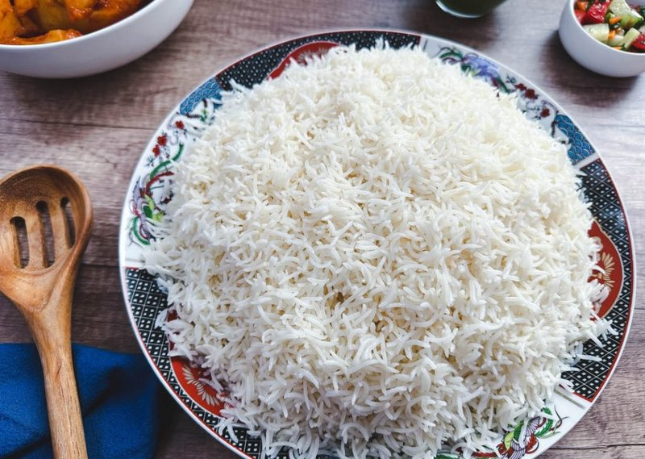

# Chalow

*The plain Afghan white rice: basmati par-boiled, drained, then steam-finished in a covered pot with oil and salt. The canvas for kebabs and stews.*

**Serves:** 4

**Prep Time:** 10 minutes (plus 30 minutes soaking)

**Cook Time:** 30 minutes

## Overview
Long-grain basmati rinses thoroughly until the water runs almost clear, then soaks for 30 minutes. Boils in plenty of salted water for 5-6 minutes until 70% cooked (the chalow par-boil). Drains; returns to a dry pot; oil drizzles over the top; the lid stays on with the heat on the lowest setting for 20 minutes (the dum). The result: separate, fluffy grains and a thin gold crust on the bottom.

## Ingredients

- 400 g basmati rice
- 2 litres water (for the par-boil)
- 1 tablespoon salt (for the par-boil)
- 3 tablespoons vegetable oil or ghee
- ½ teaspoon salt (for the dum)

## Method

### Stage 1 - Rinse and soak
1. Rinse the rice in 3-4 changes of cold water until the water runs almost clear.
1. Cover with cold water by 5 cm; soak 30 minutes.
1. Drain.

### Stage 2 - Par-boil
1. Bring 2 litres of water to a hard boil; add the tablespoon of salt.
1. Tip in the drained rice.
1. Boil 5-6 minutes until the grains are 70% cooked (a grain crushed between thumb and finger should have a chalky core).
1. Drain immediately into a sieve; rinse briefly with hot water.

### Stage 3 - Dum (steam)
1. Wipe the pot dry; return to medium heat.
1. Drizzle 2 tablespoons of the oil over the bottom.
1. Tip the par-boiled rice back in; smooth into a mound.
1. Drizzle the remaining oil over the top; sprinkle the ½ teaspoon salt.
1. Wrap the lid with a clean tea towel (catches condensation); cover tight.
1. Reduce heat to the lowest setting; steam 20 minutes undisturbed.

### Stage 4 - Serve
1. Lift the lid; fluff gently with a fork.
1. Tip onto a wide platter - the gold crust comes out last.

## Notes
- **Long-grain basmati only:** Short-grain rice cooks short and sticky; chalow is built on long separate grains.
- **70% par-boil is the trick:** Underdone in the boil, finished by steam. Cooking through in the boil gives mush after the dum.
- **The crust (tahdig-style):** Less dramatic than Persian tahdig because no yogurt or potato is used, but a thin gold layer forms on the bottom from the oil. The most-prized portion.

## Storage
- Refrigerate 3 days; reheat covered with a tablespoon of warm stock.
- Don't freeze.
