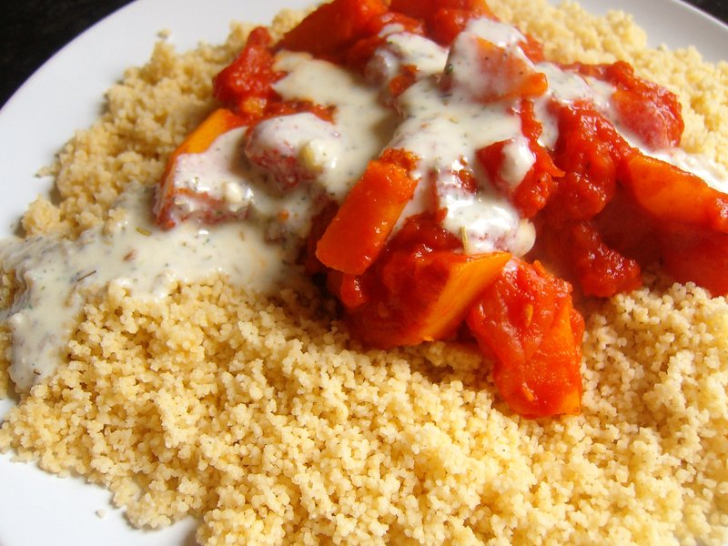

# Kadu Bouranee

*Sweet-savoury Afghan pumpkin slow-cooked with sugar, tomato and ginger until silky-soft, then served under a generous layer of garlic yogurt and a final sprinkle of dried mint. The pairing of sweet pumpkin with sour yogurt is uniquely Afghan and uniquely good. Eat as a side or a vegetarian main on naan.*

**Serves:** 4 as a side

**Prep Time:** 15 minutes

**Cook Time:** 45 minutes

## Overview
Kadu bouranee is Afghanistan's sweet-and-savoury pumpkin dish: cubes of butternut squash or pumpkin braised slowly with onion and a touch of sugar until they collapse, plated under cold garlic-and-mint yogurt while the pumpkin is still warm. The temperature contrast is the whole pleasure of the dish. You brown the pumpkin briefly in oil with chopped onion, add sugar, tomato and a splash of stock, then cover and cook low until the pumpkin is completely yielding to a spoon (around forty minutes). Spoon into a wide dish, blanket with garlic yogurt (chaka) straight from the fridge, scatter dried mint over the top. Eat with naan, scooping pumpkin and yogurt up together.

## Ingredients

- 800 g pumpkin (or butternut squash, peeled, cut into 4 cm chunks)
- 4 tablespoons vegetable oil
- 1 onion (medium, chopped)
- 4 garlic cloves (crushed)
- 1 thumb fresh ginger (grated)
- 1 fresh tomato (grated) or 4 tablespoons passata
- 2 tablespoons soft brown sugar
- 1 teaspoon ground turmeric
- ½ teaspoon Kashmiri chilli powder
- 1 teaspoon salt
- 200 ml hot stock (or stock substitute)

### Chaka (garlic yogurt)
- 300 g strained Greek yogurt
- 2 garlic cloves (crushed to a paste with ¼ tsp salt)

### To finish
- 1 teaspoon dried mint
- 1 tablespoon olive oil

## Method

### Stage 1 - Brown
1. Heat oil in a wide pan over medium-high.
1. Brown the pumpkin chunks in batches, 4-5 minutes each, until lightly caramelised on at least two sides. Set aside.

### Stage 2 - Base
1. In the same pan, soften the onion 5 minutes.
1. Add garlic and ginger; cook 30 seconds.
1. Add turmeric, chilli; toast 10 seconds.
1. Stir in tomato; cook 3 minutes to a sauce.

### Stage 3 - Slow cook
1. Return the pumpkin; sprinkle with sugar and salt.
1. Pour in the hot stock; bring to a simmer.
1. Cover; cook on low 30-35 minutes, gently turning the pumpkin once or twice, until very soft.
1. Uncover; cook 5 more minutes if loose.

### Stage 4 - Chaka
1. Whisk yogurt with the garlic-salt paste.

### Stage 5 - Plate
1. Spoon pumpkin into a wide shallow dish.
1. Top generously with the cold chaka, covering most of the surface.
1. Sprinkle dried mint; drizzle olive oil.

### Stage 6 - Serve
1. Eat warm with naan or alongside lamb karahi.

## Notes
- **Sweet meets sour:** The combination is the dish. Tasting before adding the yogurt feels weirdly sweet; together it works.
- **Pumpkin type:** Use a dense floury variety, kabocha, butternut, red kuri. Watery pumpkin (Halloween-type) collapses to mush.
- **Don't oversweeten:** 2 tablespoons sugar is right; more pushes the dish into pudding territory.

## Storage
- Pumpkin keeps 3 days refrigerated; reheat gently.
- Plate freshly each time, don't store with yogurt on top.
