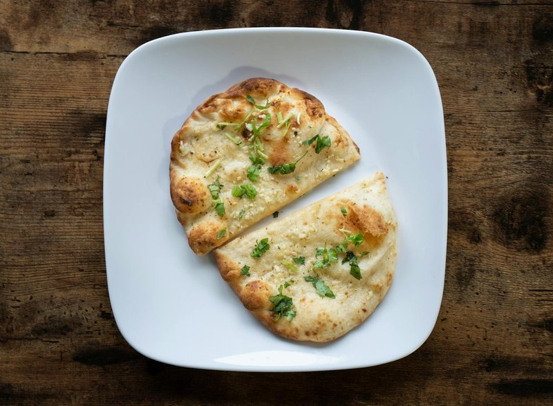

# Naan-E Afghani

*Afghanistan's long flatbread: a 50 cm canoe baked in a tandoor with finger-trailed ridges and a scatter of nigella and sesame. Torn warm at every meal.*

**Serves:** 4 (makes 4 long flatbreads)

**Prep Time:** 15 minutes (plus 1 hour 30 minutes rising)

**Cook Time:** 20 minutes (with a hot stone)

## Overview
Naan-e-afghani is the long lozenge-shaped flatbread you'll see hanging from cords in bakery windows across Afghan cities, scored down its length with three fingertip-trails and scattered with nigella and sesame seeds. The dough is straightforward (plain flour, fast-action yeast, salt, sugar, a glug of oil and warm water), kneads to smooth, rises for an hour, then divides into long ovals. Each oval is pressed and stretched on a floured bench into a 40-50 cm flat lozenge (the shape matters: thin in the middle, slightly thicker at the rim). Three fingertip trails down the length, a scatter of nigella and sesame, then slid onto a hot baking stone (or an upturned heavy baking tray) at your oven's maximum heat. Eight minutes and it is done, blistered and chewy. Tear, dip, wrap, eat warm with anything Afghan.

## Ingredients

- 500 g plain flour
- 1 sachet (7 g) fast-action yeast
- 1 ½ teaspoons salt
- 1 tablespoon caster sugar
- 2 tablespoons vegetable oil
- 320 ml warm water
- 1 tablespoon nigella seeds
- 1 tablespoon sesame seeds
- 1 tablespoon vegetable oil (for brushing)

## Method

### Stage 1 - Dough
1. Whisk flour, yeast, salt and sugar.
1. Add oil and warm water; mix to a soft dough.
1. Knead 8-10 minutes until smooth and elastic.
1. Cover; rise 1 hour until doubled.

### Stage 2 - Heat the oven
1. Place a baking stone, steel or upturned heavy tray on the top oven rack.
1. Heat the oven to maximum (250°C or higher) for at least 30 minutes.

### Stage 3 - Shape
1. Knock back; divide into 4 equal portions.
1. Cover; rest 15 minutes.
1. On a lightly floured surface, press each portion into a long oval, 40-50 cm by 15 cm, about 8 mm thick.
1. With three fingertips, trace three lines down the length, pressing firmly into the dough (the signature ridges).
1. Brush the top lightly with oil; scatter nigella and sesame seeds.

### Stage 4 - Bake
1. Slide one shaped naan onto the hot stone using a peel or back of a tray.
1. Bake 5-7 minutes - the surface should blister and the underside go deep gold.
1. If the surface is pale, give it 60 seconds under the grill.
1. Repeat with the remaining naan.

### Stage 5 - Stack
1. Stack the baked breads under a clean tea towel as they come out - the steam keeps them soft.

### Stage 6 - Serve
1. Eat warm, torn into pieces, with any Afghan meal. They keep in foil all day; reheat briefly on a dry pan.

## Notes
- **Long, not round:** The shape is essential to the bread's identity. A round naan is naan; this is naan-e Afghani.
- **Fingertip ridges:** Press firmly to the work surface but not through. The grooves trap oil and steam unevenly, giving the characteristic crisp-soft contrast across the surface.
- **Hot stone matters:** Without a hot baking stone, the bottom doesn't crisp. Pre-heat the stone for 30 minutes minimum.

## Storage
- Wrap in foil; keep at room temperature 24 hours.
- Refresh briefly on a dry pan or 200°C oven.
- Freeze 1 month.
