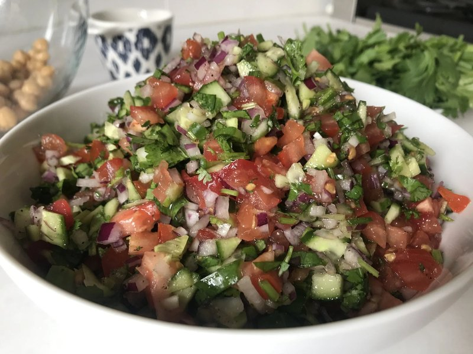

# Salata Afghani

*Afghan chopped salad: finely diced tomato, cucumber and red onion dressed with lemon, olive oil, salt, dried mint and a kick of green chilli. Served alongside kabuli pulao, kebabs and any heavy meat dish. Cool, crunchy, slightly hot. Made fresh; eaten within an hour.*

**Serves:** 4 as a side

**Prep Time:** 12 minutes

**Cook Time:** 0 minutes

## Overview
Tomatoes, cucumbers and red onion dice fine and even. A fresh dressing of lemon juice, olive oil, dried mint, salt and a small green chilli is whisked. Tossed at the last minute; the salt draws a little water out and the flavours mingle. A scatter of fresh coriander finishes.

## Ingredients

- 4 ripe tomatoes (deseeded, small dice)
- 1 cucumber (large, deseeded, small dice)
- 1 red onion (small, small dice)
- 1 green chilli (small, very finely chopped, optional)
- 3 tablespoons fresh coriander (chopped)
- 1 tablespoon fresh mint (chopped, optional)
- 4 tablespoons olive oil
- 1 lemon (juice)
- 1 teaspoon dried mint
- ½ teaspoon salt
- ¼ teaspoon ground black pepper

## Method

### Stage 1 - Chop
1. Dice tomato, cucumber and onion to a similar 5 mm size.
1. Drain any tomato juice that pools.
1. Finely chop the chilli and herbs.

### Stage 2 - Dressing
1. In a small bowl, whisk olive oil, lemon juice, dried mint, salt and pepper.

### Stage 3 - Combine
1. Place all the chopped vegetables in a serving bowl.
1. Pour over the dressing; toss gently.
1. Let stand 5 minutes for flavours to mingle.

### Stage 4 - Serve
1. Taste; adjust lemon and salt. Eat within an hour for best crunch.

## Notes
- **Deseed both:** Tomato and cucumber seeds bleed water and dilute the dressing. Remove them.
- **Dried + fresh mint:** Dried gives depth, fresh gives lift. Both is best.
- **Cuts matter:** Small even dice. Big chunks and it's a chopped salad; mince and it's a salsa.

## Storage
- Eat fresh. Doesn't keep - vegetables go soft within hours.
