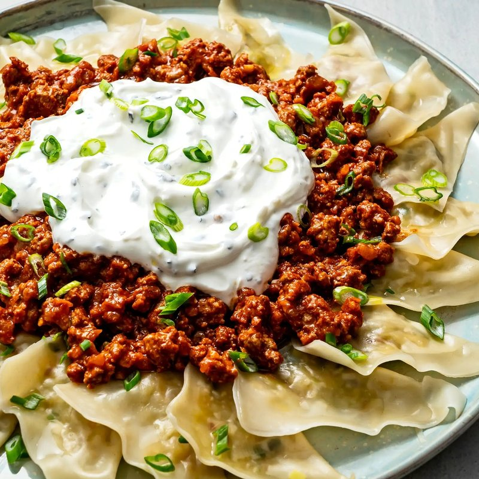

# Aushak

*Afghanistan's leek dumplings: wonton wrappers folded around chopped leek, boiled, then served under garlicky yogurt and a spiced meat sauce.*

**Serves:** 4 (about 30 dumplings)

**Prep Time:** 45 minutes

**Cook Time:** 30 minutes

## Overview
Aushak are the Afghan leek-and-mint dumplings that share their plating shape with mantu: a smear of garlic yogurt under, dumplings boiled and fanned over, a thick lamb meat sauce ladled across the top, dried mint and chilli to finish. The filling is just leeks (or scallions), salted briefly to draw the water out, squeezed dry, then mixed with fresh mint, ground coriander and pepper. Wonton wrappers (or homemade dough) seal around a teaspoon of filling pinched into half-moons or triangles. While the dumplings boil, you make the topping: ground beef or lamb fried with onion, garlic, tomato paste and dried mint, simmered into a thick savoury sauce. The yogurt sauce is just chaka with garlic. Plate together while everything is still warm.

## Ingredients

### Filling
- 400 g leeks (white and pale green only, very finely chopped) OR 6 large bunches scallions
- 1 teaspoon salt (to weep the leeks)
- 2 tablespoons fresh mint (chopped fine)
- 1 teaspoon ground coriander
- ½ teaspoon ground black pepper
- 1 tablespoon olive oil

### Wrappers
- 30 square wonton wrappers

### Meat sauce
- 2 tablespoons sunflower oil
- 1 onion (small, finely diced)
- 3 garlic cloves (crushed)
- 300 g ground beef (or lamb, 20% fat)
- 1 tablespoon tomato paste
- 1 teaspoon ground cumin
- 1 teaspoon ground coriander
- 1 teaspoon dried mint
- ½ teaspoon dried red chilli flakes
- 1 teaspoon salt
- 100 ml water

### Yogurt sauce
- 500 g full-fat Greek yogurt
- 3 garlic cloves (crushed to a paste with ½ teaspoon salt)
- 2 tablespoons cold water (to loosen)

### To finish
- 1 tablespoon dried mint
- ½ teaspoon paprika
- 2 tablespoons fresh coriander (chopped)

## Method

### Stage 1 - Filling
1. Toss chopped leeks with 1 teaspoon salt in a colander; rest 20 minutes.
1. Squeeze hard in a clean tea towel to remove excess water.
1. Mix with fresh mint, coriander, pepper and 1 tablespoon olive oil.

### Stage 2 - Wrap
1. Place 1 teaspoon of filling in the centre of each wonton wrapper.
1. Wet two edges with water; fold over into a triangle or half-moon; press to seal.
1. Set on a floured tray.

### Stage 3 - Meat sauce
1. Heat oil in a wide pan over medium heat.
1. Sauté onion 5 minutes; add garlic; cook 1 minute.
1. Add the mince; brown 6 minutes, breaking up.
1. Stir in tomato paste, cumin, coriander, dried mint, chilli flakes and salt; cook 1 minute.
1. Add water; simmer 8 minutes until thick.

### Stage 4 - Yogurt
1. Whisk yogurt with garlic-salt paste and cold water to a pourable but thick consistency.

### Stage 5 - Boil dumplings
1. Bring a wide pot of salted water to a boil.
1. Cook dumplings in batches of 10 for 3-4 minutes until they float and the wrappers are translucent.
1. Lift onto a plate with a slotted spoon.

### Stage 6 - Plate
1. Spread half the yogurt sauce on a wide warmed platter.
1. Arrange the dumplings over the yogurt.
1. Spoon over the remaining yogurt.
1. Top with hot meat sauce.
1. Sprinkle dried mint, paprika pepper and fresh coriander.

## Notes
- **Squeeze the leeks dry:** Wet leeks make a soggy filling that bursts the dumpling. The 20-minute salt-and-squeeze is essential.
- **Don't pre-cool the dumplings:** Aushak loses its appeal when the wrappers cool and stiffen. Boil, plate, serve immediately.
- **Yogurt warm, not hot:** Don't heat the yogurt sauce, Afghan tradition keeps it room-temperature so it stays loose and cool against the hot meat.

## Storage
- Best fresh.
- Filled raw dumplings freeze 2 months on a tray, then bag; boil from frozen, adding 2 minutes.
- Components keep separately 3 days; assemble at serving.
