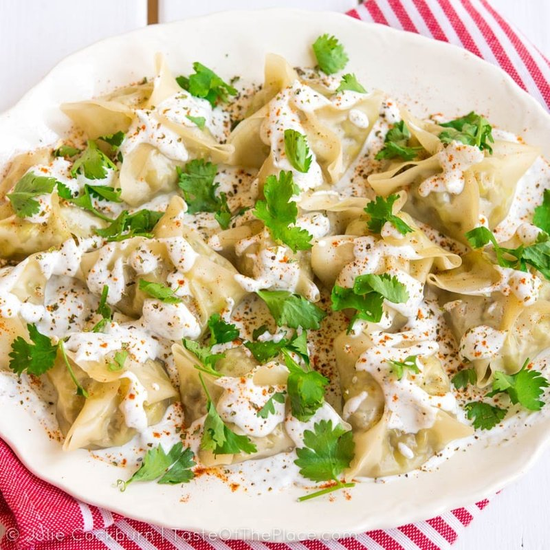

# Mantu

*Kabul's Silk Road dumplings: thin pasta wrappers folded around spiced lamb, steamed, then bathed in garlicky yogurt and a chana-dal sauce.*

**Serves:** 4 (about 24 dumplings)

**Prep Time:** 50 minutes

**Cook Time:** 25 minutes

## Overview
The filling: ground lamb mixes with grated onion (squeezed dry), garlic, ground coriander, cumin, cinnamon, salt and pepper. Wonton wrappers fold around a teaspoon of filling: pull all four corners up over the centre, pinch in pairs to form an X-shape with the meat visible in 4 small triangles at the top, like an open flower. Steamed in a bamboo basket 18-20 minutes over boiling water. While they steam, two sauces prepare: a chana dal-tomato-and-mint sauce (the legumes are simmered until soft and stewed with onion, tomato, dried mint and pepper into a slightly chunky topping), and a yogurt-garlic sauce. Plated like aushak: yogurt base, dumplings on top, lentil-tomato sauce, dried mint.

## Ingredients

### Filling
- 400 g ground lamb (20% fat)
- 1 onion (small, grated, squeezed dry - about 80 g after squeezing)
- 4 garlic cloves (crushed)
- 1 ½ teaspoons ground coriander
- 1 teaspoon ground cumin
- ½ teaspoon ground cinnamon
- ½ teaspoon ground allspice
- 1 ½ teaspoons salt
- ½ teaspoon black pepper

### Wrappers
- 24 square wonton wrappers (10-12 cm; sold at Asian shops)

### Chana dal sauce
- 100 g chana dal (split chickpeas - soaked 2 hours; or substitute split yellow peas)
- 2 tablespoons sunflower oil
- 1 onion (small, finely diced)
- 3 garlic cloves (crushed)
- 1 (400 g) tin chopped tomatoes
- 1 tablespoon tomato paste
- 1 teaspoon dried mint
- 1 teaspoon ground coriander
- ½ teaspoon chilli flakes
- 1 teaspoon salt
- 300 ml water

### Yogurt sauce
- 500 g Greek yogurt
- 3 garlic cloves (crushed to a paste with ½ teaspoon salt)
- 2 tablespoons cold water

### To finish
- 1 tablespoon dried mint
- ½ teaspoon Aleppo pepper
- 2 tablespoons fresh coriander (chopped)

## Method

### Stage 1 - Chana dal sauce
1. Drain soaked chana dal; simmer in 500 ml fresh water 30 minutes until soft.
1. In a separate wide pan, sauté onion and garlic 5 minutes in oil.
1. Add tomatoes, tomato paste, dried mint, ground coriander, chilli and salt.
1. Add drained chana dal and 300 ml water; simmer 15 minutes to thicken.
1. Taste; adjust.

### Stage 2 - Filling
1. Mix all filling ingredients in a bowl for 2 minutes until sticky.

### Stage 3 - Shape
1. Place 1 teaspoon of filling in centre of each wrapper.
1. Pull all four corners up over the filling.
1. Pinch opposite corners together at the top in 2 paired pinches, leaving a small visible gap of meat between each pinch - the result is a flower shape with 4 tiny meat windows.

### Stage 4 - Steam
1. Line a bamboo steamer with baking paper (cut to size, pierced).
1. Arrange dumplings with 1 cm between them.
1. Steam over boiling water 18-20 minutes.

### Stage 5 - Yogurt
1. Whisk yogurt with garlic-salt paste and water to a thick but spoonable consistency.

### Stage 6 - Plate
1. Spread half the yogurt sauce across a wide platter.
1. Place mantu over.
1. Spoon remaining yogurt over.
1. Top with hot chana dal sauce.
1. Sprinkle dried mint, Aleppo pepper and fresh coriander.

## Notes
- **Steam, never boil:** The thin wrappers tear in boiling water. Steaming over (not in) gives the right texture.
- **Open-top flower shape:** The exposed meat is a signature visual. Don't pinch all four corners together at once - pinch in two pairs (opposite corners), leaving gaps in between.
- **Two sauces matter:** Yogurt + chana dal + mint together is what makes mantu - the cool tangy yogurt + warm spiced lentil + bright mint. Skipping the chana dal turns it into plain dumplings.

## Storage
- Filled raw dumplings freeze 2 months on a tray.
- Cooked mantu: refrigerate 2 days; re-steam 5 minutes.
- Sauces keep separately 4 days.
