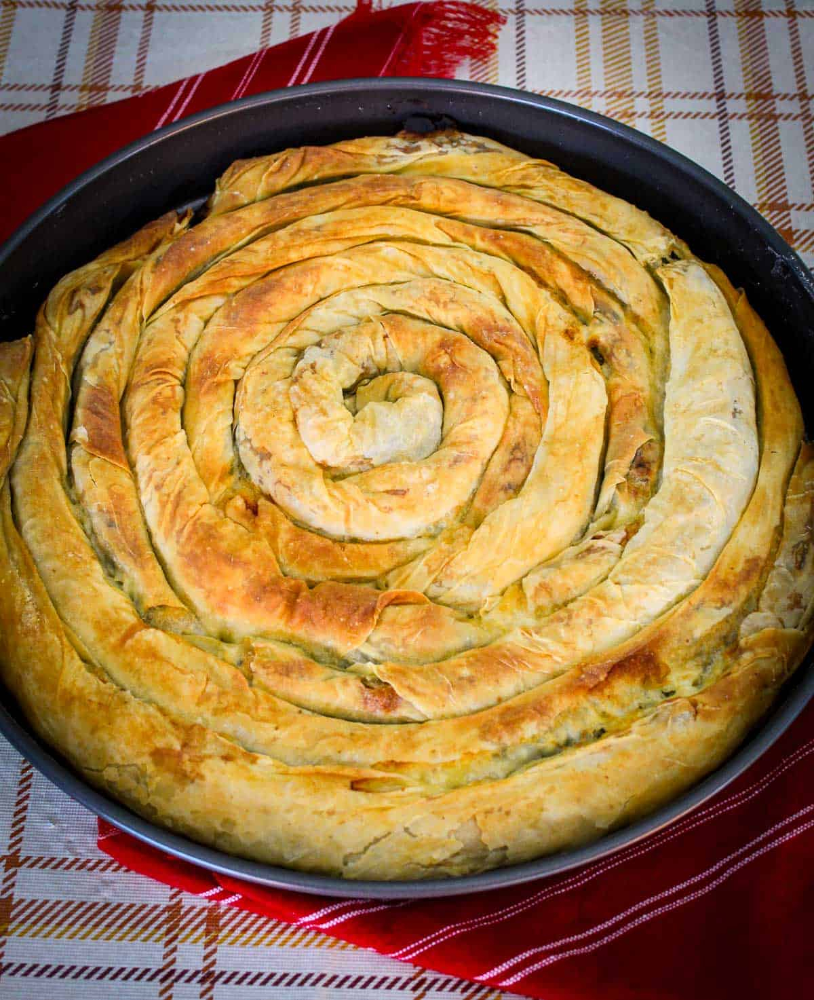

# Albanian Byrek

*A coiled spiral of thin filo brushed with butter and stuffed with spinach, leek and feta, baked till the pastry shatters into bronze shards: the bakery counter staple of every Albanian market town.*

**Serves:** 8

**Prep Time:** 30 minutes

**Cook Time:** 45 minutes

## Overview
Byrek (the spelling lazo or burek elsewhere in the Balkans) is the Albanian filo pie, and the spinach-leek-cheese version is the one most market bakeries pull from their ovens at nine in the morning. Sheets of thin pastry (the country cooks roll their own petë, but city kitchens use shop-bought filo) are laid out, brushed with melted butter, scattered with the green filling and coiled into a long sausage that is then spiralled into a round baking pan. A second brush of butter, sometimes a thin egg-and-yoghurt wash poured over the top, and the pan goes into a hot oven till the coils crack open and the pastry darkens to bronze. Served warm from the pan, cut in wedges, eaten with yoghurt on the side. The same coil technique takes leek, cheese, meat, pumpkin or nettle fillings depending on the season; spinach-and-cheese is the everyday one.

## Ingredients

### For the filling
- 500 g fresh spinach (or 300 g frozen spinach, defrosted and squeezed dry)
- 2 leeks, white and pale green parts, finely sliced
- 1 medium onion, finely chopped
- 3 tbsp olive oil
- 300 g feta cheese, crumbled
- 200 g gjizë, ricotta or cottage cheese
- 2 large eggs (for the filling)
- A small handful of dill, chopped
- A small handful of flat-leaf parsley, chopped
- Salt and freshly ground black pepper

### For the assembly
- 12 sheets thin filo pastry (about 270 g, defrosted if frozen)
- 150 g butter, melted (plus 2 tbsp olive oil)
- 1 egg yolk and 2 tbsp yoghurt (for the wash)
- 1 tsp sesame or nigella seeds (to finish)

## Method

### Stage 1 - The filling
1. If using fresh spinach: wilt in a dry pan over high heat for 2 minutes, drain, cool, squeeze out every drop of water. Chop coarsely.
2. Heat the olive oil in a wide pan over medium heat. Soften the chopped onion for 6 minutes till translucent.
3. Add the sliced leeks; cook 8 minutes more until soft and sweet (do not brown).
4. Tip the leek mixture into a large bowl with the chopped spinach. Cool 10 minutes.
5. Add the feta, gjizë, eggs, dill and parsley. Season with pepper (go light on salt because feta is salty). Mix well.

### Stage 2 - Build the coil
1. Heat the oven to 200C fan. Brush a 28 cm round baking tin (or a 30 cm round oven tray) with melted butter.
2. Mix the melted butter and olive oil in a small bowl.
3. Lay 2 filo sheets out, slightly overlapping along the long edge, into one long strip about 60 cm long.
4. Brush the strip with butter mix.
5. Spread a long sausage of filling along the lower long edge, leaving 2 cm clear at each end.
6. Roll up tight from the long edge to make a long thin sausage.
7. Coil the sausage like a snail into the centre of the tin.
8. Repeat with the remaining filo and filling, joining new sausages onto the end of the spiral as you go, until the tin is full and the coils are tight.

### Stage 3 - The wash and the bake
1. Whisk the egg yolk and yoghurt together. Pour evenly over the spiral so it runs into the cracks.
2. Scatter with sesame or nigella seeds.
3. Bake for 40 to 45 minutes until deep golden brown all over and the pastry is crisp.
4. Rest 10 minutes in the tin before cutting; the layers settle.
5. Cut in wedges from the centre out.

## Notes
- **Keep filo covered.** Cover the unworked sheets with a slightly damp tea towel; filo dries out and cracks in minutes.
- **Squeeze the spinach hard.** Wet spinach makes a soggy byrek; squeeze till you have a dry ball.
- **Butter generously.** The butter between layers is what gives the bronze crackle; do not skimp on the brushing.
- **The yoghurt wash makes the cracks.** That tangy egg wash poured over the top is what gives the byrek its proper golden cracked finish.
- **Rest before cutting.** Hot from the oven the filo shatters and the filling spills; 10 minutes of rest holds it together.

## Variations
- **Byrek me mish (meat byrek):** swap the spinach-cheese filling for 500 g minced beef or lamb browned with onion, paprika and a pinch of cinnamon.
- **Byrek me presh (leek byrek):** double the leeks, drop the spinach, keep the cheese.
- **Byrek me kungull (pumpkin byrek):** swap the green filling for 600 g grated pumpkin sweated with onion, finished with crumbled feta.
- **Byrek me hithra (nettle byrek):** swap the spinach for young nettle tops in the spring (blanched first).
- **Tray bake (faster):** layer 6 sheets of filo, half the filling, 6 more sheets, the rest of the filling, 6 more sheets, brushing each with butter; cut into squares once baked.

## Serving
- Cut in wedges from the centre out · serve warm with cold thick yoghurt · a glass of chilled buttermilk (dhalle) or ayran · a tomato-and-cucumber salad on the side · pickles for the country version.

## Storage
- Keeps 2 days at room temperature wrapped in a tea towel; 4 days refrigerated
- Reheat in a 180C oven for 10 minutes to crisp the pastry; the microwave makes it soggy
- Freezes well baked: wrap wedges in foil, freeze 2 months, reheat from frozen at 180C for 25 minutes
</content>
