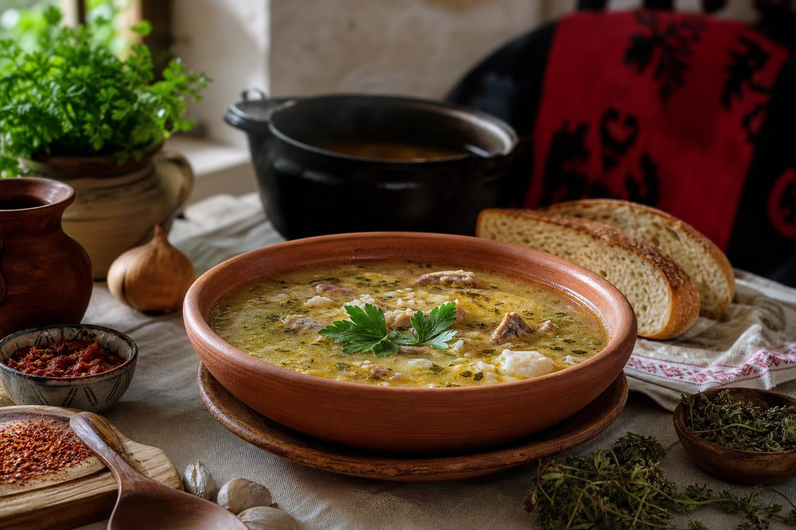

# Albanian Corba

*A clear chicken broth thickened with egg yolk and lemon, the bowl finished with shredded chicken and a scatter of fresh parsley: the Albanian answer to a winter cold and the morning-after wedding soup.*

**Serves:** 6

**Prep Time:** 20 minutes

**Cook Time:** 1 hour 30 minutes

## Overview
Corba (the Ottoman word for soup, kept across the Balkans) covers a family of slow-built broths in Albania, but the lemon-and-egg-thickened chicken corba is the most loved. A whole chicken simmers slow with onion, carrot and a stick of celery for an hour and a half till the broth runs clear and the meat falls off the bone. The chicken comes out, gets shredded, the broth is strained, the rice or fine noodles cook in it, and at the very end the soup is thickened by tempering egg yolks and lemon juice into the hot liquid (avgolemono in Greek, but the Albanian version uses more lemon and less egg, so the result is cleaner and brighter). Served hot in deep bowls with a wedge of lemon on the side, often with a wedge of warm cornbread. The lamb tripe version (paca) is the traditional cure for a long night out, sold from corner stands across Tirana from four in the morning.

## Ingredients

### For the broth
- 1 whole chicken (about 1.5 kg)
- 2 onions, halved
- 2 carrots, halved
- 1 stick celery, snapped in half
- 2 bay leaves
- 1 tsp black peppercorns
- 2 tsp salt
- 2.5 litres cold water

### For the soup
- 100 g long-grain rice (or 80 g fine vermicelli broken into 3 cm lengths)
- 1 small carrot, finely diced
- 2 tbsp butter
- 3 large egg yolks
- Juice of 2 lemons (about 6 tbsp)
- Salt
- Freshly ground white pepper
- A small handful of flat-leaf parsley, chopped (to finish)

### To serve
- Lemon wedges
- Warm cornbread or crusty bread

## Method

### Stage 1 - The broth
1. Put the whole chicken in a large stock pot. Cover with the cold water.
2. Bring slowly to a simmer over medium heat; skim the grey foam carefully off the top with a slotted spoon.
3. Add the onion halves, carrot halves, celery, bay leaves, peppercorns and salt.
4. Lower the heat to the barest simmer; cook gently uncovered for 75 minutes till the chicken is tender and falling off the bone. Do not let it boil hard (it clouds the broth).
5. Lift the chicken out carefully into a bowl; rest 10 minutes.
6. Strain the broth through a fine sieve; discard the vegetables and aromatics.

### Stage 2 - Shred and prepare
1. When the chicken is cool enough to handle, pull all the meat off the bones; shred into small pieces. Discard skin and bones.
2. Return the strained broth to the pot. You should have about 2 litres.

### Stage 3 - Build the soup
1. Bring the broth back to a simmer.
2. Melt the butter in a small pan; soften the diced carrot for 4 minutes.
3. Tip the carrot and the rice (or vermicelli) into the broth.
4. Simmer 12 minutes till the rice is just cooked.
5. Stir in the shredded chicken; warm through 2 minutes. Take off direct heat.

### Stage 4 - The lemon-egg finish
1. In a bowl, whisk the egg yolks and the lemon juice together till smooth.
2. Whisk in 1 ladle of hot broth slowly to temper the eggs.
3. Whisk in a second ladle.
4. Pour the tempered mixture back into the soup, stirring gently. Do not boil now (the eggs will scramble); the soup should sit just below simmer for 2 minutes till it thickens slightly and goes silky.
5. Taste; add salt and white pepper as needed.
6. Ladle into deep warm bowls, scatter with parsley, serve with a lemon wedge.

## Notes
- **Skim the broth properly.** That first foam carries impurities; skim it off carefully or the broth will go grey.
- **Don't boil hard.** A rolling boil pulls fat through the broth and clouds it; keep the heat low and the surface barely moving.
- **Temper the egg yolks.** Egg poured straight into hot broth scrambles in seconds; mix with cold lemon juice first, then ladle hot broth in slowly to warm them.
- **Don't reboil after the egg.** Once the egg-lemon goes in, the soup must not boil or the eggs curdle. Just below simmer.
- **Lemon to taste.** Albanian corba is brighter and sharper than the Greek avgolemono; add lemon till it sings.

## Variations
- **Corba me mish (lamb corba):** swap the chicken for a 1.5 kg lamb shoulder (bone in); cook 2 hours instead of 75 minutes.
- **Paca (tripe corba):** the morning-after version with cooked lamb tripe and trotters; a 3-hour broth, no egg-lemon, finished with vinegar and garlic.
- **With orzo:** swap the rice for orzo; the more modern Tirana style.
- **No lemon-egg:** for a plainer everyday version, skip stage 4 entirely and finish with a squeeze of lemon at the table.
- **Vegetarian:** make the broth with mushroom, onion, carrot and celery; skip the chicken and finish with cooked white beans.

## Serving
- Deep warm bowls · lemon wedges on the side · warm cornbread or crusty bread · a small dish of chilli flakes for those who want heat · the bowl as the main course at the family Sunday lunch.

## Storage
- Keeps 3 days refrigerated; the broth gels and clears further overnight
- Reheat gently below simmer; do not boil (the egg will split)
- The unfinished broth (before the egg-lemon stage) freezes well for 3 months; do the egg-lemon fresh each time
</content>
