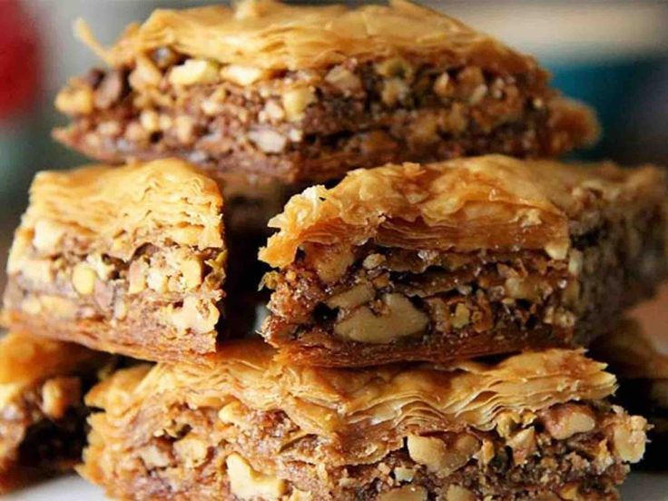

# Bakllava Shqiptare

*Albanian baklava: layers of buttered filo wrapped around a ground walnut, sugar and clove filling, baked till deep gold and drenched in a lemon syrup scented with cloves. The Eid and Christmas cake of every Albanian household.*

**Serves:** 24 pieces

**Prep Time:** 40 minutes

**Cook Time:** 45 minutes

## Overview
Bakllava shqiptare is the Albanian take on the wider Ottoman tradition, and the differences are real: the filling is almost always walnuts (not pistachios, not almonds), the syrup is scented with cloves rather than rose or orange blossom, and the cuts are diamond-shaped before baking, never afterwards. Every Albanian household bakes a tray at Bajram (Eid), at Christmas and at weddings; the version is passed down by grandmothers and argued about for decades. The construction is a stack of 30-40 filo sheets, each brushed with melted butter, with the walnut filling spread between every fifth or sixth sheet. The tray is cut into diamonds, baked till the top is a dark gold, then drenched (off the heat) with a hot syrup of sugar, water, lemon juice and whole cloves. The bakllava sits for hours so the syrup soaks all the way down. Eat at room temperature with a small dark coffee.

## Ingredients

### For the bakllava
- 500 g filo pastry (about 30 sheets), at room temperature
- 300 g unsalted butter, melted and cooled
- 500 g walnuts, finely chopped (not powdered)
- 100 g caster sugar
- 1 tsp ground cinnamon
- 1/4 tsp ground cloves

### For the syrup
- 400 g caster sugar
- 350 ml water
- Juice of 1 lemon
- 6 whole cloves
- 1 strip lemon peel

## Method

### Stage 1 - Prepare the filling
1. Combine the chopped walnuts, sugar, cinnamon and ground cloves in a bowl.
2. Mix well; set aside.

### Stage 2 - Layer the bakllava
1. Heat the oven to 170°C (fan 150°C); brush a 30 x 25 cm baking tin with butter.
2. Lay the filo sheets flat under a damp tea towel to stop them drying.
3. Place one sheet in the tin, brush generously with melted butter.
4. Repeat with 9 more sheets, buttering each one.
5. Scatter a third of the walnut mixture evenly over the top sheet.
6. Layer 6 more buttered filo sheets.
7. Scatter another third of the walnut mixture.
8. Layer 6 more buttered sheets, then the last third of the walnut mixture.
9. Finish with 9 more buttered filo sheets, buttering the very top sheet generously.

### Stage 3 - Cut and bake
1. With a sharp knife, cut the bakllava into diamonds: cut 5 parallel lines lengthwise, then 6 diagonal lines across (gives about 24 diamonds).
2. Cut all the way to the bottom of the tray.
3. Bake for 40-45 minutes until the top is a deep gold and the layers are crisp.

### Stage 4 - Make the syrup
1. While the bakllava bakes, combine the sugar, water, lemon juice, cloves and lemon peel in a saucepan.
2. Bring to a boil; reduce the heat to a gentle simmer.
3. Cook for 10 minutes until the syrup thickens slightly (it should still pour easily).
4. Take off the heat; fish out the cloves and peel.

### Stage 5 - Drench and rest
1. As soon as the bakllava comes out of the oven, pour the hot syrup slowly and evenly over the top.
2. You will hear it sizzle; this is right.
3. Cover loosely with foil; let stand at room temperature for 6 hours minimum, ideally overnight.
4. The bakllava drinks the syrup down through every layer.

### Stage 6 - Serve
1. Lift each diamond out with a small spatula.
2. Serve at room temperature.

## Notes
- **The walnuts:** Chop fine but not to a powder; the filling should have texture.
- **Hot syrup, hot bakllava:** Both must be hot when they meet. Cold syrup on cold bakllava goes soggy on top and dry below.
- **The rest:** Six hours minimum. The texture is wrong before then.

## Variations
- **With honey:** Replace half the sugar in the syrup with honey for a darker, deeper finish.
- **Half walnut half almond:** Use 250 g walnuts and 250 g blanched almonds.
- **With rose water:** Add 1 tablespoon rose water to the syrup at the end (a southern Albanian touch).
- **Pistachio version:** Substitute pistachios for the walnuts (less traditional but excellent).
- **Christmas version:** Add the zest of one orange to the walnut filling.

## Serving
With a small dark Albanian coffee · at Bajram (Eid) · at Christmas · at weddings and family celebrations · with a glass of cold water · cut diamond by diamond from the tray.

## Storage
- Keeps 2 weeks at room temperature, covered loosely (not airtight, which softens the top).
- Do not refrigerate (the butter goes hard and the texture turns waxy).
- The flavour deepens for the first 3 days.
