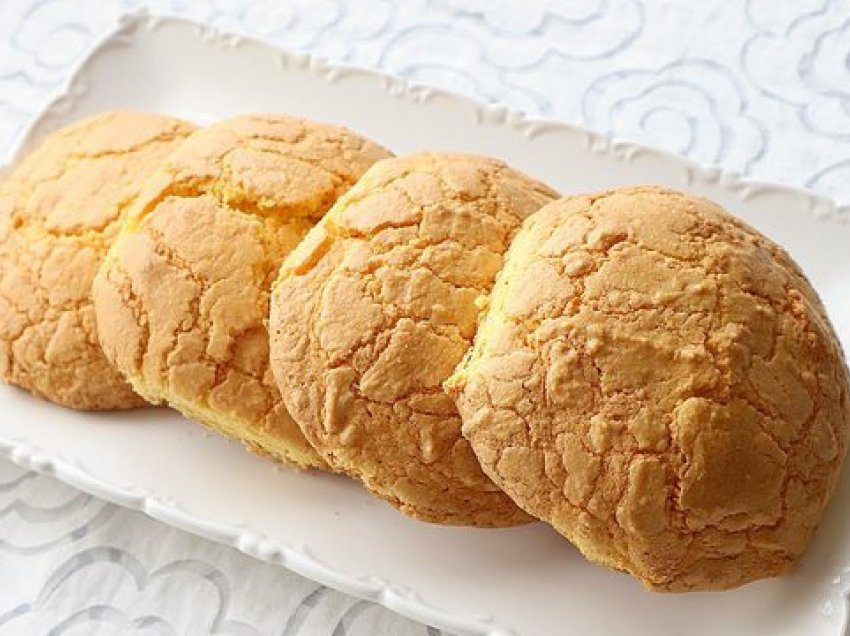

# Ballokume (Elbasan Cornmeal Cookies)

*The PGI-protected Easter-and-spring biscuit of Elbasan: a soft cornmeal-and-butter cookie tinted faintly yellow with the local cornmeal, baked round on the day before Dita e Verës (Summer Day, March 14) and shared at every house.*

**Serves:** 30 cookies

**Prep Time:** 25 minutes (plus overnight rest of butter mixture)

**Cook Time:** 18 minutes per tray

## Overview
Ballokume is the festival cookie of Elbasan, a small Albanian city in the central plain. The cookies are baked the night before Dita e Verës (the 14th of March, the day the Albanian calendar marks the end of winter), and shared between neighbours and visitors the following day. The traditional construction is unusual: butter is melted, salted, and worked with sugar overnight (the long whisking is the technique that gives ballokume its distinctive light texture); the next morning egg yolks, fine yellow cornmeal and a small amount of flour are folded in, the dough is shaped into walnut-sized balls, flattened lightly on a tray, and baked till the bottoms are pale gold but the tops stay almost white. PGI-protected since 2017, ballokume is one of only two Albanian foods on the European Union's protected origin list. The flavour is gently sweet, butter-rich, faintly cornmealy.

## Ingredients

### Dough (rested overnight)
- 300 g unsalted butter
- 1 1/2 teaspoons fine sea salt
- 350 g caster sugar
- 4 egg yolks (at room temperature)
- 400 g fine yellow cornmeal (Elbasan local cornmeal traditional; any fine yellow polenta works)
- 100 g plain flour
- 1/2 teaspoon baking powder

### To serve
- A small bowl of icing sugar (for dusting, optional)
- A glass of cold milk OR a small cup of Albanian coffee

## Method

### Stage 1 - Butter and sugar (night before)
1. Melt the butter gently in a small saucepan over low heat.
2. Off the heat, stir in the salt.
3. Pour the melted butter into a large mixing bowl.
4. Add the caster sugar.
5. Whisk by hand for 15 minutes (this is the long-whisking step that gives ballokume its texture; an electric whisk works at low speed).
6. Cover the bowl with a clean tea towel.
7. Leave at room temperature overnight (10-12 hours).

### Stage 2 - Egg yolks
1. In the morning, the butter-sugar mixture will have separated slightly; whisk briefly to recombine.
2. Add the egg yolks one at a time, whisking between each.
3. The mixture should look pale and creamy.

### Stage 3 - Dry ingredients
1. In a separate bowl, whisk the cornmeal, flour and baking powder together.
2. Tip the dry mixture into the butter mixture.
3. Fold gently with a spatula till just combined; don't over-mix.
4. The dough is soft and pliable.

### Stage 4 - Shape
1. Heat the oven to 160°C (140°C fan, gas 3).
2. Line 2 baking sheets with baking paper.
3. Pinch off walnut-sized pieces of dough (about 25 g each).
4. Roll into balls between your palms.
5. Sit on the baking sheets 4 cm apart (they spread slightly).
6. Flatten each ball gently with the back of a spoon to a 1 cm thick disc.

### Stage 5 - Bake
1. Bake one tray at a time on the middle shelf for 18 minutes.
2. The bottoms should be pale gold; the tops should stay almost white.
3. (Ballokume is meant to be a pale cookie; over-browned ballokume is wrong.)
4. Lift carefully onto a wire rack to cool (they firm up as they cool).

### Stage 6 - Serve
1. Stack onto a plate.
2. Optional: dust with icing sugar.
3. Serve with cold milk or Albanian coffee.

## Notes
- **Overnight rest is non-negotiable:** the long rest hydrates the cornmeal and develops the soft texture. A quick same-day version is harder and less Elbasan.
- **Fine cornmeal, not coarse polenta:** coarse polenta gives a gritty cookie. Fine yellow cornmeal (the kind used for mămăligă or polenta tagliata) is right.
- **Pale, not browned:** ballokume is a pale-yellow cookie. Pulling them when the bottoms are golden but the tops are still white is the cue.
- **PGI-protected:** real Elbasan ballokume uses local Elbasan cornmeal; outside Elbasan you approximate with any fine yellow cornmeal.
- **Don't over-mix:** once the cornmeal and flour go in, the dough wants gentle folding, not vigorous beating.

## Variations
**Walnut ballokume:** stir 50 g finely chopped walnuts into the dough before shaping.
**Lemon ballokume:** add the zest of 1 lemon with the egg yolks.
**Half-sized:** roll into 12 g balls for bite-sized cookies; reduce the bake time to 14 minutes.
**With orange-flower water:** add 1 teaspoon orange-flower water to the dough for a wedding-day version.
**Gluten-free:** swap the 100 g plain flour for a 1:1 gluten-free flour blend (the cookie still works because cornmeal carries the structure).

## Serving
For Dita e Verës (the 14th of March, the Albanian Summer Day, the traditional setting) · at an Elbasan family table the morning after baking · with Albanian coffee (kafe turke) · in a tin offered to visiting neighbours · as a wedding-gift sweet · alongside a glass of cold milk for the children.

## Storage
- Keeps 2 weeks in an airtight tin at room temperature.
- The cookies soften slightly with age; refresh 3 minutes at 140°C in the oven to crisp the bases.
- Freeze the unbaked shaped balls 1 month; bake from frozen at 160°C for 22 minutes.
- Don't refrigerate (the texture goes hard).
