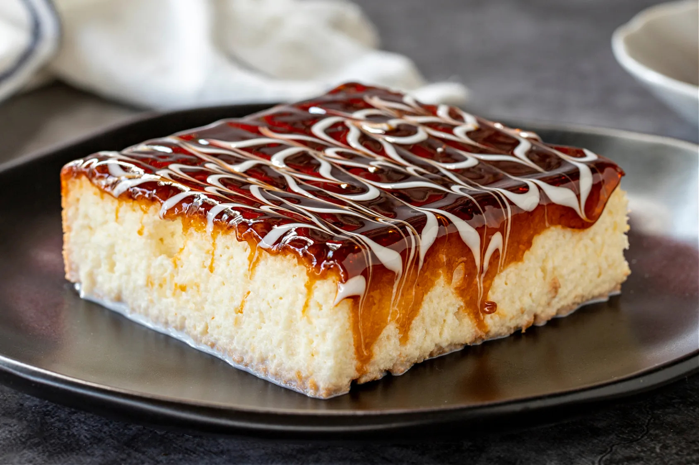

# Trileçe

*Albania's three-milk sponge cake: a pale yellow sponge soaked in evaporated milk, condensed milk and double cream, topped with a dark amber caramel that sets to a thin glass on top. The everyday celebration cake of Tirana coffee shops.*

**Serves:** 12

**Prep Time:** 25 minutes (plus 6 hours chilling)

**Cook Time:** 30 minutes

## Overview
Trileçe (literally "three milks") is the cake that took over Albania in the 1990s and never left. The base is a light Genoese sponge, baked thin in a square tin, then pierced all over with a skewer while still warm and drenched in a mixture of three milks: evaporated, condensed and double cream. The cake sits in the fridge for at least six hours to drink the milks in fully; the top is then poured with a hot dark caramel made from sugar cooked to a deep amber and finished with butter and cream. The caramel sets to a thin glass on top, the sponge underneath is wet and cool, and the contrast is the whole point. Every kafiteri in Tirana, Durrës and Vlorë sells trileçe by the slab; every household makes a version for guests.

## Ingredients

### For the sponge
- 6 large eggs, at room temperature
- 180 g caster sugar
- 1 tsp vanilla extract
- 180 g plain flour
- 1 tsp baking powder
- Pinch of salt

### For the milk soak
- 400 ml evaporated milk (1 tin)
- 397 g sweetened condensed milk (1 tin)
- 300 ml double cream

### For the caramel topping
- 200 g caster sugar
- 60 ml water
- 80 ml double cream
- 30 g butter
- Pinch of salt

## Method

### Stage 1 - Bake the sponge
1. Heat the oven to 175°C (fan 160°C); line a 30 x 20 cm baking tin with baking paper.
2. Crack the eggs into a large bowl; add the sugar and vanilla.
3. Whisk on high speed for 8-10 minutes until pale, thick and trebled in volume.
4. Sift the flour, baking powder and salt over the eggs.
5. Fold in gently with a spatula in three additions; keep as much air as possible.
6. Pour into the lined tin; level the top.
7. Bake for 25-30 minutes until pale gold and springy in the centre.

### Stage 2 - Mix and pour the milks
1. While the cake bakes, whisk the evaporated milk, condensed milk and cream in a jug until smooth.
2. When the cake comes out of the oven, leave it in the tin.
3. Pierce the whole surface with a skewer at 1 cm intervals.
4. Pour the milk mixture slowly over the warm cake; let each pour soak in before the next.
5. Cover with cling film; refrigerate at least 6 hours, ideally overnight.

### Stage 3 - Make the caramel
1. Put the sugar and water in a heavy saucepan over medium heat.
2. Swirl (do not stir) until the sugar dissolves; bring to a boil.
3. Cook for 6-8 minutes without stirring until the syrup turns deep amber.
4. Take off the heat; carefully pour in the cream (it will spit and bubble hard).
5. Stir in the butter and salt; whisk until smooth.
6. Cool for 5 minutes until just warm and pourable.

### Stage 4 - Finish
1. Pour the warm caramel over the chilled cake; tilt the tin to cover evenly.
2. Refrigerate another 30 minutes until the caramel sets.
3. Cut into squares with a hot knife; eat cold.

## Notes
- **The whisking:** The sponge gets its lift from the eggs alone; whisk till the mixture leaves a ribbon trail.
- **The soak time:** Six hours minimum, overnight is better. The cake should look swollen and feel cold and heavy.
- **The caramel:** Take it dark (deep amber), not pale. Pale caramel tastes only of sugar.

## Variations
- **Cuatro leches:** Add a fourth milk (50 ml rum-soaked raisins folded into the soak).
- **Chocolate caramel:** Stir 30 g dark chocolate into the warm caramel.
- **Coffee version:** Add 2 tablespoons strong espresso to the milk soak.
- **Cinnamon trileçe:** Add 1 teaspoon ground cinnamon to the milk mixture (a Berat touch).
- **With strawberries:** Top with halved strawberries over the caramel just before serving (summer trileçe).

## Serving
- With a small dark coffee · at the end of a long Albanian lunch · cut into squares for a coffee-shop platter · with a glass of cold milk · at celebrations and family gatherings · cold straight from the fridge.

## Storage
- Keeps 4 days refrigerated, covered.
- The texture improves on day 2 as the milks settle.
- Do not freeze (the caramel cracks and the sponge weeps).
