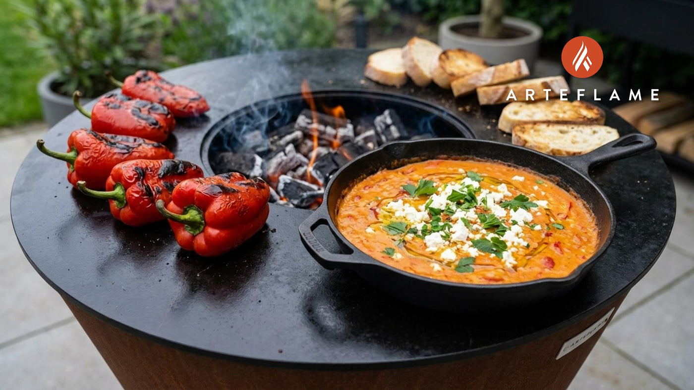

# Fergese

*A skillet of ripe tomato, sweet red pepper and crumbled cottage cheese fried in olive oil till the edges brown and the pan smells of summer: the Tirana classic served straight from the pan with crusty bread.*

**Serves:** 4 as a starter, 2 as a main

**Prep Time:** 15 minutes

**Cook Time:** 30 minutes

## Overview
Fergese (often written fergese me speca, fergese with peppers) is the most Albanian way to cook a few simple summer vegetables. Onion goes first into hot olive oil till sweet, then sliced sweet peppers cook down till they soften, then chopped tomatoes go in and reduce to a thick jam. At the end, crumbled gjize cottage cheese is stirred through and the whole pan is finished under a hot grill (or sometimes baked in a clay tave) till the top browns in patches and the cheese starts to crack on the surface. The dish lives somewhere between a stew, a baked custard and a thick sauce. Bring the pan to the table with a basket of bread; everyone tears off a piece and scoops. The Tirana version uses cottage cheese; the Berat version adds liver; the Korce version puts walnuts in. Summer pan food at its most Albanian.

## Ingredients

- 4 tbsp olive oil
- 1 large onion, finely chopped
- 3 large red bell peppers (or 4 long romano peppers), deseeded and sliced 1 cm thick
- 4 ripe tomatoes (about 500 g), peeled and chopped (or 1 tin of plum tomatoes, drained and chopped)
- 2 cloves garlic, finely chopped
- 1 tsp paprika
- 1/2 tsp dried oregano
- 300 g gjize or ricotta (or crumbled feta for a saltier finish)
- 2 tbsp butter
- Salt and freshly ground black pepper
- A small handful of flat-leaf parsley, chopped (to finish)

## Method

### Stage 1 - Soften the base
1. Heat the olive oil in a heavy 24 cm ovenproof skillet over medium heat.
2. Add the chopped onion. Cook 8 minutes, stirring, until soft and pale gold (do not brown hard).
3. Add the sliced peppers. Cook 12 minutes more, stirring every few minutes, until the peppers collapse and the edges colour.

### Stage 2 - Tomato reduction
1. Add the garlic; stir for 30 seconds till fragrant.
2. Tip in the chopped tomatoes, the paprika and the oregano.
3. Simmer hard for 10 to 12 minutes, stirring often, until the tomato cooks down to a thick jam-like sauce. Season with salt and a generous grind of pepper.

### Stage 3 - The cheese and the finish
1. Heat the grill to high (or the oven to 220C fan).
2. Crumble the gjize (or ricotta) evenly over the surface of the pan.
3. Dot the butter in pieces on top.
4. Slide the pan under the grill for 5 to 6 minutes until the cheese browns in patches and the edges bubble.
5. Scatter the chopped parsley over and bring the pan to the table.

## Notes
- **Use a heavy skillet.** Cast iron or a thick-bottomed pan holds the heat for the final grill step; a thin pan will scorch the base.
- **Peppers need time.** They must collapse and sweeten; rushing this leaves the dish vegetal and thin.
- **Gjize vs ricotta vs feta.** Gjize (Albanian fresh cheese) is the proper choice; ricotta is the best substitute; feta works but adds salt, so reduce the seasoning.
- **The browned top is the point.** A pale fergese is an unfinished fergese; push the grill stage till the surface marks dark in places.

## Variations
- **Fergese me melci (liver):** brown 200 g chopped chicken liver with the onion in stage 1 for the Berat liver version.
- **Fergese me arra (walnut):** stir 50 g coarsely chopped walnuts into the tomato reduction for the Korce version.
- **Feta finish:** swap gjize for crumbled feta and skip the salt; the saltiness changes the whole balance.
- **Baked tave:** transfer to a clay tave after stage 2, top with cheese and butter, bake at 200C for 20 minutes (longer, deeper bake).
- **With egg:** crack 4 eggs onto the surface before the grill stage for a richer brunch dish.

## Serving
Bring the pan to the table · crusty bread to scoop · a chilled glass of white wine or raki · a tomato salad on the side · a green salad of cos and spring onion.

## Storage
- Keeps 3 days refrigerated; the flavour improves overnight
- Reheat in the original pan over medium heat with a splash of water, 5 minutes
- Not suitable for freezing (the cheese separates)
</content>
