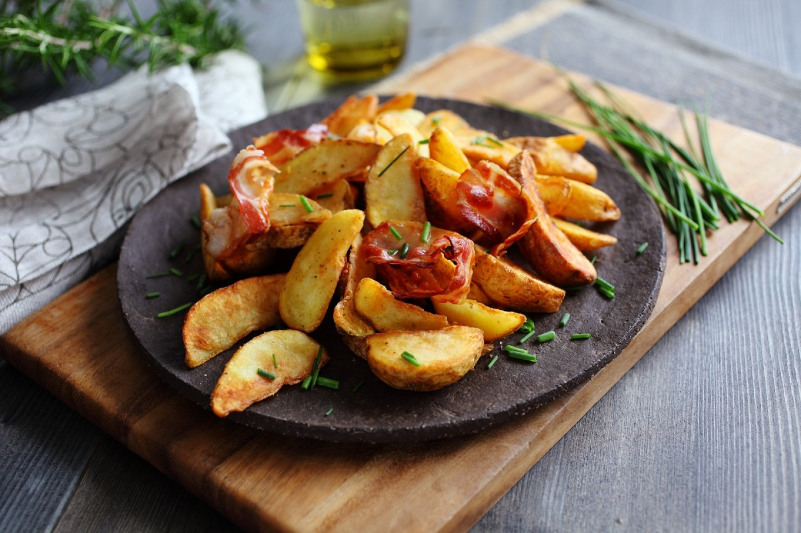

# Patate në Furrë

*Albanian oven-roasted potatoes: thick wedges tossed with olive oil, paprika, garlic and dried oregano, baked till the edges crisp dark and the centres go floury, the everyday side beside roast lamb or tave kosi.*

**Serves:** 4

**Prep Time:** 10 minutes

**Cook Time:** 50 minutes

## Overview
Patate në furrë is the side that turns up beside any Albanian roast: tave kosi, baked lamb, grilled qofte, even a simple plate of fried fish. Floury potatoes are cut into thick wedges, tossed with olive oil heavy on paprika and dried oregano, scattered with sliced garlic and roasted on a wide tray until the skins blister and the corners go almost black. The trick is two things: a hot oven (220°C, no lower) and a single layer with room to crisp, never crowded. A spoonful of the pan juices gets poured back over the potatoes at the end, and a final scatter of fresh parsley goes on as the tray comes out. Eat warm with a wedge of feta or a spoon of yoghurt on the side.

## Ingredients

- 1 kg floury potatoes (Maris Piper or similar), peeled
- 80 ml olive oil
- 4 garlic cloves, thinly sliced
- 2 tsp sweet paprika
- 1 tsp dried oregano
- 1 tsp salt
- Freshly ground black pepper
- 150 ml water or chicken stock
- Small handful flat-leaf parsley, chopped

## Method

### Stage 1 - Cut and season
1. Heat the oven to 220°C (fan 200°C).
2. Cut each potato into 6-8 thick wedges (about 4 cm long).
3. Tip into a large bowl; add the olive oil, sliced garlic, paprika, oregano, salt and a few twists of black pepper.
4. Toss with your hands until every wedge is coated red with paprika oil.

### Stage 2 - Roast
1. Tip the wedges onto a large roasting tray; arrange in a single layer, cut sides down.
2. Pour the water or stock around (not over) the potatoes.
3. Roast for 30 minutes until the bottoms are golden.
4. Turn each wedge with tongs.
5. Roast another 15-20 minutes until the edges are dark brown and the centres are tender when pierced with a knife.

### Stage 3 - Finish
1. Tip the wedges and any pan juices into a warm serving dish.
2. Scatter the chopped parsley over the top.
3. Eat warm.

## Notes
- **The potato:** Use floury, not waxy. Waxy potatoes stay too dense and never crisp properly.
- **The oven temperature:** 220°C is the floor; go lower and the potatoes steam instead of roasting.
- **The single layer:** A crowded tray steams the potatoes pale. Use two trays if needed.

## Variations
- **With lemon:** Add the juice of one lemon to the pan juices before roasting (a southern Albanian touch).
- **With rosemary:** Swap the oregano for two sprigs of fresh rosemary.
- **Hot paprika version:** Use half sweet, half hot paprika.
- **With feta crumble:** Scatter 100 g crumbled feta over the hot potatoes as they come out of the oven.
- **With chicken stock and a bay leaf:** Use stock instead of water; add a bay leaf to the tray for a deeper roast.

## Serving
Beside tave kosi · with roast lamb or chicken · alongside fergese · with grilled qofte · under a spoon of plain yoghurt · with a wedge of feta and a tomato salad.

## Storage
- Eat warm from the oven; the texture softens once cold.
- Leftovers keep 2 days refrigerated; reheat in a hot oven for 10 minutes to re-crisp.
- Do not microwave (the potatoes go soggy).
