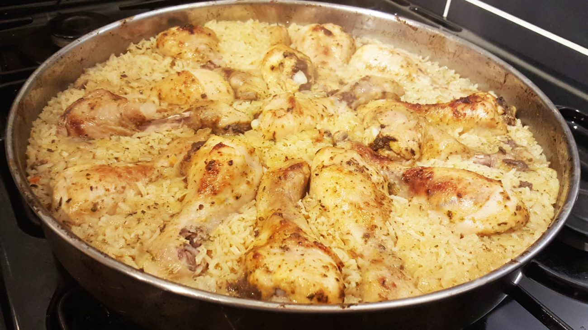

# Pilaf me Pula (Albanian Chicken Pilaf)

*The Albanian everyday lunch in a single pot: long-grain rice cooked in chicken stock with butter, onion and bay, finished with shredded poached chicken and parsley; the centre-of-the-table dish at Sunday family lunches across Tirana and Shkodër.*

**Serves:** 4-6

**Prep Time:** 15 minutes

**Cook Time:** 1 hour

## Overview
Pilaf me pula is the cousin of the bare Albanian rice pilaf, lifted into a one-pot main-side by adding poached and shredded chicken. The technique stays the same: a whole chicken is gently poached with onion, bay and peppercorns till tender, the stock is strained and saved, and that golden stock becomes the cooking liquid for the rice. The cooked chicken is shredded and folded back in just before the rest stage so it warms through without drying. The result is a soft fluffy rice studded with shredded chicken, perfumed faintly with cinnamon and bay, finished with a knob of butter and a green hit of parsley. The dish goes on the Albanian table on Sunday lunches, at name-day celebrations, and at any gathering where one pot needs to stretch to feed eight.

## Ingredients

### Chicken poach
- 1 whole chicken (about 1.5 kg)
- 1 large onion (halved)
- 2 carrots (cut in 5 cm chunks)
- 1 leek (white part, halved lengthwise)
- 4 fresh bay leaves
- 10 whole black peppercorns
- 2 sprigs fresh thyme
- 1 1/2 teaspoons fine sea salt
- 2.5 litres cold water (enough to cover)

### Pilaf
- 400 g long-grain white rice (basmati or any long-grain)
- 50 g butter
- 1 large white onion (finely sliced)
- 1 small cinnamon stick (about 5 cm)
- 6 whole black peppercorns
- 1 bay leaf
- 1 teaspoon fine sea salt
- 800 ml of the reserved chicken stock
- 1 knob (25 g) butter (to finish)
- 1 small handful fresh parsley (finely chopped, to finish)
- 1 teaspoon coarsely cracked black pepper

### To serve
- A bowl of cold thick yoghurt (kos)
- A wedge of lemon
- A small pile of sliced raw red onion

## Method

### Stage 1 - Poach the chicken
1. Sit the whole chicken in a large lidded pot.
2. Add the halved onion, carrots, leek, bay leaves, peppercorns, thyme and salt.
3. Pour over the cold water to cover.
4. Bring slowly to a gentle simmer over medium heat (don't boil hard; the chicken stays tender at a bare simmer).
5. Skim any scum from the surface.
6. Simmer covered 45 minutes till the meat pulls easily from the bone.

### Stage 2 - Rest and shred
1. Lift the chicken carefully onto a board.
2. Strain the stock through a fine sieve into a measuring jug; reserve 800 ml for the pilaf and freeze the rest.
3. Once the chicken is cool enough to handle, lift the breast and thigh meat off the carcass.
4. Discard the skin and bones.
5. Shred the meat into thumb-sized pieces.
6. Cover loosely with foil to keep warm.

### Stage 3 - Rinse the rice
1. Tip the rice into a fine sieve.
2. Rinse under cold running water 1-2 minutes till the water runs clear.
3. Drain thoroughly.

### Stage 4 - Aromatics
1. Melt the 50 g butter in a heavy lidded saucepan over medium heat.
2. Add the sliced onion and a pinch of salt; sweat 6-8 minutes till soft and golden at the edges.
3. Add the cinnamon stick, peppercorns and bay leaf; toast 30 seconds.

### Stage 5 - Toast the rice
1. Tip the drained rice into the pan.
2. Stir constantly 2 minutes till the grains are coated and slightly translucent at the edges.

### Stage 6 - Steam
1. Pour in the 800 ml reserved chicken stock.
2. Add the salt and the cracked pepper.
3. Bring to a rolling boil over high heat.
4. Reduce to the lowest setting; clamp the lid on tightly.
5. Cook 18 minutes undisturbed.

### Stage 7 - Add the chicken and rest
1. Take the pot off the heat.
2. Lift the lid; scatter the shredded chicken evenly across the rice surface (don't stir in).
3. Replace the lid; rest 10 minutes (the chicken warms through; the rice finishes steaming).

### Stage 8 - Fluff and finish
1. Lift the lid; fish out the cinnamon stick, peppercorns, bay leaf.
2. Drop in the 25 g knob of butter.
3. Fold gently with a fork to mix the chicken through the rice (don't stir vigorously, which breaks the grains).
4. Sprinkle the parsley over.

### Stage 9 - Serve
1. Pile onto a warm serving plate.
2. Serve with a bowl of cold yoghurt, a lemon wedge, and sliced raw red onion alongside.
3. Eat with a spoon, Albanian-style.

## Notes
- **Whole chicken, not just breasts:** the bones make the stock, and the dark meat gives more flavour than breast alone.
- **Gentle simmer for the poach:** boiling the chicken hard makes it stringy and dry.
- **Reserve the stock:** the cooking liquid is the dish; never substitute cube stock.
- **Rinse the rice:** the difference between fluffy pilaf and gluey rice.
- **Rest 10 minutes covered after the chicken goes in:** the chicken warms gradually rather than drying out from direct heat.

## Variations
- **Pilaf me pula dhe kos (with yoghurt):** stir 3 tablespoons cold yoghurt through the warm rice at the rest stage for a creamier finish.
- **Pilaf me pula dhe arra:** scatter 50 g toasted pine nuts over the finished pilaf.
- **Pilaf me rrush thatë:** add 50 g raisins soaked in hot water for 10 minutes; fold through with the chicken.
- **Pilaf me pula dhe perime:** add 100 g cooked peas and 50 g diced carrot at the rest stage for a vegetable-rich version.
- **Saffron pilaf me pula:** soak 1 teaspoon saffron threads in 50 ml warm water; add with the stock for a wedding-table version.

## Serving
- At an Albanian Sunday lunch (the traditional setting) · for a Tirana family name-day · as the centrepiece of an Albanian iftar table during Ramadan · with cold kos yoghurt and pickled peppers · for a winter weeknight one-pot supper · at a Kosovo wedding alongside roast lamb.

## Storage
- Refrigerates 3 days in a sealed container.
- Reheat in a covered pan with a splash of stock to revive the moisture.
- Don't freeze (the chicken pieces dry out and the rice texture suffers).
- The reserved chicken stock keeps 5 days in the fridge or 3 months in the freezer; use for soup, the next pilaf, or to cook ferges.
