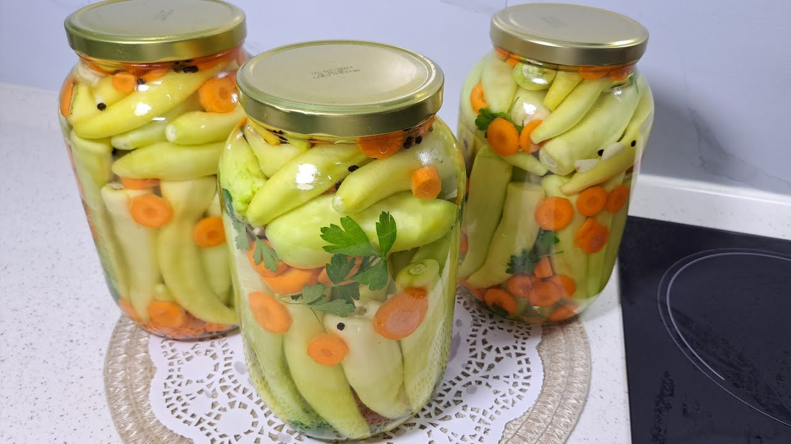

# Speca Turshi

*Albanian pickled banana peppers: long pale-yellow peppers brined in vinegar with garlic and bay, the winter pantry side that lives on the table beside cheese, bread and roast meat from October to spring.*

**Serves:** Makes 2 large jars (about 2 litres)

**Prep Time:** 30 minutes

**Cook Time:** 10 minutes

## Overview
Every Albanian kitchen has a jar of speca turshi on the table from autumn through to the next harvest. The peppers are the long, pale-yellow banana variety grown in the gardens of Berat and Korçë; they are picked when still firm and just beginning to blush, salted briefly to draw water, then packed into jars with garlic, bay and a hot brine of vinegar, water and a pinch of sugar. After two weeks the peppers turn translucent gold, the brine goes cloudy, and the kitchen smells faintly of garlic vinegar each time the lid comes off. The side runs beside grilled lamb, white cheese and cornbread; the brine itself gets stirred into bean stews and tomato salads. The whole point is that long-ago practical move: get the late-summer harvest into a jar before the cold sets in.

## Ingredients

- 1500 g banana peppers (long, pale yellow, firm)
- 1 head garlic, peeled and lightly crushed (about 10 cloves)
- 4 bay leaves
- 2 tsp black peppercorns
- 1 tsp coriander seeds
- 750 ml white wine vinegar (5% acidity)
- 750 ml water
- 60 g salt
- 30 g sugar

## Method

### Stage 1 - Prepare the peppers
1. Wash the peppers; pat dry.
2. Prick each pepper twice with a fork (lets the brine into the flesh).
3. Pack the peppers into clean sterilised jars, slotting them upright; tuck garlic cloves, bay leaves, peppercorns and coriander seeds between them.

### Stage 2 - Make the brine
1. Combine the vinegar, water, salt and sugar in a saucepan.
2. Bring to a rolling boil, stirring until the salt and sugar dissolve.
3. Boil for 2 minutes; turn off the heat.

### Stage 3 - Pour and seal
1. Pour the hot brine over the peppers, covering them completely; leave 1 cm headspace at the top.
2. Tap the jars to release any trapped air bubbles.
3. Wipe the rims clean; seal with sterilised lids.

### Stage 4 - Cure
1. Leave the sealed jars at room temperature in a dark place for 14 days.
2. The peppers turn from bright yellow to translucent gold; the brine clouds slightly.
3. After two weeks, move to a cool larder or the fridge.

## Notes
- **The peppers:** Use firm, slightly under-ripe banana peppers. Soft or fully ripe peppers go mushy in the brine.
- **The vinegar:** 5% acidity is the safety minimum for shelf-stable pickling; do not dilute further than the recipe.
- **Sterilising:** Wash jars in hot soapy water, then warm in a 120°C oven for 15 minutes before filling.

## Variations
- **Hot version:** Add 4-6 small red chillies to each jar.
- **With cabbage:** Add chunks of cabbage between the peppers for crunch.
- **With carrot rounds:** Slot carrot coins between the peppers; they go bright orange.
- **Wild fennel version:** Add a sprig of dried wild fennel to each jar (a Berat touch).
- **With dill:** Add a sprig of dill for a Korçë variation.

## Serving
- Beside grilled lamb or pork · with white cheese and bread for breakfast · alongside fasule (bean stew) · as part of a meze plate · stirred into tomato salad · with cornbread and butter.

## Storage
- Sealed jars keep 12 months in a cool dark place.
- Once opened, refrigerate and use within 2 months.
- The peppers improve in flavour for the first 4 weeks; eat from 2 weeks onward.
- If a jar smells off or the lid bulges, discard the whole jar.
