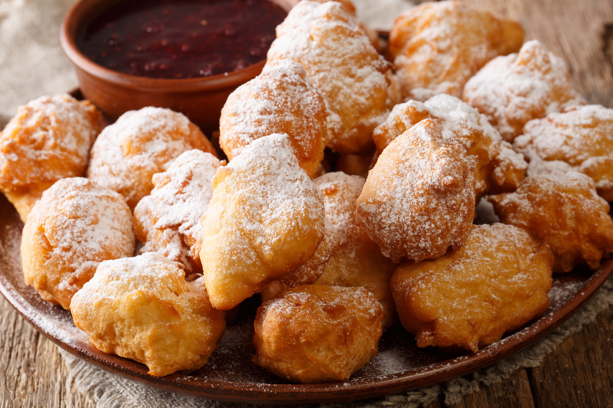

# Petulla

*Albanian fried dough: simple yeasted rounds pulled by hand and dropped into hot oil till they puff and go dark gold. Served hot with crumbled white cheese and a drizzle of honey or homemade jam, the breakfast and afternoon snack of Albanian kitchens.*

**Serves:** 4 (makes about 16 petulla)

**Prep Time:** 15 minutes (plus 1 hour rising)

**Cook Time:** 20 minutes

## Overview
Petulla is the Albanian fried dough that lives at the centre of weekend breakfast and Sunday tea. The dough is barely more than flour, water, salt and yeast, mixed loose and left to rise for an hour; small handfuls are then pulled into rough ovals and dropped into hot oil where they puff and crisp on the outside while staying chewy in the middle. Two finishes split the country in two: the savoury side gets crumbled gjizë or feta and a slick of yoghurt; the sweet side gets honey, walnut jam, or reçel arrash spooned over while still hot. Children get sugar dusted on. The pan never stays cool for long, fresh petulla come off the stove all afternoon, served as they land. Eat hot, with whichever topping is on the table.

## Ingredients

### For the dough
- 400 g plain flour
- 7 g instant yeast (1 sachet)
- 1 tsp salt
- 1 tsp sugar
- 300 ml warm water (about 35°C)
- 1 tbsp olive oil
- 600 ml sunflower oil, for frying

### To serve (choose one or several)
- 200 g feta or gjizë cheese, crumbled
- 4 tbsp honey
- 4 tbsp walnut jam or reçel arrash
- 200 ml plain yoghurt
- Icing sugar, for dusting

## Method

### Stage 1 - Make the dough
1. Whisk the flour, yeast, salt and sugar together in a large bowl.
2. Pour in the warm water and the olive oil.
3. Stir with a wooden spoon until a sticky, soft dough comes together; it should be wetter than a bread dough.
4. Cover the bowl with cling film; leave in a warm spot for 1 hour until doubled and bubbly.

### Stage 2 - Heat the oil
1. Pour the sunflower oil into a deep heavy pan; the oil should be at least 4 cm deep.
2. Heat to 180°C (or until a small piece of dough dropped in sizzles and rises in 5 seconds).

### Stage 3 - Fry
1. Wet your hands with cold water.
2. Pull a small handful of dough (about 50 g) from the bowl; stretch it into a rough oval about 10 cm long.
3. Lower carefully into the oil; it will puff and float almost immediately.
4. Fry 3-4 petulla at a time; cook for 1 minute on one side until dark gold, then turn for 30 seconds on the other.
5. Lift with a slotted spoon onto kitchen paper.
6. Repeat with the rest of the dough, keeping the oil at 180°C.

### Stage 4 - Serve
1. Pile the hot petulla on a warm plate.
2. Set out the toppings: crumbled cheese, honey, walnut jam, yoghurt, icing sugar.
3. Eat with hands while still hot.

## Notes
- **The dough texture:** Wetter than bread dough, drier than batter. If it is too dry the petulla will not puff.
- **Wet hands:** Stops the dough sticking as you pull it.
- **The oil temperature:** Too cool and they go greasy. Too hot and they go dark outside while raw inside. A thermometer is helpful.

## Variations
- **With Greek yoghurt and garlic:** Mix 1 crushed garlic clove into the yoghurt as a savoury dip.
- **Sweet with walnut sugar:** Toss the hot petulla in a mix of crushed walnuts and caster sugar.
- **Stuffed:** Press a cube of feta into each piece of dough before stretching.
- **With ajvar:** Spread the savoury red pepper paste on the hot petulla.
- **Cornmeal version:** Replace 100 g of the flour with fine cornmeal for a coarser crumb.

## Serving
For weekend breakfast with cheese, yoghurt and honey · for afternoon tea on a Sunday · at Bajram (Eid) with fig jam · stacked high for a family snack · with a small dark coffee · as fast street food from a market stall.

## Storage
- Eat warm, the same day.
- The texture goes hard within hours; reheat briefly in a hot oven if needed.
- The raw dough keeps overnight in the fridge; bring back to room temperature before frying.
