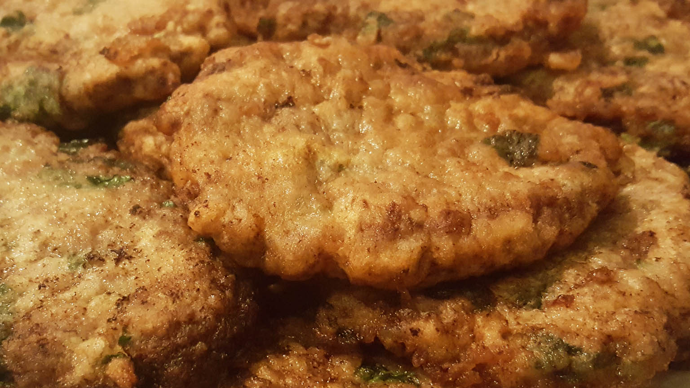

# Qofte të Fërguara

*Small Albanian fried meatballs: beef and lamb mince worked with grated onion, paprika and dried oregano, rolled into 3 cm balls and fried in olive oil till the outsides go dark and the insides stay juicy. The standing meze at every Albanian table.*

**Serves:** 4 (makes about 24 small meatballs)

**Prep Time:** 20 minutes (plus 1 hour resting)

**Cook Time:** 15 minutes

## Overview
Qofte të fërguara are the small fried meatballs that turn up at every Albanian meze table, every wedding buffet, every weekend lunch. The mix is half beef and half lamb (the lamb gives the flavour, the beef gives the bite), worked with finely grated onion till the meat loosens, then seasoned heavily with sweet paprika, dried oregano and crumbled feta or breadcrumbs to hold the texture together. The mix rests in the fridge for an hour so the spices settle in; the meatballs are then rolled small (about 3 cm) and fried in shallow olive oil till the outsides go almost black and the insides stay soft and pink. They get piled on a warm plate with a wedge of lemon and a spoon of yoghurt on the side; the table tears into them while still hot. The smaller-and-darker rule applies: smaller balls mean more crust, dark crust means more flavour.

## Ingredients

- 300 g minced beef
- 300 g minced lamb
- 1 medium onion, finely grated
- 2 garlic cloves, finely grated
- 1 large egg
- 50 g feta cheese, crumbled (or 30 g breadcrumbs)
- 2 tsp sweet paprika
- 1 tsp dried oregano
- 1/2 tsp ground cumin
- 1 tsp salt
- Freshly ground black pepper
- 100 ml olive oil, for frying
- 1 lemon, cut into wedges
- 200 ml plain yoghurt, to serve

## Method

### Stage 1 - Mix
1. Place the grated onion in a sieve over a bowl; squeeze with your hand to remove most of the juice (otherwise the mix is too wet).
2. Tip the drained onion into a large bowl with the minced beef, minced lamb, grated garlic, egg, feta, paprika, oregano, cumin, salt and pepper.
3. Work with your hands for 3 minutes until the mix is uniform and slightly tacky.
4. Cover; rest in the fridge for 1 hour.

### Stage 2 - Roll
1. Wet your hands with cold water.
2. Pinch off small pieces (about 25 g each) and roll into balls about 3 cm across.
3. Set on a tray; you should have about 24 balls.

### Stage 3 - Fry
1. Pour the olive oil into a wide heavy frying pan; heat over medium-high until shimmering.
2. Add the meatballs in a single layer (work in two batches if needed); leave space between them.
3. Fry for 3 minutes on the first side without moving until a dark crust forms.
4. Turn with tongs; fry another 3 minutes on the second side.
5. Roll for a final 2 minutes to brown all over.
6. Lift onto kitchen paper; rest for 2 minutes.

### Stage 4 - Serve
1. Pile the meatballs on a warm plate.
2. Set the lemon wedges and the yoghurt alongside.
3. Eat while hot.

## Notes
- **The mince ratio:** Half beef half lamb is traditional. All beef goes dry; all lamb goes greasy.
- **Drain the onion:** Wet onion gives wet meatballs that fall apart in the pan.
- **The dark crust:** Do not move the meatballs until the crust forms, or they tear.

## Variations
- **With chilli:** Add 1 teaspoon dried chilli flakes for hot qofte.
- **With mint:** Add 2 tablespoons chopped fresh mint to the mix.
- **Tirana version:** Skip the lamb; use all beef and double the paprika.
- **Grilled version (qofte në hell):** Mould the mix around metal skewers and grill over charcoal.
- **With pine nuts:** Fold 2 tablespoons toasted pine nuts into the mix.

## Serving
On the meze plate with white cheese and pickled peppers · with lemon and yoghurt · stuffed into warm pita with chopped onion · with rice pilaf as a main course · at parties and family gatherings · with a glass of cold raki.

## Storage
- Eat hot the day they are cooked.
- Leftovers keep 3 days refrigerated; reheat in a hot oven for 8 minutes.
- The raw rolled meatballs freeze 2 months; defrost overnight before frying.
