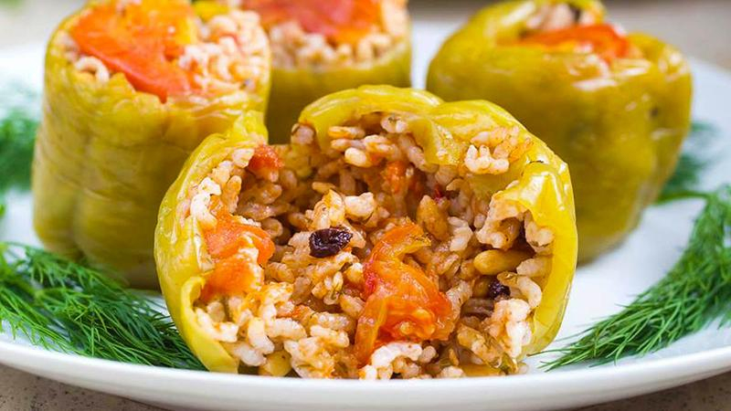

# Speca te Mbushur

*Sweet red and yellow peppers hollowed out and stuffed with rice, minced beef, onion and herbs, then braised standing upright in a tomato broth till the peppers slump and the filling drinks the liquid.*

**Serves:** 6 (2 peppers each)

**Prep Time:** 30 minutes

**Cook Time:** 1 hour 15 minutes

## Overview
Speca te mbushur (stuffed peppers) is the autumn family meal across Albania, made when the peppers are at their cheapest and ripest in the September market. Twelve fat peppers are topped, cored and stood upright in a deep pan, each one packed with a rice-and-mince filling seasoned with onion, parsley, mint and a little paprika, then the pan is filled halfway with a tomato broth and the lot is simmered slow under a lid for an hour till the peppers go soft and slumped and the filling has drunk the liquid. The dish is finished by reducing the broth to a thick sauce that gets spooned over each pepper at the plate. Eat warm with a spoonful of thick yoghurt on top and a hunk of bread. The combination of sweet collapsed pepper, soft rice and rich mince in tart tomato is the everyday Albanian Sunday.

## Ingredients

### For the peppers
- 12 medium red, yellow or orange bell peppers (similar size so they sit level)

### For the filling
- 3 tbsp olive oil
- 2 large onions, finely chopped
- 500 g minced beef (or half beef, half lamb)
- 200 g short-grain or medium-grain rice
- 2 cloves garlic, finely chopped
- 1 tsp paprika
- 1/2 tsp ground allspice
- A small handful of flat-leaf parsley, chopped
- A small handful of fresh mint, chopped
- 1 tsp salt
- 1/2 tsp freshly ground black pepper

### For the braising broth
- 2 tbsp olive oil
- 1 onion, finely chopped
- 500 g chopped tomatoes (tinned or fresh, peeled)
- 1 tbsp tomato puree
- 500 ml chicken or beef stock
- 1 tsp salt
- 1 tsp sugar
- A bay leaf

### To serve
- Thick Greek-style yoghurt
- Crusty country bread

## Method

### Stage 1 - The filling
1. Heat 3 tbsp olive oil in a large pan over medium heat.
2. Add the chopped onions; cook 8 minutes till soft and pale gold.
3. Add the mince; brown well, breaking up with a wooden spoon, 8 minutes.
4. Stir in the rice, garlic, paprika and allspice; cook 2 minutes.
5. Take off the heat, stir in the parsley, mint, salt and pepper. Cool 10 minutes.

### Stage 2 - The peppers
1. Slice the tops off the peppers (keep the lids); scoop out the seeds and white pith with a teaspoon.
2. Spoon the filling into each pepper, filling to 1 cm below the rim (the rice swells as it cooks).
3. Set the lids back on.

### Stage 3 - The broth and the braise
1. In a wide deep heavy pan (big enough to hold the peppers standing up), heat 2 tbsp olive oil over medium heat.
2. Soften the onion 6 minutes.
3. Add the chopped tomatoes, tomato puree, stock, salt, sugar and bay leaf. Bring to a simmer.
4. Stand the peppers upright in the pan. The liquid should come halfway up the peppers; add a little water if needed.
5. Cover with a lid, lower the heat, simmer gently for 60 to 70 minutes until the peppers are soft and slumped and the rice is fully cooked.

### Stage 4 - Reduce and serve
1. Lift the peppers out gently with a slotted spoon to a warm serving dish.
2. Turn the heat up under the pan, simmer the remaining broth hard for 5 to 8 minutes till it reduces to a thick sauce.
3. Spoon the sauce over and around the peppers.
4. Serve hot with a spoon of cold thick yoghurt on top of each pepper.

## Notes
- **Choose peppers that sit flat.** A pepper that tips over leaks its filling; pick squat round peppers, not long pointed ones.
- **Rice goes in raw.** Half-cooked rice absorbs the broth and seasoning as it cooks in the pepper; pre-cooked rice goes mushy.
- **Don't overfill.** Rice swells; 1 cm clear below the rim is the right gap.
- **The yoghurt finish is essential.** The cold sharp dollop against the warm sweet pepper and rich mince is the whole point.
- **Pack the pan snug.** Peppers held upright by their neighbours stay upright; loose peppers fall over.

## Variations
- **Vegetarian:** swap the mince for 300 g cooked white beans or 300 g grated firm tofu plus more rice; the texture changes but works.
- **With pine nuts and currants:** stir 30 g toasted pine nuts and 30 g currants into the filling for an older Ottoman version.
- **Lamb-only:** use 500 g lamb mince; richer and more fragrant.
- **With aubergine:** stuff hollowed aubergines and courgettes alongside the peppers (different cooking times; aubergine 75 minutes, courgette 45).
- **Tomato-baked:** transfer to a roasting tin after stage 3, finish in a 180C oven for 30 minutes for a darker top.

## Serving
A spoon of cold yoghurt on each pepper · crusty bread to mop the sauce · a green salad with vinegar and oil · a glass of country red · pickled peppers on the side for the country version.

## Storage
- Keeps 4 days refrigerated; the flavour deepens overnight
- Reheat gently in a covered pan with a splash of stock, 15 minutes
- Freezes well: pack in pairs with sauce, freeze 2 months, defrost overnight before reheating
</content>
