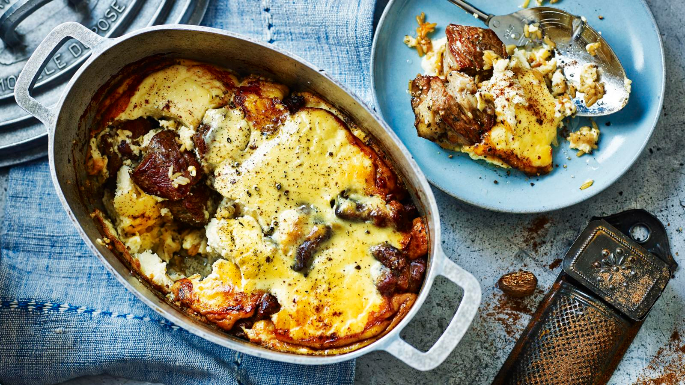

# Tave Kosi

*Albania's national dish: pieces of lamb baked with rice under a thick yoghurt-and-egg crust that sets to a pale gold custard with the sharp clean tang of the country's mountain dairy.*

**Serves:** 6

**Prep Time:** 25 minutes

**Cook Time:** 1 hour 30 minutes

## Overview
Tave kosi (tavë kosi in proper Albanian spelling) translates plainly as "yoghurt casserole" and that is exactly what it is. Pieces of lamb are browned with butter and garlic, layered into a clay or earthenware dish with parboiled rice, then drowned in a yoghurt-egg-flour mixture that goes into a slow oven for an hour till the lamb falls off the bone underneath and the yoghurt sets to a pale gold custard on top, with patches of browned dark crust. The dish came down from the Ottoman kitchens of Elbasan in central Albania (where it is still called tave Elbasani) and travelled through the country to become the national plate. It is autumn and winter food, the long-cook Sunday lunch, the meal cooked when the lamb is good and the new yoghurt has come in. Eat warm with a spoon, scooping crust, rice and meat together.

## Ingredients

- 1 kg lamb shoulder or leg, cut into 4 cm pieces (bone-in or boneless)
- 4 tbsp butter (plus 1 tbsp more for the rice)
- 3 cloves garlic, finely chopped
- 1 tbsp plain flour (for the lamb)
- 1 tsp dried oregano
- 500 ml lamb or chicken stock (good quality)
- 200 g short-grain or medium-grain rice
- 750 g thick Greek-style yoghurt (full fat, the thicker the better)
- 4 large eggs
- 2 tbsp plain flour (for the topping)
- 1 tsp salt
- 1/2 tsp freshly ground black pepper
- 1/2 tsp paprika (to finish)

## Method

### Stage 1 - Brown the lamb
1. Heat the oven to 180C fan.
2. Melt 4 tbsp butter in a heavy ovenproof casserole over medium-high heat.
3. Pat the lamb dry, season with salt and pepper, and brown in 2 batches till the pieces colour dark on all sides (8 minutes per batch). Lift out to a plate.
4. Lower the heat, add the chopped garlic to the same pan, stir for 30 seconds.
5. Sprinkle in 1 tbsp flour, stir for a minute to cook the flour out.
6. Add the oregano and pour in the stock; whisk to lift the brown stuff off the base of the pan. Return the lamb to the casserole, bring up to a simmer.
7. Cover and braise in the oven for 45 minutes, until the lamb is tender but not falling apart. Keep the cooking liquid.

### Stage 2 - Parboil the rice
1. While the lamb braises, bring a small pan of salted water to the boil.
2. Add the rice and cook for 8 minutes, then drain.
3. Stir in the extra 1 tbsp butter so the grains don't stick.

### Stage 3 - The yoghurt topping
1. In a large bowl, whisk together the yoghurt, eggs and 2 tbsp flour till smooth.
2. Take 4 tbsp of the warm lamb cooking liquid and whisk it slowly into the yoghurt mixture (tempering, so the eggs don't scramble).
3. Season with salt and pepper.

### Stage 4 - Assemble and bake
1. Pull the lamb out of the oven. Drop the heat to 170C fan.
2. Scatter the parboiled rice evenly over the lamb and its juices, pushing the grains down so they soak.
3. Pour the yoghurt mixture slowly over the top so the whole surface is covered. Tap the dish to settle.
4. Dust the top with paprika.
5. Bake uncovered for 35 to 40 minutes, until the topping has set, puffed slightly, and the surface is patched with golden brown.
6. Rest 10 minutes before serving (the crust firms as it cools).

## Notes
- **The yoghurt matters.** Use a thick full-fat strained Greek-style yoghurt (10% fat or more). Thin runny yoghurt will weep liquid into the bake.
- **Brown the lamb hard.** Pale lamb gives a pale dish. Push the browning till the pieces are dark on all sides.
- **Don't overwhip the topping.** A few whisks to combine; aggressive beating puts too much air in and the topping puffs and falls flat.
- **Rest before serving.** Hot from the oven the custard is fragile; 10 minutes of rest sets the structure.
- **The top should be patchy gold.** A uniform pale top is underbaked; a dark uniform top is overbaked. Aim for patches.

## Variations
- **Tave kosi me oriz e mish pule (chicken version):** swap the lamb for 1 kg chicken thighs, on the bone, skin on, and reduce stage 1 braise to 30 minutes.
- **With mint:** stir 2 tbsp finely chopped fresh mint into the yoghurt mixture for a fresher version (the southern Albanian style).
- **Elbasan classic:** skip the rice and serve over thick slices of toasted day-old bread laid into the dish; the bread soaks the juices.
- **With orzo:** swap the rice for 200 g orzo, parboiled the same way (the more recent Tirana style).
- **Vegetarian (improvised):** swap the lamb for 1 kg roasted aubergine chunks and use vegetable stock; not traditional but works.

## Serving
- Bring the casserole to the table · scoop crust, rice and meat together onto warm plates · a simple cos lettuce salad with lemon · a glass of country red or chilled raki · crusty bread for the corners of the dish.

## Storage
- Keeps 3 days refrigerated; the dish gets better on the second day
- Reheat covered at 160C for 20 minutes; the custard firms further
- Not suitable for freezing (the yoghurt splits on thawing)
</content>
