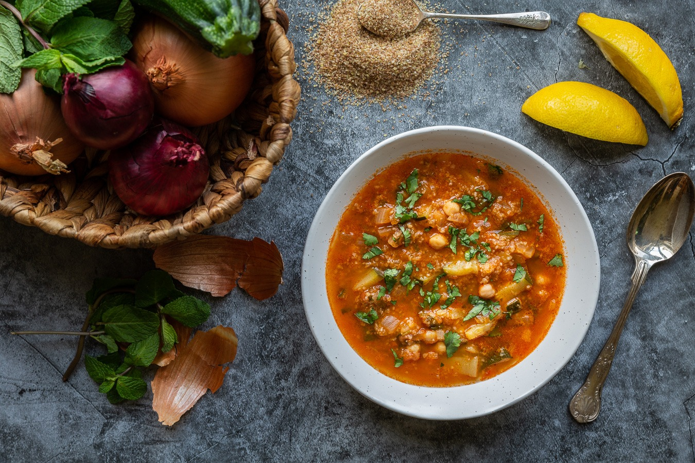

# Chorba Frik

*The Algerian Ramadan soup: lamb, tomato and the smoky cracked green wheat called frik, simmered with mint and coriander into the first thing every household tastes at sundown.*

**Serves:** 6

**Prep Time:** 20 minutes

**Cook Time:** 1 hour 30 minutes

## Overview
Chorba frik is the soup that breaks the fast in Algeria. Through the whole month of Ramadan, almost every household has a pot on the stove by mid-afternoon and a bowl waiting on the table when the call to maghrib prayer comes. The body of the soup is frik, a green wheat harvested young, then roasted over fire and cracked. The roasting gives it a faintly smoky, nutty note that thickens the broth slowly as it cooks and sets the soup apart from any other lamb-and-tomato pottage. Lamb (shoulder or neck, on the bone for the flavour) is the protein; tomato, onion and chickpeas build the base; cinnamon, black pepper and a heavy hand with fresh coriander and mint at the end give the perfume. A squeeze of lemon at the table cuts the richness. Served with a date and a glass of water on the side for the traditional break of fast.

## Ingredients

- 400 g lamb shoulder or neck on the bone, cut into 2 cm cubes
- 2 tbsp olive oil
- 1 large onion, finely chopped
- 2 stalks celery with leaves, finely chopped
- 3 tbsp tomato paste
- 3 ripe tomatoes, grated (skin discarded)
- 1 tsp ground cinnamon
- 1 tsp ground black pepper
- 0.5 tsp ground caraway
- 1 tsp paprika
- 1 small bunch fresh coriander, finely chopped (reserve half for the end)
- 1 small bunch fresh mint, leaves only, finely chopped (reserve half for the end)
- 100 g cooked chickpeas
- 100 g frik (cracked roasted green wheat); rinse twice in cold water
- 2 litres water or light lamb stock
- 1.5 tsp salt
- 1 lemon, cut into wedges, to serve

## Method

### Stage 1 - Brown the lamb
1. Heat the olive oil in a heavy pot over medium-high heat.
1. Add the lamb cubes; brown for 6 minutes, turning, until coloured on all sides.
1. Reduce the heat to medium.

### Stage 2 - Build the base
1. Add the chopped onion and celery; cook for 6 minutes until soft.
1. Stir in the tomato paste, grated tomatoes, cinnamon, black pepper, caraway and paprika; cook for 3 minutes until the mixture darkens and the oil separates at the edges.
1. Add half the coriander and half the mint, the chickpeas, and the water. Bring to a simmer.
1. Cover loosely; cook for 45 minutes, until the lamb is tender.

### Stage 3 - Add the frik
1. Stir in the rinsed frik and the salt.
1. Continue to simmer, uncovered now, for 25 to 30 minutes, stirring from time to time so the wheat does not stick. The frik should be tender but still with a little bite, and the broth should be thickened to a loose porridge.

### Stage 4 - Final herbs and serve
1. Off the heat, stir in the reserved coriander and mint.
1. Check the salt and the consistency. If the soup has tightened too much overnight or while sitting, loosen with a little hot water; chorba should be pourable, not stew-thick.

### Stage 5 - Break the fast
1. Ladle into warmed bowls.
1. Serve with lemon wedges on the side; each person squeezes their own to taste.

## Notes
- **Frik.** Look for it at Middle Eastern and North African grocers, sometimes labelled "freekeh" (the spelling used in the Levant). The cracked variety is right for chorba; whole grain frik is for pilafs and takes longer to cook.
- **Lamb on the bone matters.** The marrow gives the broth depth; if you can only get boneless, add a small lamb knuckle or a marrow bone to the pot.
- **Make it ahead.** Chorba is better on day two when the spices have settled and the wheat has fully bloomed; loosen with water when reheating.

## Serving
- Serve at sundown during Ramadan after breaking the fast with a date and water. The rest of the year, eat as a starter or as a full meal with bread (kesra or baguette) and a small salad. Lemon wedges and a small pot of harissa for those who want heat.

## Storage
- Keeps 3 days refrigerated, thickening further overnight; loosen with water when reheating
- Freezes 2 months; the wheat texture survives the freeze better than most grains
- Reheat slowly and gently, stirring often, so the wheat does not catch on the base of the pot
