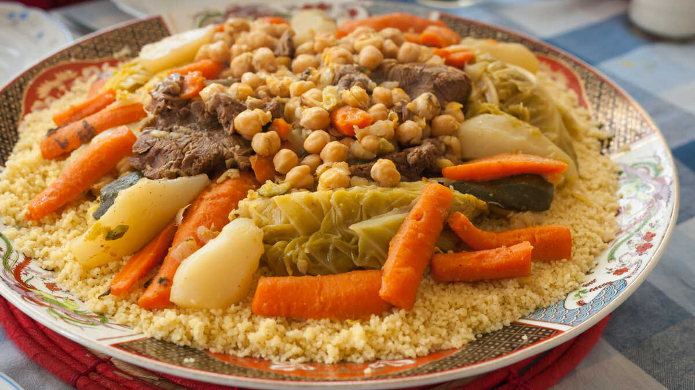

# Couscous Algérien

*The Friday couscous of Algerian households: steamed semolina under a fragrant broth of lamb, chickpeas and seven vegetables, the table-centre dish that gathers a whole family in one bowl.*

**Serves:** 6

**Prep Time:** 30 minutes

**Cook Time:** 2 hours 30 minutes

## Overview
Couscous is the national dish of Algeria, eaten in some form across the whole country and reserved in most households for Friday, when the family gathers after midday prayers. The Algerian version differs from the Moroccan in two small but important ways: the broth is tomato-led rather than saffron-led, and the vegetables are stewed firm rather than soft, served in clear pieces alongside the meat. Lamb on the bone is the traditional protein, simmered in a copper-bottomed couscoussier while the semolina is steamed in the perforated top, catching the meat's vapour as it cooks. The seven vegetables vary by season and region, but turnip, carrot, courgette, pumpkin and chickpea are usually present. The grain is rolled by hand at least once during cooking to keep it light and separate. Serve the grain piled on a wide platter, the broth and vegetables poured around it, the meat in the centre, and a small bowl of harissa-loosened broth on the side for anyone who wants heat.

## Ingredients

### Broth and meat
- 800 g lamb shoulder on the bone, cut into 6 pieces
- 1 large onion, roughly chopped
- 2 tbsp olive oil
- 3 tbsp tomato paste
- 2 tomatoes, grated (skin discarded)
- 200 g cooked chickpeas (or 1 tin, drained)
- 1 tsp ground cumin
- 1 tsp ground caraway
- 1 tsp sweet paprika
- 1 tsp ground black pepper
- 1 small cinnamon stick
- 1 tsp salt
- 1.5 litres water

### Vegetables (the seven)
- 2 carrots, peeled, cut into long batons
- 2 turnips, peeled, quartered
- 2 courgettes, cut into thick rounds
- 300 g pumpkin or butternut squash, peeled and cut into chunks
- 1 small green cabbage wedge (optional, regional)
- 1 small bunch fresh coriander, tied with string
- 1 small bunch fresh flat-leaf parsley, tied with string

### Semolina
- 500 g medium couscous (the proper hand-rolled kind if you can find it; instant works at a pinch)
- 60 ml olive oil
- 1 tsp salt
- 500 ml warm water (for hydrating in stages)

### To serve
- 1 tbsp harissa stirred into a small bowl of hot broth
- A small dish of smen (Algerian aged butter) or extra olive oil

## Method

### Stage 1 - Build the broth
1. Heat the olive oil in the bottom of a couscoussier (or a tall heavy pot fitted with a steamer top) over medium heat.
1. Add the chopped onion; cook for 5 minutes until soft.
1. Add the lamb pieces; brown on all sides for 8 minutes.
1. Stir in the tomato paste, grated tomatoes, cumin, caraway, paprika, pepper, cinnamon stick and salt; cook for 2 minutes until fragrant.
1. Pour in the water; add the herb bundles. Bring to a simmer, cover loosely, and cook for 1 hour while you prepare the grain.

### Stage 2 - First steaming of the semolina
1. Tip the couscous into a wide shallow bowl.
1. Drizzle over half the olive oil and rub through the grains with your fingertips for 2 minutes; this coats and separates them.
1. Sprinkle over 150 ml warm water in a thin stream while continuing to rub; the grains should swell but stay separate.
1. Transfer to the top of the couscoussier (lined with muslin if the holes are large); steam uncovered for 20 minutes over the simmering broth.

### Stage 3 - Second hydration and steaming
1. Tip the steamed grain back into the bowl; break up any clumps with a wooden spoon.
1. Sprinkle over another 200 ml warm water and the salt; rub through again.
1. Return to the steamer for another 20 minutes.

### Stage 4 - Add the vegetables
1. After the broth has had 1 hour, add the carrots and turnips to the pot; simmer 15 minutes.
1. Add the courgettes, pumpkin and chickpeas; simmer 15 more minutes.
1. Add the cabbage wedge if using; simmer 10 minutes. The vegetables should be tender but holding their shape.
1. Discard the herb bundles.

### Stage 5 - Final fluff and serve
1. Tip the steamed couscous back into the bowl one last time.
1. Sprinkle over the remaining 150 ml warm water and the rest of the olive oil; rub through until light, separate and glossy.
1. Pile the couscous in a wide mound on a large platter.
1. Arrange the lamb pieces and vegetables on top.
1. Ladle a generous amount of hot broth over the grain to moisten it; do not drown it.
1. Serve with the harissa-broth on the side; each person spoons it over their own portion to their own heat preference.

## Notes
- **The couscoussier.** A two-tier pot is the proper kit. The bottom holds the broth; the top is perforated for steam. A stockpot with a metal steamer on top works at a pinch; seal the join with a damp strip of cloth or flour-water paste so the steam goes up through the grain.
- **Hand-rolling vs. instant.** Hand-rolled couscous (the kind sold in clear plastic bags at Algerian and Moroccan grocers) gives a much better texture than the boxed instant. If you must use instant, follow the box hydration but still steam it once over the broth to pick up the flavour.
- **Smen.** A small spoonful of aged Algerian butter stirred into the hot grain at the end gives the funky, fermented note that is unmistakably North African. Optional but recommended.

## Serving
Serve hot from a large communal platter; each person takes from the section nearest them. Eat with a spoon (or right-hand fingers in the most traditional households). A small glass of buttermilk (leben) or mint tea on the side. Friday lunch in Algeria is a long meal; do not rush it.

## Storage
- The broth and meat keep 3 days refrigerated and improve overnight as the spices settle
- Cooked couscous refreshes well: sprinkle with water, cover, steam 10 minutes to re-fluff
- Freeze broth and meat together for up to 2 months; freeze cooked grain separately for 1 month
