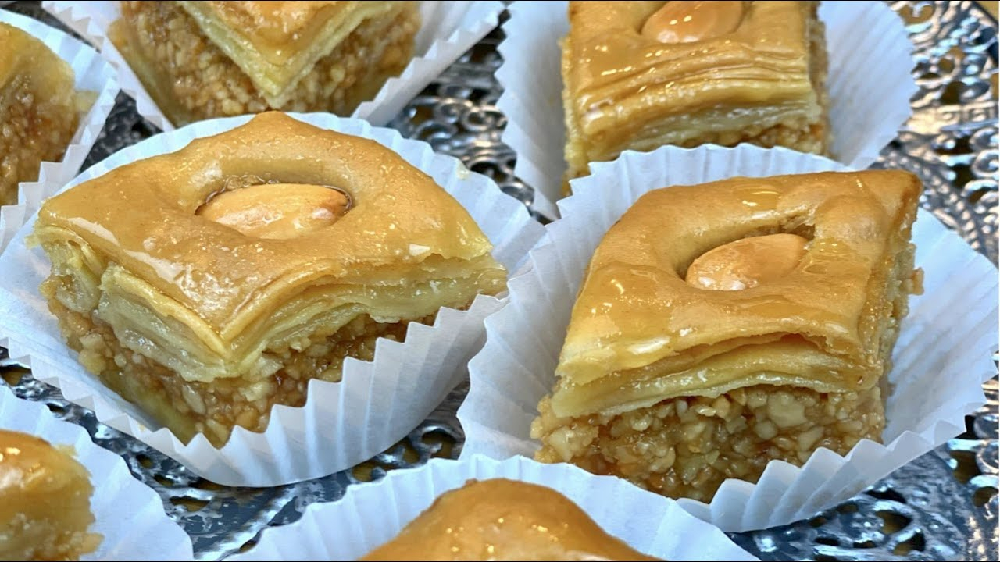

# Baklawa Algérienne

*The Algiers version of baklava: thin layers of filo around blanched almonds and clarified butter, baked in diamonds and bathed in orange-blossom syrup.*

**Serves:** Makes about 24 pieces

**Prep Time:** 45 minutes

**Cook Time:** 45 minutes

## Overview
Baklawa is the Ottoman legacy on the Algerian sweet table, brought through Algiers' three centuries as a regency of the Sublime Porte and reshaped by local taste: where the Turkish original favours pistachio and rosewater, the Algerian version is almond-led and scented with orange-blossom water, the dominant floral perfume of the Algerian kitchen. The filo is brushed with clarified butter (smen or ghee in the most traditional households), layered around a finely ground almond filling sweetened with sugar and cinnamon, then scored into small diamonds before baking. The syrup is poured cold over the hot pastry as it comes out of the oven; the contrast soaks the layers without making them limp. A single almond is pressed into the centre of each diamond before baking, the mark of a proper Algerian baklawa.

## Ingredients

### Pastry
- 500 g filo pastry (about 1 standard pack), thawed if frozen
- 250 g clarified butter or ghee, melted

### Almond filling
- 400 g blanched almonds
- 100 g icing sugar
- 1 tsp ground cinnamon
- 2 tbsp orange-blossom water
- 24 whole blanched almonds (one for each diamond)

### Syrup
- 400 g sugar
- 300 ml water
- 1 tbsp lemon juice
- 3 tbsp orange-blossom water
- 1 cinnamon stick

## Method

### Stage 1 - Make the almond filling
1. Pulse the blanched almonds in a food processor with the icing sugar and cinnamon until finely ground but not pasty.
1. Sprinkle in the orange-blossom water; pulse briefly to bring the mixture together to a damp, mouldable sand. Set aside.

### Stage 2 - Layer the pastry
1. Heat the oven to 170 C (150 fan).
1. Brush a 30 by 25 cm baking tin generously with melted butter.
1. Lay one sheet of filo in the tin (trim to fit if needed); brush with butter.
1. Repeat with another 7 sheets, brushing each with butter, for the bottom layer.
1. Spread the almond filling evenly over the buttered filo; press flat with a spatula.
1. Lay a final 8 sheets of filo on top, brushing each one with butter as you go.
1. Brush the top generously with the last of the butter.

### Stage 3 - Score and finish
1. With a sharp knife, cut the pastry into diamonds: first cut parallel lines about 4 cm apart along the length of the tin; then cut diagonally across at the same spacing.
1. Press a whole blanched almond into the centre of each diamond.

### Stage 4 - Bake
1. Bake for 45 minutes, until the top is deeply gold and crisp.
1. Check at 30 minutes; if the top is browning too fast, drop the temperature to 160 C and cover loosely with foil.

### Stage 5 - Make the syrup
1. While the pastry bakes, combine the sugar, water, lemon juice and cinnamon stick in a small pan.
1. Bring to a simmer; cook 10 minutes until lightly thickened.
1. Stir in the orange-blossom water; remove the cinnamon stick.
1. Cool the syrup completely.

### Stage 6 - Syrup and rest
1. The moment the baklawa comes out of the oven, pour the cold syrup evenly over the hot pastry.
1. Let it sit at room temperature for at least 4 hours, ideally overnight, so the syrup soaks through and the pastry sets.
1. Re-cut along the original score lines before lifting out.

## Notes
- **Hot pastry, cold syrup.** Critical. Pour cold syrup onto hot pastry. The other way around makes a soggy mess.
- **Smen versus butter.** Smen (Algerian aged butter) gives the most traditional flavour but is hard to find outside North Africa; ghee is the best substitute. Plain melted butter works but the flavour is less round.
- **Almonds, not walnuts.** Algerian baklawa uses almonds. Walnut versions exist in Turkish and Levantine baklava but are not the Algiers tradition.

## Serving
Serve in small diamonds at the end of a meal, at Ramadan iftars, at weddings or Aid feasts, paired with hot mint tea or strong qahwa. One or two pieces per person; this is a rich, slow sweet.

## Storage
- Keeps 1 week in a sealed tin at room temperature; the layers stay crisp under the syrup
- Do not refrigerate (the filo softens) or freeze (the syrup crystallises)
- Improves overnight as the syrup distributes evenly through the layers
