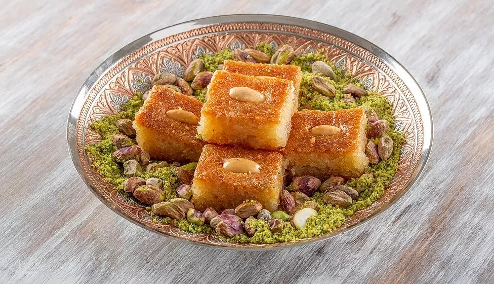

# Kalb el Louz

*"Heart of almonds": a syrup-drenched semolina-and-almond cake from Algiers, baked into golden diamonds and the most famous Ramadan sweet of the city.*

**Serves:** Makes about 24 diamonds

**Prep Time:** 20 minutes (plus 1 hour resting)

**Cook Time:** 35 minutes

## Overview
Kalb el louz (literally "heart of almonds") is the great Algerian Ramadan cake, a single tray of semolina-and-almond dough baked until the top is deep gold and the inside is moist with orange-blossom syrup. It belongs especially to Algiers, where through the whole month of Ramadan the pastry-shop windows fill with great glistening trays of it, each one cut into diamonds and topped with a single blanched almond. The technique sits between a cake and a confection: the dough is mixed by hand with semolina, ground almonds, sugar and melted butter, pressed into a tin, marked into diamonds, baked at a moderate heat, then drowned in cold syrup the instant it leaves the oven. The semolina swells with the syrup overnight, leaving a cake that is sweet, dense, perfumed and unmistakably Algerian. A spoonful of fermented yoghurt batter (raibi) in the mix is the touch that gives the bakery version its faintly tangy crumb.

## Ingredients

### Cake
- 500 g medium semolina
- 200 g ground almonds
- 200 g caster sugar
- 250 g unsalted butter, melted
- 1 tsp baking powder
- 1 tbsp orange-blossom water
- 200 ml plain whole-milk yoghurt
- 24 whole blanched almonds (for the tops)

### Syrup
- 400 g sugar
- 350 ml water
- 1 tbsp lemon juice
- 3 tbsp orange-blossom water

## Method

### Stage 1 - Mix the dough
1. In a wide bowl, mix the semolina, ground almonds, sugar and baking powder.
1. Pour in the melted butter; mix with your fingertips until evenly damp and crumbly.
1. Add the orange-blossom water and the yoghurt; bring together to a soft, slightly sticky dough.
1. Cover; rest 1 hour at room temperature (this lets the semolina hydrate fully).

### Stage 2 - Press into the tin
1. Heat the oven to 170 C (150 fan).
1. Line a 30 by 25 cm tin with baking paper or grease generously with butter.
1. Tip in the dough; press flat with the back of a damp spoon or a spatula until even, about 2.5 cm thick.
1. Smooth the top.

### Stage 3 - Score and almond
1. Score the surface into diamonds about 4 cm across: parallel lines along the long side, then diagonal lines across.
1. Press a whole blanched almond into the centre of each diamond.

### Stage 4 - Bake
1. Bake for 30 to 35 minutes, until the top is deeply gold and the centre feels just firm to the touch.
1. The cake should have lifted slightly and pulled away gently from the sides of the tin.

### Stage 5 - Make the syrup
1. While the cake bakes, combine the sugar, water and lemon juice in a small pan.
1. Bring to a simmer; cook 10 minutes until lightly thickened.
1. Stir in the orange-blossom water; cool completely.

### Stage 6 - Syrup and rest
1. The moment the cake comes out of the oven, pour the cold syrup evenly over the hot surface.
1. The cake will absorb the syrup gradually; do not stir or disturb.
1. Cool to room temperature, then leave at least 4 hours (overnight is better) before cutting.
1. Re-cut along the score lines and lift the diamonds out.

## Notes
- **Yoghurt.** The yoghurt is what makes kalb el louz different from a plain semolina cake; it gives the faint tang and tender crumb that the bakery version is famous for. Do not skip it.
- **Press, do not roll.** This is a pressed cake, not a rolled or kneaded dough. Press firmly into the tin so the layers are even and the diamonds cut cleanly.
- **Cool syrup, hot cake.** Same rule as with baklawa and makroud. The temperature contrast is what soaks the cake without turning it to mush.

## Serving
- Serve in small diamonds at the end of a Ramadan iftar or as a Mawlid sweet, with mint tea or strong black qahwa on the side. One diamond is usually plenty; it is very sweet and very rich.

## Storage
- Keeps 1 week in a sealed tin at room temperature; the syrup keeps the cake moist
- Improves on day two as the syrup distributes evenly
- Do not refrigerate (the semolina goes hard) or freeze (the syrup crystallises)
