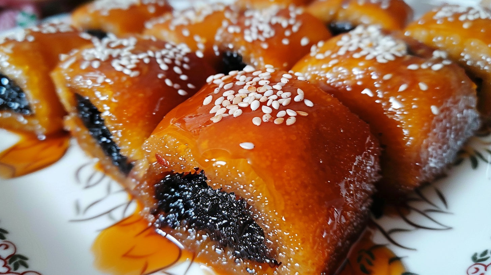

# Makroud

*Date-stuffed semolina diamonds, fried gold and soaked in orange-blossom syrup; the most beloved Algerian sweet and a Ramadan night-table fixture.*

**Serves:** Makes about 30 pieces

**Prep Time:** 45 minutes (plus 30 minutes resting)

**Cook Time:** 25 minutes

## Overview
Makroud is the Algerian and Tunisian pastry that everyone makes for Ramadan, weddings and Aid: a buttery semolina dough rolled around a soft paste of pitted dates and warm spices, sliced into diamonds, fried gold and dunked while still hot into a cold syrup scented with orange-blossom water. The pastry is firm and crumbly, almost like shortbread, with a tender date centre that catches a slick of syrup as you bite. Each region has its own version (the Tolga oasis variant uses the famous Deglet Nour dates of the Algerian south), and each grandmother has her own diamond size. This is the home Algiers version, simple to make and shippable in tins.

## Ingredients

### Dough
- 500 g fine semolina
- 100 g plain flour
- 180 g unsalted butter, melted and cooled
- 1 tsp salt
- 1 tsp ground aniseed (optional but traditional)
- About 150 ml warm water

### Date filling
- 400 g pitted soft dates (Deglet Nour or Medjool)
- 50 g unsalted butter, melted
- 0.5 tsp ground cinnamon
- 1 tbsp orange-blossom water
- A pinch of ground clove

### Syrup
- 300 g sugar
- 250 ml water
- 1 tbsp lemon juice
- 2 tbsp orange-blossom water
- 1 tbsp honey (optional, for gloss)

### To fry
- Sunflower or other neutral oil for shallow frying (about 1 litre)

## Method

### Stage 1 - Make the dough
1. Mix the semolina, flour, salt and aniseed in a wide bowl.
1. Pour in the melted butter; rub through with your fingertips until the texture resembles coarse sand.
1. Sprinkle in the warm water in stages, bringing the dough together; do not knead aggressively, just press until cohesive.
1. Cover; rest 30 minutes (this lets the semolina absorb the water).

### Stage 2 - Make the date paste
1. Process the dates with the melted butter, cinnamon, orange-blossom water and clove in a food processor to a smooth, sticky paste.
1. If working by hand, mash with a fork and knead into a paste.

### Stage 3 - Shape the makroud
1. Divide the dough into 4 equal pieces.
1. Roll one piece into a rectangle about 30 by 10 cm and 1 cm thick on a board lightly dusted with semolina.
1. Roll a quarter of the date paste into a sausage the length of the dough rectangle.
1. Lay the date sausage along the centre of the dough; fold the long sides up to meet over the top; press to seal.
1. Roll gently to even the cylinder; flatten slightly to a long log about 4 cm wide.
1. Press a fork or a patterned roller along the top for the traditional ridges.
1. Cut diagonally into diamonds about 3 cm across.
1. Repeat with the remaining dough and filling.

### Stage 4 - Make the syrup
1. Combine the sugar, water and lemon juice in a small pan; bring to a simmer; cook 8 minutes until lightly thickened.
1. Stir in the orange-blossom water and honey; simmer 1 minute more.
1. Cool the syrup completely. Cold syrup is essential for the dunk.

### Stage 5 - Fry and dunk
1. Heat the oil to 170 C in a wide deep pan.
1. Fry the diamonds in batches of about 8, turning, for 3 to 4 minutes until deeply gold.
1. Lift out with a slotted spoon; drain briefly on kitchen paper.
1. While still hot, drop the diamonds into the cold syrup; let them sit submerged for 1 minute (the hot pastry sucks up the syrup).
1. Lift out with a slotted spoon onto a wire rack set over a tray to catch the drips.
1. Repeat until all the makroud are fried and dunked.

## Notes
- **The hot-into-cold dunk.** This is the trick. Hot pastry, cold syrup. The opposite (cold pastry, hot syrup) gives a soggy outside and a dry inside.
- **Dough texture.** The dough should be just cohesive, slightly crumbly; if it is too wet the makroud go heavy.
- **Make ahead.** Makroud keep beautifully in a sealed tin for 2 weeks; the syrup soaks deeper over the first day.

## Serving
Pile in a small pyramid on a plate; serve at the end of a meal with mint tea or qahwa, or at any point during a Ramadan evening of visiting and being visited.

## Storage
- Keeps 2 weeks in an airtight tin at room temperature
- Improves on day two as the syrup distributes through the dough
- Do not refrigerate (the semolina goes hard); do not freeze
