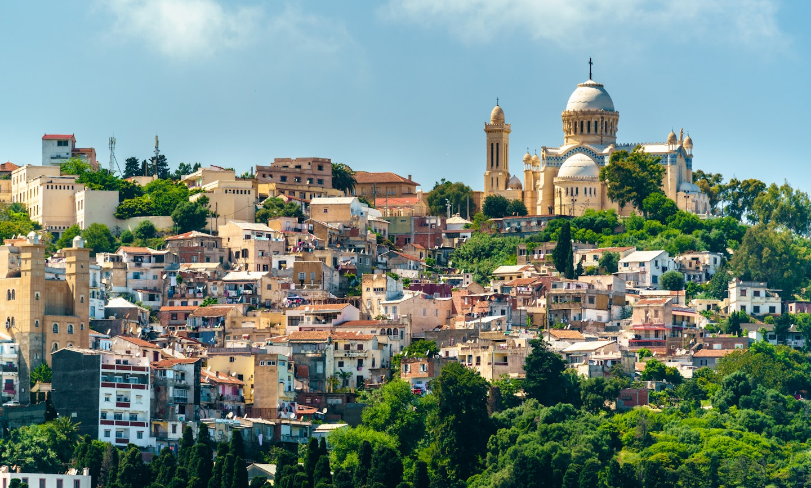

# Algerian Cuisine

Algeria is the largest country in Africa, and its food carries every layer of its history: Berber semolina and slow-cooked broths from the mountains, Arab spicing brought by the seventh-century conquests, Andalusian refinement carried across the strait after 1492, Ottoman pastry traditions absorbed through three centuries of Algiers as a regency, and a French colonial pâtisserie layer still visible in the country's bakeries. The Mediterranean coast gives olive oil, tomato, fish and the leafy vegetables of the cooler north; the Saharan south gives dates, dried meats and the toasted-semolina sweets that travel without spoiling. Friday is couscous day in almost every household, the family table built around a steaming mound of grain and a seven-vegetable broth. Ramadan reshapes the kitchen each year: chorba frik appears on every table at sundown, makroud and kalb el louz cool on trays through the night, and boureks are folded in their hundreds. It is a cuisine of patience, of layered spice (cumin, caraway, paprika, cinnamon, dried rose), of bread eaten with everything, and of strict hospitality.
