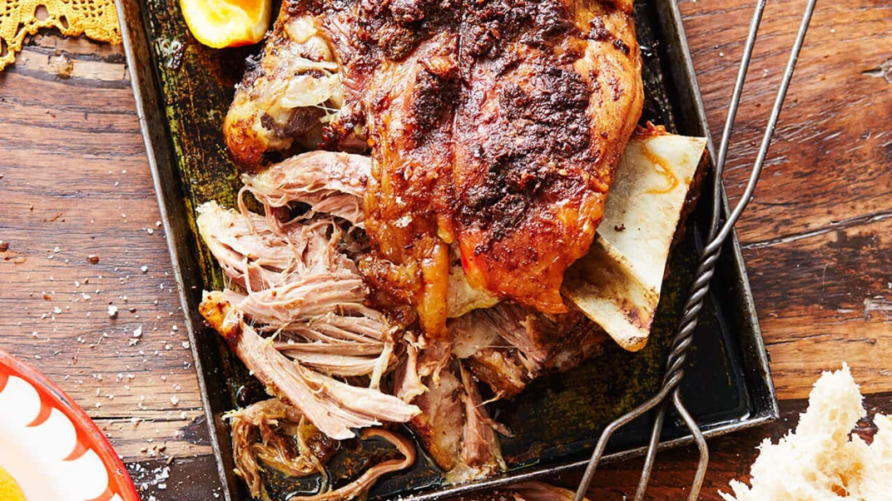

# Méchoui

*A whole lamb roasted slowly over open coals until the skin crackles and the meat falls from the bone, the centrepiece of Algerian celebrations and the great desert feast for Aid el Adha.*

**Serves:** 12 to 16 (whole lamb); recipe scaled to a 2 kg shoulder for home

**Prep Time:** 30 minutes (plus 6 hours marinating)

**Cook Time:** 4 hours

## Overview
Méchoui (from the Arabic shawa, "to grill") is the great feast lamb of Algeria, properly a whole young lamb impaled on a long spit and turned for hours over a bed of glowing wood embers, brushed with butter, cumin and salt as the skin tightens and the meat goes meltingly tender. It is the dish of Aid el Adha (the feast of sacrifice), of large weddings and of any gathering where a whole animal can be justified. In the Saharan south, the lamb is often buried in a sand-and-coal pit; in the north it is more often turned on a spit. Home cooks across Algeria have adapted the dish to the oven, using a bone-in shoulder or leg, a long slow roast at low heat, and a butter-spice rub that mimics the basting of the open pit. The aromatics are stripped back: cumin, paprika, garlic, butter, salt. That is all. The flavour comes from the lamb itself, the slow cooking and the careful basting. Serve carved at the table with cumin salt and bread.

## Ingredients

- 2 kg lamb shoulder, bone in
- 100 g unsalted butter, softened
- 4 cloves garlic, mashed to a paste
- 2 tbsp ground cumin (plus extra for the cumin salt)
- 1 tbsp sweet paprika
- 1 tsp ground black pepper
- 1.5 tbsp salt (plus extra for the cumin salt)
- 2 tbsp olive oil
- 250 ml water (for the roasting tin)

### Cumin salt for serving
- 2 tbsp coarse sea salt
- 2 tbsp ground cumin
- 0.5 tsp dried mint, crumbled (optional)

## Method

### Stage 1 - The rub and the rest
1. In a small bowl, mash together the soft butter, the garlic paste, the cumin, paprika, black pepper, 1.5 tbsp salt and the olive oil into a paste.
1. Score the fat side of the lamb shoulder in a shallow crosshatch.
1. Rub the paste all over the meat, working it into the scores and under any folds.
1. Cover loosely and refrigerate at least 6 hours, ideally overnight, to let the spices penetrate.
1. Bring back to room temperature for 1 hour before cooking.

### Stage 2 - First blast
1. Heat the oven to 220 C (200 fan).
1. Place the shoulder fat side up on a rack over a roasting tin.
1. Pour the water into the tin (this keeps the drippings from scorching).
1. Roast for 30 minutes to set the crust.

### Stage 3 - Low and slow
1. Reduce the oven to 140 C (120 fan).
1. Continue roasting for 3 hours 30 minutes, basting every 30 minutes with the buttery juices from the tin.
1. Top up the water in the tin from time to time so the drippings stay liquid.
1. The lamb is ready when it is pull-apart tender and the bone moves freely; internal temperature should read 92 to 95 C at the thickest point.

### Stage 4 - Rest and crisp
1. Lift the shoulder onto a board; tent loosely with foil; rest 20 minutes.
1. If the skin is not as crackling as you would like, blast the oven back to 240 C and return the lamb for 5 to 8 minutes to tighten the surface.

### Stage 5 - Cumin salt and carving
1. In a small bowl, mix the coarse salt, cumin and mint into a coarse dipping salt.
1. Carve the lamb into rough chunks or tear with two forks; the meat should pull cleanly from the bone.
1. Pile on a warm platter; spoon over a little of the spiced butter from the tin.

## Notes
- **For a whole lamb (the traditional version):** a 12 kg dressed lamb roasts spit-turned over wood embers for about 4 hours, basted every 15 minutes with the butter-cumin rub thinned with olive oil. The fire must be steady; flares from rendered fat are quenched with a sprinkle of water.
- **For a leg of lamb:** the method works the same. Reduce the slow-roast to 3 hours for a 2 kg leg.
- **Cumin salt is the only sauce.** No gravy, no jus, no mint sauce. The pure flavour of slowly roasted lamb is the point; the cumin salt punctuates each bite.

## Serving
Serve carved or pulled, on a wide platter, with a small dish of cumin salt for dipping and warm Algerian khobz bread for tearing. A salade algéroise (cucumber, tomato, olives) and a bowl of harissa-loosened pan juices alongside. Mint tea afterwards.

## Storage
- Keeps 3 days refrigerated; the meat pulls easily for next-day sandwiches with cumin salt and harissa
- Freezes 2 months; cool first, freeze in the cooking juices to keep moist
- Reheat covered with a splash of water and the reserved juices, 160 C for 25 minutes
