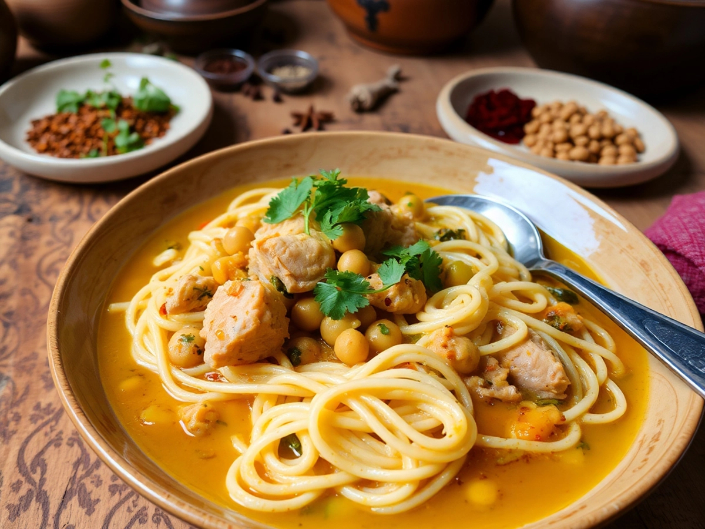

# Rechta

*Algiers-style hand-pulled noodles with chicken and chickpeas in a cinnamon-warmed white broth, the dish served on the eve of Mawlid and at family weddings.*

**Serves:** 6

**Prep Time:** 1 hour (plus 30 minutes resting)

**Cook Time:** 1 hour

## Overview
Rechta is one of the great dishes of Algiers, traditionally served on the night before the Prophet's birthday (Mawlid el Nabawi) and at weddings, baby-namings and other major family celebrations. The name refers both to the fresh hand-pulled noodles (a flat tagliatelle made with semolina, flour and water) and to the finished dish that bathes them in a pale, cinnamon-scented chicken-and-chickpea broth. There is no tomato; the broth is white, perfumed only with cinnamon, white pepper, onion and the meat itself. The noodles are first steamed (not boiled) in a couscoussier, which gives them a distinctive springy bite that boiled pasta cannot replicate. They are then dressed with the broth and finished with a generous handful of toasted onion confit. The leftover broth is served on the side in a small bowl, ready to be ladled over the noodles by each diner. If pulling fresh noodles feels too much for a weeknight, fresh tagliatelle from a good Italian grocer is the most acceptable substitute.

## Ingredients

### Noodles (or use 500 g fresh tagliatelle as a shortcut)
- 300 g fine semolina
- 100 g plain flour
- 1 tsp salt
- About 180 ml warm water
- 2 tbsp olive oil, plus more for steaming

### Broth
- 1 chicken (about 1.2 kg), cut into 6 pieces, skinned
- 2 tbsp olive oil
- 1 large onion, finely grated
- 1 cinnamon stick
- 1 tsp ground white pepper
- 0.5 tsp ground ginger
- 1.5 litres water
- 200 g cooked chickpeas
- 1 small turnip, peeled and quartered (optional, traditional in Algiers)
- 1 tsp salt

### Toasted onion topping
- 2 large onions, very thinly sliced
- 2 tbsp olive oil
- 1 tsp ground cinnamon
- 1 tbsp icing sugar

### To serve
- A small bowl of broth for each diner
- A dusting of ground cinnamon
- A scattering of icing sugar (yes, properly traditional)

## Method

### Stage 1 - Make the noodle dough (skip if using fresh tagliatelle)
1. Whisk together the semolina, flour and salt.
1. Add the water in stages, mixing to a firm but supple dough; you may need a touch more or less depending on the flour.
1. Knead 8 minutes until smooth.
1. Coat with the olive oil, cover, rest 30 minutes.
1. Roll out very thin on a floured board; cut into long 5 mm ribbons (a pasta machine makes light work).

### Stage 2 - Build the broth
1. Heat the olive oil in a couscoussier base or tall pot over medium heat.
1. Add the grated onion; cook for 8 minutes until soft and translucent (do not let it brown).
1. Add the chicken pieces; turn them for 5 minutes without browning deeply.
1. Add the cinnamon stick, white pepper, ginger and the water; bring to a gentle simmer.
1. Add the chickpeas, the turnip and salt; cover loosely; simmer 40 minutes.

### Stage 3 - Steam the noodles
1. Toss the fresh noodles with a tablespoon of olive oil so they do not clump.
1. Place in the perforated top of the couscoussier (or in a metal steamer over the simmering broth).
1. Steam, uncovered, for 15 minutes. Tip back into a bowl, separate the strands with two forks, sprinkle a little water; steam another 10 minutes until tender.

### Stage 4 - Make the toasted onion topping
1. Heat the olive oil in a small pan over medium-low heat.
1. Add the sliced onions; cook slowly for 20 minutes, stirring often, until deeply gold and softly caramelised.
1. Stir in the cinnamon and the icing sugar; cook 2 more minutes until glossy. Set aside warm.

### Stage 5 - Assemble and serve
1. Lift the chicken, chickpeas and turnip from the broth onto a plate; keep warm.
1. Pile the steamed noodles in a wide warm serving dish; pour over a couple of ladles of hot broth to moisten.
1. Arrange the chicken and vegetables on top.
1. Spoon the onion topping in a strip across the centre.
1. Dust the whole dish with a little ground cinnamon and (optionally) a light shower of icing sugar.
1. Serve the remaining broth in a jug or bowl on the side for each diner to add to taste.

## Notes
- **The white broth.** No tomato. No paprika. No turmeric. The pale colour is part of the identity of rechta, as is the gentle cinnamon perfume.
- **The cinnamon-and-sugar dusting** at the end sounds odd to non-Algerian eyes but is the proper finish: the savoury broth, the sweet onion, the warm spice all marry in the bowl.
- **Couscoussier or no.** A perforated steamer over a pot of simmering broth works; just keep the lid off so the noodles do not turn gluey.

## Serving
- Eat from a wide warm dish, with extra broth on the side. A small wedge of preserved lemon or a piece of fresh bread is welcome. Mint tea afterwards. Properly served on Mawlid eve or at a wedding, but no rule forbids cooking it on a Sunday.

## Storage
- Best eaten the day it is made; the noodles soften in storage
- Keep broth and noodles separate; the broth keeps 3 days refrigerated and freezes 2 months
- Refresh leftover noodles by steaming 5 minutes with a sprinkle of water
