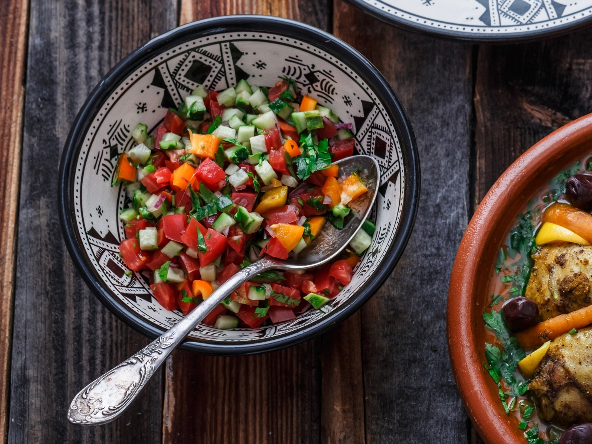

# Felfel Mhamer

*A cooked Algerian salad of charred peppers and tomato slow-braised in olive oil with garlic, the spoonable hot-and-sweet relish eaten with bread at lunch.*

**Serves:** 4 as a side

**Prep Time:** 15 minutes

**Cook Time:** 40 minutes

## Overview
Felfel mhamer (literally "browned peppers") is the cooked sister of hmiss: where hmiss is fresh-chopped and dressed, felfel mhamer is reduced slowly in a wide pan until the peppers and tomatoes break down into a soft, glossy, spoonable relish, deeply scented with olive oil and garlic. It belongs to the everyday cooking of the western Algerian coast (Oran in particular), where it is laid out at lunch as one of three or four small dishes alongside a stew or a grilled fish. The technique is unhurried: char, peel, braise. The reduction is what gives the dish its name and its depth. Make a generous batch; it keeps a week and gets better.

## Ingredients

- 6 long red and green peppers (the thin-walled frying kind)
- 4 ripe tomatoes, grated (skin discarded)
- 4 cloves garlic, thinly sliced
- 80 ml olive oil
- 1 tsp ground cumin
- 1 tsp sweet paprika
- 0.5 tsp dried oregano (optional, Oran tradition)
- 0.5 tsp salt
- 1 small red chilli, finely chopped (optional)

## Method

### Stage 1 - Char and peel the peppers
1. Place the peppers over a flame or under the grill; turn until the skins are blackened.
1. Cover with a plate and steam 5 minutes; peel; discard stalks and seeds.
1. Chop the flesh into rough 2 cm pieces.

### Stage 2 - Build the braise
1. Heat the olive oil in a wide heavy pan over medium heat.
1. Add the sliced garlic; cook gently for 2 minutes until just golden (do not let it burn).
1. Add the grated tomatoes; simmer 8 minutes until reduced and thickened.

### Stage 3 - Slow-cook the peppers
1. Add the chopped peppers, cumin, paprika, oregano, salt and chilli (if using).
1. Stir to coat; reduce the heat to low.
1. Cook uncovered for 25 minutes, stirring every few minutes, until the mixture is dark, glossy and the oil has separated to the edges of the pan.
1. Mash gently with a wooden spoon to break the peppers down a little further but not to a puree.

### Stage 4 - Finish
1. Check the salt; the long reduction concentrates the saltiness, so taste at the end.
1. Tip into a shallow bowl; cool to room temperature; finish with a drizzle of olive oil.

## Notes
- **The colour.** Felfel mhamer should look almost burnished, the peppers and tomatoes melded into one another. If the pan looks watery at the end, raise the heat and reduce another 5 minutes.
- **Use plenty of olive oil.** This is a dish where the oil is part of the flavour, not a frying medium. Skimping makes the relish dry.
- **A whisper of sugar.** Some Oran cooks add 0.5 tsp sugar at the end to balance the acidity. Optional, but it works with very tart tomatoes.

## Serving
Serve cool or at room temperature with warm bread (khobz, baguette or pita) for scooping, as part of a mezze spread, or alongside grilled lamb or fish. A spoonful next to scrambled eggs makes a beautiful Algerian breakfast.

## Storage
- Keeps 1 week refrigerated under a film of olive oil in a sealed jar
- Freezes 2 months; defrost overnight and refresh with a drizzle of fresh oil
- Always bring to room temperature before serving; cold from the fridge dulls the spice
