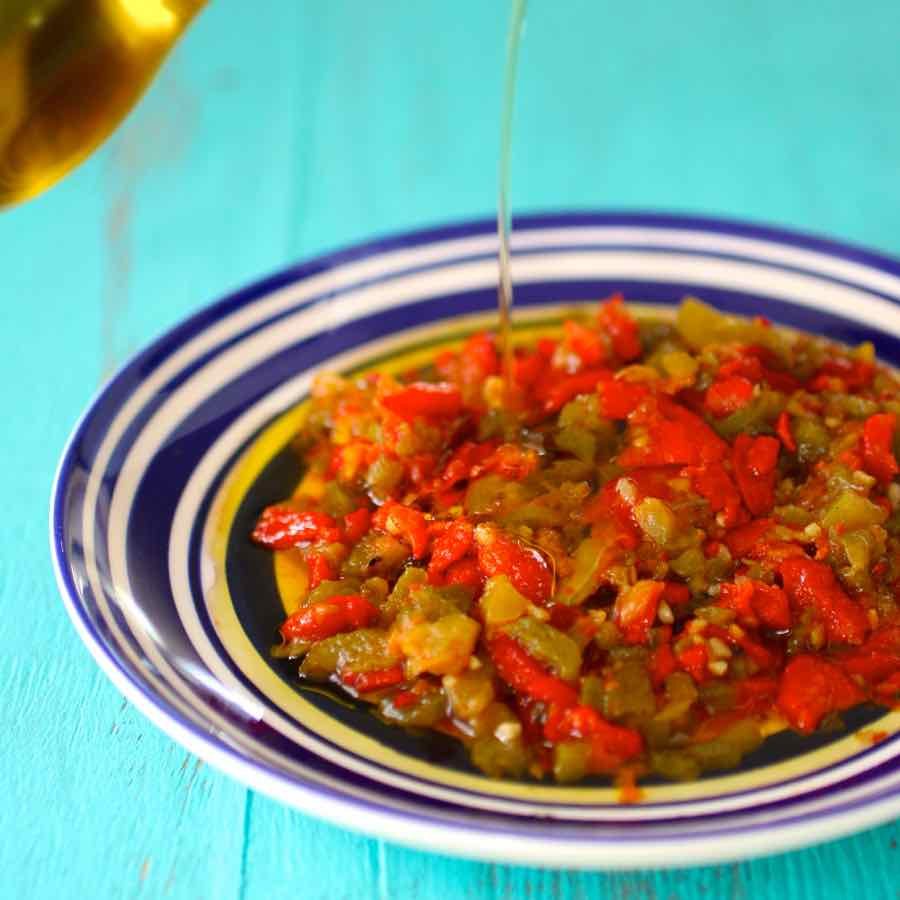

# Hmiss

*Algerian roasted pepper and tomato salad with crushed garlic and cumin, charred over a flame and served cool with olive oil and bread.*

**Serves:** 4 as a side

**Prep Time:** 10 minutes

**Cook Time:** 20 minutes

## Overview
Hmiss (sometimes written hmis) is the Algerian roasted-pepper salad, present on almost every mezze table in the country and a particular favourite of the Algiers and Oran kitchens. Long green frying peppers and ripe tomatoes are charred whole over a gas flame or under the grill until their skins blister, then peeled, roughly chopped and dressed with crushed garlic, ground cumin, olive oil and a little vinegar. The result sits somewhere between a salad and a relish, soft and smoky, eaten cool with bread for soaking or alongside grilled meats and tajines. Make a generous bowl: hmiss improves overnight in the fridge and is one of the first things to vanish from a Ramadan iftar table.

## Ingredients

- 4 long green peppers (the thin-walled frying kind; Hungarian wax or romano works)
- 4 ripe tomatoes
- 2 cloves garlic
- 1 tsp ground cumin
- 0.5 tsp salt
- 0.5 tsp sweet paprika (optional)
- 3 tbsp olive oil
- 1 tsp white wine vinegar or lemon juice

## Method

### Stage 1 - Char the vegetables
1. Place the peppers and tomatoes directly over a gas flame (or under a hot grill, or on a barbecue).
1. Turn frequently for 8 to 10 minutes until the skins are blackened in patches and blistered all over.
1. Tip into a bowl, cover with a plate or clingfilm; steam 5 minutes (this loosens the skins).

### Stage 2 - Peel and chop
1. Peel the blackened skins from the peppers and tomatoes; do not rinse under water or the flavour washes away.
1. Discard the stalks and seeds of the peppers; squeeze out and discard the tomato seeds.
1. Chop the flesh roughly on a board.

### Stage 3 - Dress and season
1. Crush the garlic to a paste with the salt using the flat side of a knife or a pestle.
1. In a wide bowl, combine the chopped pepper and tomato with the garlic paste, cumin, paprika (if using), olive oil and vinegar.
1. Mix gently with a fork; check the salt.

### Stage 4 - Rest and serve
1. Leave to stand 10 minutes for the flavours to mingle.
1. Transfer to a shallow plate; finish with a final drizzle of olive oil.

## Notes
- **The peppers must be the thin-walled frying kind.** Bell peppers are too sweet and too watery and give a different dish; use the long thin ones.
- **Char hard.** The flavour of hmiss is built on smoke. If the peppers are pallid the salad is dull. Char until properly black in patches.
- **Make ahead.** Hmiss is better after a night in the fridge; the cumin and garlic mellow into the oil.

## Serving
Serve cool or at room temperature, with warm khobz or fresh baguette for scooping. A reliable side for grilled lamb, méchoui, or any tajine, and an essential dish on a Ramadan iftar table.

## Storage
- Keeps 4 days refrigerated in a sealed jar under a film of olive oil
- Improves on day two; do not freeze (the texture collapses)
- Bring back to room temperature before serving; cold from the fridge mutes the flavours
