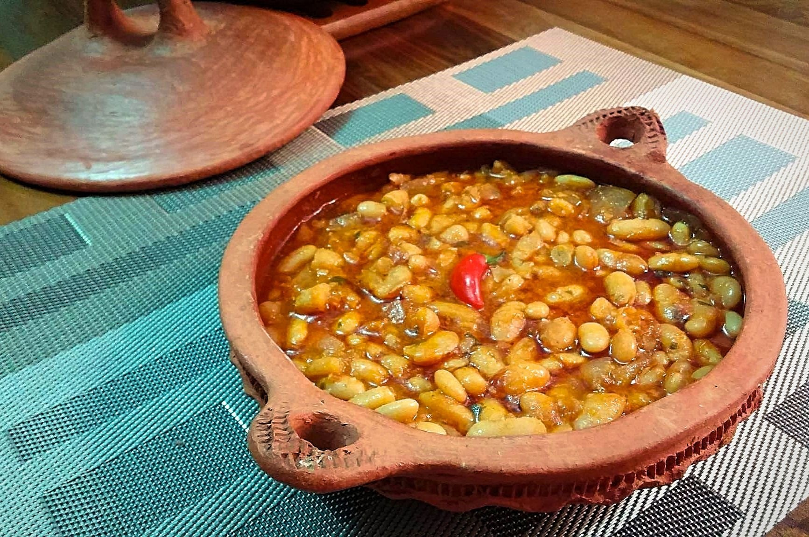

# Loubia (Algerian White Bean Stew)

*Algeria's everyday warming side: dried white beans slowly simmered with tomato, garlic, paprika and harissa, often finished with sliced merguez sausage; the rural plate served with khobz to dip and a glass of mint tea after.*

**Serves:** 6 as a side

**Prep Time:** 15 minutes (plus overnight soak)

**Cook Time:** 1 hour 30 minutes

## Overview
Loubia (the Maghrebi word for white beans) is the Algerian country-table side that turns dried beans into a slow-simmered tomato-harissa stew, eaten with chunks of khobz semolina bread to mop the sauce. The construction is straightforward but slow: dried cannellini or coco beans are soaked overnight, then simmered in a tomato-onion-garlic base spiced with sweet paprika, cumin, caraway, and a small spoon of harissa for heat. The traditional Algerian touch is finishing with sliced merguez sausage that adds smoke and lamb-fat richness as it cooks into the last fifteen minutes. The dish sits at the centre of an Algerian Friday lunch alongside couscous, but loubia also stands on its own as a meal with bread. Vegetarian versions skip the merguez and lean harder on the spices.

## Ingredients

### Beans
- 400 g dried white beans (cannellini, coco, or great northern; soaked overnight in cold water)
- 2 fresh bay leaves
- 2 cloves garlic (peeled, left whole)

### Stew base
- 60 ml olive oil
- 1 large onion (finely diced)
- 4 cloves garlic (finely chopped)
- 2 tablespoons tomato paste
- 1 tin (400 g) chopped tomatoes
- 2 teaspoons sweet paprika (paprika doux)
- 1 teaspoon ground cumin
- 1 teaspoon ground caraway
- 1 tablespoon harissa (Algerian or Tunisian; or 1/2 tablespoon if you prefer mild)
- 1 teaspoon fine sea salt
- 1 teaspoon coarsely cracked black pepper
- 700 ml reserved bean cooking liquid (plus extra water if needed)

### Finish
- 2 merguez sausages (sliced into 2 cm coins; optional for vegetarian)
- 1 tablespoon olive oil (for frying the merguez)
- 1 small handful fresh coriander (chopped)
- 1 small handful fresh parsley (chopped)
- 1 lemon (cut into wedges)

### To serve
- A round of khobz Algerian semolina bread
- A pot of mint tea
- A small bowl of harissa for the table

## Method

### Stage 1 - Cook the beans
1. Drain the soaked beans; rinse.
2. Tip into a large pot with 2 litres cold water, the bay leaves, and 2 whole garlic cloves.
3. Bring to a boil; skim the scum.
4. Drop the heat; simmer gently 60-75 minutes till the beans are tender but not falling apart.
5. Drain, reserving 700 ml of the cooking liquid.
6. Discard the bay leaves and cooked garlic.

### Stage 2 - Build the stew base
1. Heat the olive oil in a wide heavy pan over medium heat.
2. Add the diced onion and a pinch of salt; sweat 6 minutes till soft.
3. Add the chopped garlic; cook 1 minute.
4. Stir in the tomato paste; cook 2 minutes till it darkens.
5. Add the chopped tomatoes; simmer 5 minutes till thickened.
6. Add the paprika, cumin, caraway, harissa, salt, pepper; stir 30 seconds.

### Stage 3 - Combine and simmer
1. Tip the cooked beans into the tomato base.
2. Pour over the reserved 700 ml bean cooking liquid.
3. Bring to a gentle simmer.
4. Cover loosely; simmer 25 minutes, stirring occasionally.
5. The beans should be soft and the sauce thickened to a stew consistency (not soupy).
6. Add a splash of water if it dries out too fast.

### Stage 4 - Add the merguez
1. While the beans simmer, heat 1 tablespoon olive oil in a small pan over medium-high heat.
2. Add the sliced merguez; brown 3-4 minutes till crisp at the edges.
3. Drop the merguez (with its rendered oil) into the bean stew for the last 10 minutes.

### Stage 5 - Finish and serve
1. Check seasoning; loubia should be smoky-paprika forward with a clear chilli note.
2. Stir in half the chopped coriander and parsley.
3. Ladle into a wide serving bowl.
4. Scatter the rest of the herbs over.
5. Drizzle with a final tablespoon of olive oil.
6. Serve hot with khobz on the side and lemon wedges for squeezing.

## Notes
- **Overnight soak:** the long soak gives a creamy bean texture; a quick boil-and-rest produces tougher skins.
- **Don't skip the tomato-paste-cooking step:** caramelising the paste 2 minutes deepens the whole stew.
- **Harissa quality matters:** Algerian or Tunisian rose-harissa is the right one. Supermarket "chilli paste" is harsh.
- **Merguez optional:** the vegetarian loubia is excellent; just bump the cumin and add 1 extra tablespoon olive oil at the end for richness.
- **Loubia gets better day 2:** the beans absorb the sauce overnight; reheat with a splash of water.

## Variations
**Vegetarian loubia:** skip the merguez; add 1 teaspoon smoked paprika to mimic the smokiness; use vegetable bean stock.
**Loubia with lamb shoulder:** cube 300 g lamb shoulder; brown first; add with the tomato base; extend the simmer to 90 minutes.
**Spicy loubia:** double the harissa; add 1 sliced fresh red chilli at the start.
**Loubia bil dersa:** stir 2 tablespoons of dersa (Algerian garlic-coriander-cumin paste) in at the end for the Algiers version.
**With white beans + chickpeas:** swap half the white beans for soaked chickpeas; gives the dish more texture.

## Serving
At an Algerian Friday lunch alongside couscous (the traditional setting) · with khobz to dip · at Ramadan iftar after chorba frik · as a standalone main with a green salad · for a winter weeknight supper · at an Algerian-Tunisian shared mezzeh table.

## Storage
- Refrigerates 4 days in a sealed container; the flavour deepens.
- Reheat gently in a covered pan with a splash of water.
- Freezes well 3 months; defrost in the fridge overnight before reheating.
- Don't reduce too far when reheating; loubia should stay slightly saucy.
